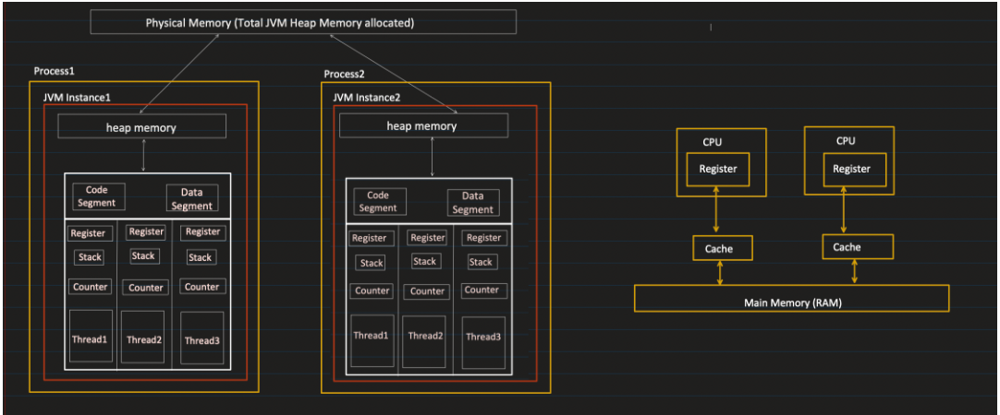
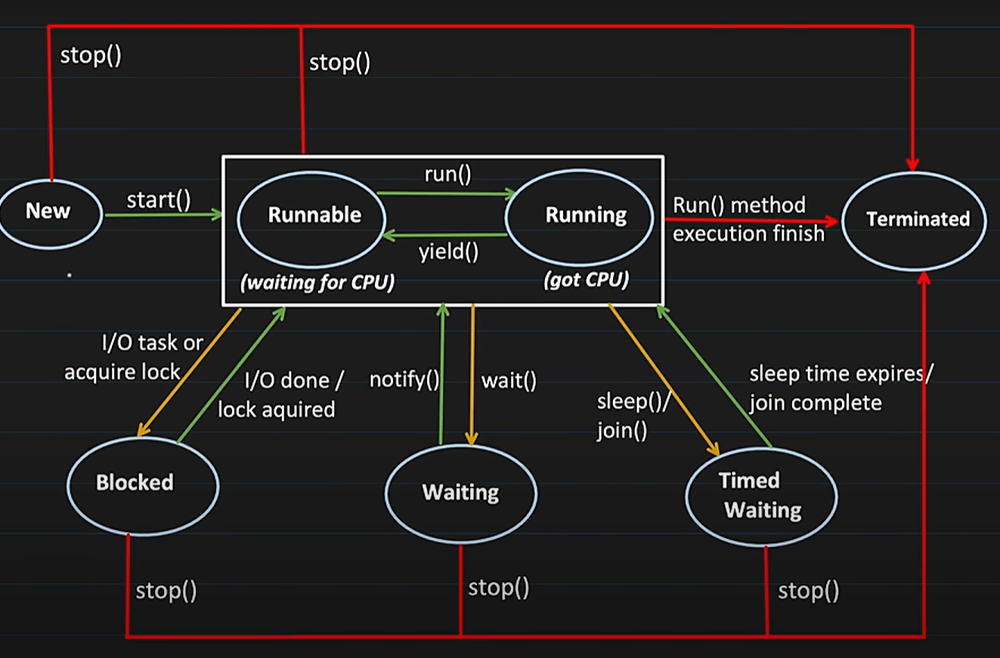
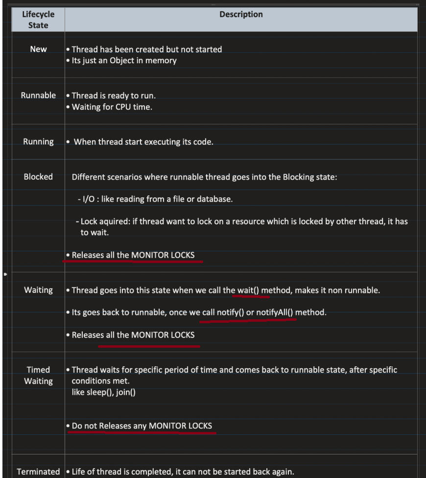

# Java Basics to Advance

## Table of Contents
1. [OOPS Concepts](#oops-concepts)
> a. [Overwiew Of OOPS](#overview-of-oops)<br>
> b. [Objects and Classes](#objects-and-classes)<br>
> c. [Pillar of OOPS](#pillars-of-oops)
>> i. [Abstraction](#abstraction)<br>
>> ii. [Encapsulation](#encapsulation)<br>
>> iii. [Inheritance](#inheritance)<br>
>> iv. [Polymorphism](#polymorphism)<br>

> d. [Types of inheritance](#types-of-inheritance)<br>
>> i. [Single Inheritance](#1-single-inheritance)<br>
>> ii. [Multilevel Inheritance](#2-multilevel-inheritance)<br>
>> iii. [Hierarchical Inheritance](#3-hierarchical-inheritance)<br>
>> iv. [Multiple Inheritance Through Interfaces](#4-multiple-inheritance-through-interfaces)<br>
>> v. [Diamond Problem](#diamond-problem)<br>

> e. [Types of polymorphism](#types-of-polymorphism)<br>
>> i. [Compile Time / Overloading](#1-compile-time-polymorphism-static-binding--method-overloading)<br>
>> ii. [Runtime Polymorphis / Overiding](#2-runtime-polymorphism-dynamic-binding--method-overriding)<br>

> f. [Is-a and has-a relationship](#is-a-and-has-a-relationship)<br>
>> i. [Is-a relationship](#is-a-relationship-inheritance)<br>
>> ii. [Has-a relationship](#has-a-relationship-composition)<br>
>>> -> [Weak has-a relationship](#weak-has-a-relationship-aggregation)<br>
>>> -> [Strong has-a relationship](#strong-has-a-relationship-composition)<br>
2. [Java & Its ecosystem](#java--its-ecosystem-wora-jvm-jre-jdk)<br>
> a. [WORA](#wora-write-once-run-anywhere)<br>
> b. [JVM](#jvm-java-virtual-machine)<br>
> c. [JRE](#jre-java-runtime-environment)<br>
> d. [JDK](#jdk-java-development-kit)<br>
> e. [Analogy](#real-world-analogy)<br>
> f. [Platform Independence](#how-java-achieves-platform-independence)<br>
> g. [Explanation public-static-void-mains](#explanation-public-static-void-mainstring-args)<br>
> h. [File and public class](#single-file-can-have-only-1-public-class)<br>
3. [Java Variables](#java-variables)<br>
> a. [IEEE 754 format](#ieee-754-floating-point-representation-single-precision---32-bit)<br>
>> i. [Decimal to IEEE754](#step-by-step-conversion-of-4125-to-ieee-754-float)<br>
>> ii. [IEEE754 to Decimal](#ieee-754-to-decimal-conversion)<br>
>> iii. [Why bias is needed](#why-bias-is-needed)<br>
>> iv. [0.7f representation](#why-07f-cannot-be-represented-exactly)<br>
>> v. [IEE754 and 2s-complement](#ieee754-and-2s-complement)<br>

> b. [Static Type & Strong Type Language](#static-type--strong-type-language)<br>
> c. [Type Conversion](#type-conversion)<br>
>> i. [Implicit Type Conversion](#implicit-type-conversion-wideningautometic-conversion--type-promotion)<br>
>> ii. [Explicit Type Conversion](#explicit-type-conversion-narrowing-conversion--type-casting)<br>
>> iii. [Type Promotion](#type-promotion-in-expressions)<br>

> d. [Data Types](#data-types)<br>
>> i. [Primitive Types](#primitive-data-types)<br>
>> ii. [Reference Types](#non-primitive-data-types-reference-types)<br>

> e. [Strings](#strings)<br>
>> i. [String Immutability](#string-immutability)<br>
>> ii. [String literal and Constant Pool](#string-literal--string-constant-pool)<br>

> f. [Wrapper Class](#wrapper-class)<br>

4. [Java Methods](#java-methods)<br>
> a. [Access Specifiers](#access-specifiers)<br>
> b. [Static Methods](#static-methods)<br>
>> i. [Method Hiding](#method-hiding)<br>

> c. [Final Method](#final-method)<br>
> d. [Abstract Method](#abstract-method)<br>
> e. [Variable Number of Arguments](#variable-number-of-arguments)<br>
> f. [Constructor](#constructor)<br>
>> i. [Constructor Chaining](#constructor-chaining)<br>

5. [Memory Managment](#memory-managment)<br>
> a. [Memory Brakdown](#memory-brakdown)<br>
> b. [Memory Areas](#memory-areas)<br>
>> i. [Heap memory](#heap-memory)<br>
>>> - [Minor GC explanation](#java-minor-gc-cycle-explained-young-generation)<br>
>>> - [Surviour Space](#survivor-space-rotation)<br>

>> ii. [Stack Memory](#stack-memory)<br>
>> iii. [Metaspace](#method-area-metaspace)<br>
>> iv. [Progam Counter](#program-counter-pc-register)<br>

> c. [Garbage Collection](#garbage-collection)<br>
> d. [References and their impact on gc](#references-and-their-impact-on-gc)<br>
>> i. [Strong Reference](#strong-reference-default)<br>
>> ii. [Soft Reference](#soft-reference-javalangrefsoftreference)<br>
>> iii. [Weak Reference](#weak-reference-javalangrefweakreference)<br>
>> iv. [Phantom Reference](#phantom-reference-javalangrefphantomreference)<br>

6. [Java Classes](#java-classes)<br>
> a. [Concrete Class](#concrete-class)<br>
> b. [Abstract Class](#abstract-class)<br>
> c. [Object Class](#object-class)<br>
> d. [Nested Class](#nested-classes)<br>
>> i. [Inner Class, non-static](#inner-class)<br>
>>> - [Anonymous Inner Class](#anonymous-inner-class)<br>
>>> - [Member Inneer Class](#member-inner-class)<br>
>>> - [Local Inner Class](#local-inner-class)<br>

>> ii. [Static Inner Class](#static-nested-class)<br>

> e. [Generic Class](#generic)<br>
>> i. [Multiple Type Parameters](#generic-class-with-multiple-type-parameters)<br>
>> ii. [Bounded Type Parameters](#bounded-type-parameters)<br>
>> iii. [Generic Class inheritance with interface and class](#generic-class-inheritance-with-interface-and-class)<br>
>> iv. [Wildcards in Generic](#wildcards-in-generic)<br>
>>> - [Unknown type unbounded wildcard](#1---unknown-type-unbounded-wildcard)<br>
>>> - [Upper Bounded Wildcard](#2--extends-t--upper-bounded-wildcard)<br>
>>> - [Lower Bounded Wildcard](#3--super-t--lower-bounded-wildcard)<br>

> f. [POJO](#pojo-plain-old-java-object)<br>
> g. [Enum](#enum)<br>
> h. [Final](#final)<br>
> i. [Singleton](#singleton)<br>
>> i. [Eager Initialization](#1-eager-initialization)<br>
>> ii. [Lazy Initialization](#2-lazy-initialization)<br>
>> iii. [Synchronization Block](#3-synchronization-block)<br>
>> iv. [Double Check Lock](#4-double-check-lock)<br>
>> v. [Bill Pugh Solution](#5-bill-pugh-solution)<br>

> j. [Immutable](#immutable)<br>
> l. [Wrapper Class](#wrapper-class)<br>


7. [Java Interfaces](#java-interfaces)<br>
> a. [Nested Interfaces](#nested-interfaces)<br>
>> i. [Interface Inside a Class](#interface-inside-a-class)<br>
>> ii. [Interface Inside an interface](#interface-inside-an-interface)<br>

> b. [Default Method](#default-method)<br>
>> i. [Class implements multiple interfaces having same default method](#problem-what-happens-when-a-class-implements-multiple-interfaces-having-same-default-method)<br>
>> ii. [Overriding and Inheriting Default Methods](#overriding-and-inheriting-default-methods)<br>


> c. [Static methods](#static-methods-1)<br>
> d. [Private and Private Static](#private-and-private-static)<br>

8. [Functional interface and lambda expression](#functional-interface-and-lambda-expression)<br>
> a. [Functional Interface](#functional-interface)<br>
> b. [Implementing Functional Interface](#implementing-functional-interface)<br>
>> i. [Class with implement keyword](#1-using-a-class-with-implements-keyword)<br>
>> ii. [Anonymous Inner Class](#anonymous-inner-class)<br>
>> iii. [Lambda expressions](#3-using-lambda-expressions-java-8)<br>

> c. [Type-of Functional Interface](#type-of-functional-interface)<br>
>> i [Consumer\<T>](#consumert)<br>
>> ii. [Supplier\<T>](#suppliert)<br>
>> iii. [Function\<T,R>](#functiont-r)<br>
>> iv. [Predicate\<T>](#predicatet)<br>

> d. [Inheritance of functional interfaces](#inheritance-of-functional-interfaces)
>> i. [Functional interface extending non-functional interface](#functional-interface-extending-non-functional-interface)<br>
>> ii. [Non-functional Interface extending funtional interface](#non-functional-interface-extending-funtional-interface)<br>
>> iii. [Functional Interface extending functional-interface](#functional-interface-extending-functional-interface)<br>

9. [Reflection](#reflection)<br>
> a. [What is class `Class`](#what-is-class-class)<br>
> b. [How to get the class `Class` object](#how-to-get-the-class-class-object)<br>
>> i. [Using `forname` method](#using-forname-method)<br>
>> ii. [Using `.class`](#using-class)<br>
>> iii. [Using `getClass()` method](#using-getclass-method)<br>

> c. [Perform reflection of a class](#perform-reflection-of-a-class)<br>
> d. [Perform reflection of a method](#perform-reflection-of-a-method)<br>
> e. [Perform reflection of a constructor](#perform-reflection-of-a-constructor)<br>

10. [Annotations](#annotations)<br>
> a. [What are annotations](#what-are-annotations)<br>
> b. [Types of annotations](#types-of-annotations)<br>
>> i. [Pre defined annotations](#pre-defined-annotations)<br>
>>> - [Java code annotations](#java-code-annotations-like-class-method-etc)<br>
>>>> - [@Deprecated](#1-deprecated)<br>
>>>> - [@Override](#2-override)<br>
>>>> - [@Suppresswarning](#3-suppresswarningsunchecked)<br>
>>>> - [@Functional Interface](#functional-interface)<br>
>>>> - [@SafeVarargs](#5-safevarargs)<br>

>>> - [Meta Annotations](#meta-annotations-used-on-annotations)<br>
>>>> - [@Target](#1-target)<br>
>>>> - [@Retention](#2-retention)<br>
>>>> - [@Documented](#3-documented)<br>
>>>> - [@Inherited](#4-inherited)<br>
>>>> - [@Repeatable](#5-repeatable)<br>

>> ii. [Custom(user-defined) annotations](#custom-annotations--user-defined)<br>

11. [Exception](#exception)<br>
> a. [Types of exceptions](#types-of-exceptions)<br>
> b. [Error vs exception](#error-vs-exception)<br>
> c. [Compile time exception](#compile-time-exception)<br>
> d. [Runtime exception](#runtime-exception)<br>
> e. [Common exception handling keywords](#common-exception-handling-keywords)<br>
>> i. [try-catch](#1-try--catch)<br>
>> ii. [finally](#2-finally)<br>
>> iii. [throw](#3-throw)<br>
>> iv. [throws](#4-throws)<br>

> f. [User Defined (Custom) Exceptions](#user-defined-custom-exception)<br>
>> i. [Create Custom Exception](#how-to-create-a-custom-exception)<br>

12. [Multithreading and concurrency](#multithreading-and-concurrency)<br>
> a. [Threads vs processes](#threads-vs-processes-in-java)<br>
> b. [JVM memory structure and thread behavior](#jvm-memory-structure-and-thread-behavior)<br>
>> i. [Code segment](#code-segment)<br>
>> ii. [Data segment](#data-segment)<br>

> c. [Multi-threading Defination](#defination-of-multi-threading)<br>  
>> i. [Multitasking vs multithreading](#multitasking-vs-multithreading)<br>

> d. [Thread Creation](#thread-creation)<br>
>> i. [Extending Thread Class](#1-extending-the-thread-class)<br>
>> ii. [Implementing runnable interface](#2-implementing-the-runnable-interface)<br>
>> iii. [Using lambda expression](#3-using-lambda-expression-java-8)<br>
>> iv. [Using Executor Service](#4-using-executorservice-thread-pooling)<br>

> e. [Thread LifeCycle](#thread-lifecycle)<br>
> f. [Synchronized and Thread Satety](#synchronized-and-thread-satety)<br>
>> i. [Monitor Lock](#monitor-lock-aka-intrinsic-lock)<br>

> g. [Deprecated methods stop, resume, suspended](#deprecated-methods-stop-resume-suspended)<br>
> h. [Thread Joining, thread Priority, deamon thread](#thread-joining-thread-priority-deamon-thread)<br>
> i, [Locks and semaphores](#locks-and-semaphores)<br>
>> i. [Optimistic Locking](#optimistic-locking)<br>
>> ii. [Pessimistic Locking](#pessimistic-locking)<br>
>> iii. [Reentrant Lock](#reentrant-lock-reentrantlock)<br>
>> iv. [Read Write Lock](#read-write-lock-reentrantreadwritelock)<br>
>> v. [Semaphore](#semaphore-semaphore)<br>
>> vi. [Stamped Lock](#stamped-lock-stampedlock)<br>

> j. [Inter-Thread Communication](#inter-thread-communication)<br>
>> i. [Communication between synchronized blocks or methods](#communication-between-synchronized-blocks-or-methods)<br>
>> ii. [Communication between lock interfaces](#communication-between-lock-interfaces)<br>
>> ii. [Spurious Wakeup](#spurious-wakeup)<br>

> l. [Lock free Mechanishm](#lock-free-mechanism-for-concurrency) <br>
>> i. [Java Support for Cas](#java-support-for-cas) <br>
>> ii. [ABA Problem in Cas](#aba-problem-in-cas)<br>
>> iii. [Volatile vs Atomic](#volatile-vs-atomic)<br>
## OOPS Concepts

### Overview Of OOPS
- OOPS mean Object-Oriented Programming
- Here Object means real world entity like Car, Bike etc. Every real world entity has two things 
    - Behaviour or Functionality 
    - Properties or State
- Procedural Programming vs OOPS

    | ***Aspect***  | ***Procedural Programming***   | OOPS          |
    |---------------------|--------------------|--------------------------|
    | Structure           | Program is structured and divided into parts as procedures c(methods)       | Code is structured around classes and objects      |
    | Core Concept        | Functions and step-by-step instructions    | Objects and classes representing entities    |
    | Data                | Data is passed to functions                      | Data is encapsulated within objects    |
    | Reusability         | Difficult; requires duplicate or refactored code | Promotes reuse through inheritance and composition |
    | Abstraction         | Limited, Overloading, Inheritence, code reusability, data hiding not possible     | High; supports abstraction via interfaces/classes, Overloading, Inheritence, data hiding, code reusability is possible  |
    | Example             | C, Pascal, FORTRAN | Java, C++, Python | 

    - Procedural Style in Java (Not idiomatic Java, but to illustrate)
        ```java
        public class BankProcedural {
            static int balance = 0;

            public static void deposit(int amount) {
                balance += amount;
            }

            public static void withdraw(int amount) {
                if (amount <= balance) {
                    balance -= amount;
                } else {
                    System.out.println("Insufficient funds");
                }
            }

            public static void checkBalance() {
                System.out.println("Balance: " + balance);
            }

            public static void main(String[] args) {
                deposit(1000);
                withdraw(200);
                checkBalance();
            }
        }
        ```
    
    - Object-Oriented Style in Java (Preferred Java way)
        ```Java
        public class BankAccount {
            private int balance;

            public void deposit(int amount) {
                balance += amount;
            }

            public void withdraw(int amount) {
                if (amount <= balance) {
                    balance -= amount;
                } else {
                    System.out.println("Insufficient funds");
                }
            }

            public void checkBalance() {
                System.out.println("Balance: " + balance);
            }

            public static void main(String[] args) {
                BankAccount account = new BankAccount();
                account.deposit(1000);
                account.withdraw(200);
                account.checkBalance();
            }
        }
        ```

### Objects and Classes

What is a Class?

- A **class** is a blueprint/template for creating **objects**.
- It defines **fields (variables)** and **methods (functions)** that describe the behavior and state of the object.
    ```java
    class Student {
        // Fields (attributes, properties)
        int id;
        String name;

        // Methods (behavior)
        void display() {
            System.out.println(id + " " + name);
        }
    }
    ```

What is an Object?
- An object is an instance of a class.
- Object has 2 things:
    - Behaviour or Functionality (methods in class)
    - Properties or State (variables in class)
- It contains **actual values** and can access the class’s methods and fields.

Syntax to Create an Object
```Java
ClassName obj = new ClassName();
```

### Pillars Of OOPS

OOPS is based on four fundamental principles. We’ll understand these principles of OOPS  using a **single real-world example**: a `Vehicle` system with `Car` and `Bike`.

#### Encapsulation

Wrapping data (variables) and methods (functions) together in a single unit (class), and restricting direct access to some of the object's components.

```java
class Vehicle {
    private int speed;
    private int fuel;

    public void setSpeed(int speed) {
        this.speed = speed;
    }

    public int getSpeed() {
        return speed;
    }

    public void refuel(int liters) {
        this.fuel += liters;
    }
}
```

We protect `speed` and `fuel` fields using private, and provide `public` methods to access them safely.

#### Abstraction

Hiding complex internal details and showing only the essential features to the user.

```java
class Vehicle {
    void startEngine(){
        // process of starting a engine
    }
}
```

`Vehicle` gives a high-level method `startEngine()` to start the engine, hiding or abstracting the details of how vehicle starts.

#### Inheritance

Mechanism where one class (child) inherits fields and methods from another class (parent), promoting code reuse.

```Java
class Car extends Vehicle {
    void startEngine() {
        System.out.println("Car engine started with key.");
    }
}

class Bike extends Vehicle {
    void startEngine() {
        System.out.println("Bike engine started with kick.");
    }
}
```

`Car` and `Bike` share behavior from `Vehicle`, avoiding code duplication.

#### Polymorphism

The ability of a single method or object to take many forms — typically by method **overriding (runtime)** or **overloading (compile-time)**.

Poly means **Many** and Morphism means **Form**.

```Java
public class Main {
    public static void main(String[] args) {
        Vehicle v1 = new Car();
        Vehicle v2 = new Bike();

        v1.startEngine();  // Output: Car engine started with key.
        v2.startEngine();  // Output: Bike engine started with kick.
    }
}
```

The same method `startEngine()` behaves differently depending on the object’s runtime type.

### Types of Inheritance

Inheritance is one of the core concepts of OOPS. It allows one class to acquire the properties (fields) and behaviors (methods) of another class.

#### 1. Single Inheritance
A subclass inherits from a single superclass.


```java
class Animal {
    void eat() {
        System.out.println("This animal eats food.");
    }
}

class Dog extends Animal {
    void bark() {
        System.out.println("Dog barks.");
    }
}
```

```yaml
Animal
  |
  v
Dog
```

#### 2. Multilevel Inheritance
A class inherits from a class, which in turn inherits from another class.
```java
class Animal {
    void eat() {
        System.out.println("Eating...");
    }
}

class Dog extends Animal {
    void bark() {
        System.out.println("Barking...");
    }
}

class Puppy extends Dog {
    void weep() {
        System.out.println("Weeping...");
    }
}
```
```yaml
Animal
  |
  v
Dog
  |
  v
Puppy
```

#### 3. Hierarchical Inheritance

Multiple classes inherit from a single superclass.
```java
class Animal {
    void eat() {
        System.out.println("Eating...");
    }
}

class Dog extends Animal {
    void bark() {
        System.out.println("Barking...");
    }
}

class Cat extends Animal {
    void meow() {
        System.out.println("Meowing...");
    }
}
```
```markdown
      Animal
      /    \
     v      v
   Dog     Cat
```

#### 4. Multiple Inheritance (Through Interfaces)
Java does not support multiple inheritance with classes to avoid ambiguity (Diamond Problem). However, it can be achieved using interfaces as interfaces does not contains any implementation. 

```Java
interface Printable {
    void print();
}

interface Showable {
    void show();
}

class A implements Printable, Showable {
    public void print() {
        System.out.println("Printing...");
    }
    public void show() {
        System.out.println("Showing...");
    }
}
```
```markdown
Printable   Showable
     \         /
      v       v
         A
```

#### Diamond Problem

The **Diamond Problem** is a well-known issue in **multiple inheritance** when a class inherits from two classes that both inherit from a common base class. This can cause ambiguity in the inheritance hierarchy.

❗ Problem

Imagine this inheritance structure:
```plaintext
      A
     / \
    B   C
     \ /
      D
```
Now, class `D` has **two paths to inherit from** `A`, which creates **a diamond shape**.

If `A` has a method, and both `B` and `C` override it, when `D` calls that method, it is **ambiguous which version to use** — the one from `B`, `C`, or `A`?

⚠️ Java Avoids the Diamond Problem

Java does **not support multiple inheritance with classes** to prevent this ambiguity. You cannot extend more than one class in Java.

✅ Instead, Java allows multiple inheritance using interfaces, which **do not carry implementation logic** (until Java 8 added default methods)

```Java
interface A {
    default void greet() {
        System.out.println("Hello from A");
    }
}

interface B extends A {
    default void greet() {
        System.out.println("Hello from B");
    }
}

interface C extends A {
    default void greet() {
        System.out.println("Hello from C");
    }
}

class D implements B, C {
    public void greet() {
        // Must resolve the ambiguity
        B.super.greet();  // or C.super.greet();
    }
}
```
Output:
```java
Hello from B
```

📌 Key Point:
- If `D` doesn't override `greet()`, the compiler will throw an **error due** to ambiguity.
- Java forces you to **explicitly specify** which default method to use.

### Types Of Polymorphism

**Polymorphism** in Java means "**many forms**" — the ability of a single function, method, or object to behave differently based on context.

There are two main types of polymorphism in Java:

#### 1. Compile-Time Polymorphism (Static Binding / Method Overloading)

When the method to be executed is determined **at compile time**, it is called compile-time polymorphism.

-  Achieved By: **Method Overloading** — same method name with different parameters (type/number/order).

```Java
class Calculator {
    int add(int a, int b) {
        return a + b;
    }

    double add(double a, double b) {
        return a + b;
    }

    int add(int a, int b, int c) {
        return a + b + c;
    }
}

public class Main {
    public static void main(String[] args) {
        Calculator calc = new Calculator();
        System.out.println(calc.add(2, 3));         // 5
        System.out.println(calc.add(2.5, 3.5));     // 6.0
        System.out.println(calc.add(1, 2, 3));      // 6
    }
}
```

Key Points:
- Resolved at compile time.
- Java does **not support operator overloading** (like C++), only method overloading.
- Methods cannot be overloaded solely based on different return types if their parameter types and count are the same.
    ```Java
    class Demo {
        int display(int x) {
            return x;
        }

        // ❌ Compilation error — only return type is different
        double display(int x) {
            return (double) x;
        }
    }
    ```

#### 2. Runtime Polymorphism (Dynamic Binding / Method Overriding)

When the method to be executed is determined **at runtime**, it is called runtime polymorphism.

- Achieved By: **Method Overriding** — subclass provides specific implementation of a method already defined in its parent class. Method signature should be same, number of arguments, type of arguments and return type. Only the internal implementation will differ.

```Java
class Animal {
    void sound() {
        System.out.println("Animal makes a sound");
    }

    void color() {
        System.out.println("Define animal color here");
    }
}

class Dog extends Animal {
    void sound() {
        System.out.println("Dog barks");
    }
}

class Cat extends Animal {
    void sound() {
        System.out.println("Cat meows");
    }

    void color() {
        System.out.println("Cat color is white");
    } 
}

public class Main {
    public static void main(String[] args) {
        Animal a1 = new Dog();
        Animal a2 = new Cat();

        a1.sound();  // Output: Dog barks
        a2.sound();  // Output: Cat meows

        a1.color();  // Output: Define animal color here
        a2.color(); // Output: Cat color is white

        // Dog d = new Animal();  // ❌ Not Allowed, incompatible types: Animal cannot be converted to Dog
    
    }
}
```

- Key Points:
    - Resolved at runtime using **dynamic method dispatch**.
    - Allows Java to support **late binding**.
    - In line `a1.color()` since there is no method named `color` in `Dog` class, so it calls the parent class method but in `a2.color()` it finds the method `color` in `Cat` class.

- Execution Flow:
    - A method is called on an object.
    - The **JVM checks the actual object's class** (not the reference type).
    - If the method is overridden in the subclass, the subclass's version is executed.
    - Otherwise, the superclass’s version is executed.

### IS-A and HAS-A Relationship

####  IS-A Relationship (Inheritance)
- Represents **inheritance** or a **parent-child** relationship.
- If class B extends class A, then **B IS-A A**.
- Achieved using the `extends` or `implements` keyword.
- Used to promote code reuse and polymorphism.

    ```Java
    class Animal {
        void eat() {
            System.out.println("This animal eats food.");
        }
    }

    class Dog extends Animal {
        void bark() {
            System.out.println("Dog barks.");
        }
    }
    ```
- Here, `Dog IS-A Animal` because it inherits from `Animal`.

#### HAS-A Relationship (Composition)
- Represents composition or containment.
- One class contains a reference to another class.
- Achieved by creating an instance of one class inside another.
- Promotes flexibility and code reuse.
    ```Java
    class Engine {
        void start() {
            System.out.println("Engine starts.");
        }
    }

    class Car {
        Engine engine = new Engine(); // Car HAS-A Engine

        void drive() {
            engine.start();
            System.out.println("Car is driving.");
        }
    }
    ```
- Here, `Car HAS-A Engine` because it contains an instance of `Engine`.
- A **"has-a"** relationship (also called **Association**) means that **one class contains a reference to another class**. Depending on how tightly the objects are bound, "has-a" can be categorized into two.

##### Weak "Has-A" Relationship (Aggregation)
- Represents a **"whole-part"** relationship, but the **child object can exist independently** of the parent.
- **Loosely coupled:** Both objects have independent lifecycles.
    ```Java
    class Engine {
        void start() {
            System.out.println("Engine started");
        }
    }

    class Car {
        Engine engine;

        Car(Engine engine) {
            this.engine = engine;
        }

        void move() {
            engine.start();
            System.out.println("Car is moving");
        }
    }
    ```
- Here, `Car has-a Engine`, but the `Engine` can exist even without the `Car`.
- Use Aggregation when the contained object **should not be deleted** when the container is deleted.

##### Strong "Has-A" Relationship (Composition)
- Represents a **stronger whole-part** relationship.
- The **child object’s lifecycle is dependent on the parent**.
- Tightly coupled.
    ```Java
    class Heart {
        void beat() {
            System.out.println("Heart is beating");
        }
    }

    class Human {
        private final Heart heart = new Heart();  // tightly bound

        void live() {
            heart.beat();
            System.out.println("Human is alive");
        }
    }
    ```
- Here, `Human has-a Heart`, and the `Heart` cannot logically exist without the `Human`.
- Use Composition when the contained object **must not exist without the container**.

## Java & Its Ecosystem: WORA, JVM, JRE, JDK

### What is Java?
- Java is a high-level, object-oriented programming language developed by **Sun Microsystems** (now owned by Oracle). 
- Designed to be platform-independent, secure and portable.

### WORA (Write Once, Run Anywhere)
- WORA is Java’s core philosophy. Write the code once, and run it on Windows, Mac, Linux, or any other OS with a JVM.
- Java programs are **compiled into bytecode** (not machine code).
- This bytecode can run **on any platform** that has a compatible **Java Virtual Machine (JVM)**.

###  JVM (Java Virtual Machine)
- **JVM** is a virtual engine that executes **Java bytecode**.
- It provides:
    - Platform Independence
    - Memory Management (GC)
    - Security
    - Multithreading Support
- Each OS has its own implementation of the JVM (platform dependent).
- JVM is not a physical machine, an abstract machine. 
- JVM provides the portability (WORA).
- It is an abstract machine not a physical one. 

Flow
```ssh
Java Source Code written in any machine(.java)
        ↓ javac/compile
Bytecode (.class)
        ↓ JVM converts
Machine Code (Understandble by CPU)
```

### JRE (Java Runtime Environment)
- **JRE = JVM + Libraries + other components** to run Java programs.
- It is used by end-users who **only want to run Java applications, not develop them.**
- It can only run the **bytecode** i.e **.class** file not a **.java** file as it does not have **javac**
-  Includes:
    - JVM
    - Core libraries (e.g., java.util, java.io)
    - Supporting files
- ❌ JRE **does not contain** the compiler or development tools.

###  JDK (Java Development Kit)
- JDK = JRE + development tools (compiler, debugger, etc.)
- It is used by developers to **write, compile, and debug Java programs**.
-  Includes:
    - JRE (JVM + libraries)
    - `javac` (Java compiler), `input`: **platform independent code**  `output:` **independent bytecode** 
    - `javadoc`, `jdb` (documentation & debugger)
    - Development tools

### Real-World Analogy
- **Java Source Code** = Blueprint of a building, **platform independent**
- **JVM** = The manager who ensures the building works the same on all lands (OS), **platform dependent**
- **JRE** = A furnished building ready to use, **platform dependent**
- **JDK** = Architect tools to draw, build, and test, **platform dependent**

### How Java Achieves Platform Independence

Step-by-Step Flow
1. Write Java Code
2. Compile Java Code
    - The `javac` compiler (part of JDK) compiles the **source code to bytecode**.
    - Output: `.class` file (contains **platform-independent** bytecode).
    - The binary executable of `javac` **is specific to your OS and architecture** — so we can't run a Windows `javac.exe` on Linux or macOS directly.

3. Bytecode Generation
    - The `.class` file contains **intermediate bytecode**, not native machine code.
    - Bytecode is **universal** across all platforms i.e **platform independent**
4. Run Bytecode on JVM
    - Each operating system (Windows, Mac, Linux) has its own version of the JVM.
    - The JVM reads the **bytecode** and **converts it to machine code** for the host system **at runtime** (using an interpreter or Just In Time (JIT) compiler).

So `JVM` is the main component which makes JAVA platform independent. 

```ssh
Your Code (.java)
        ↓ [javac]
Bytecode (.class)
        ↓ [JVM]
Native/Machine Code for OS
        ↓ [JRE]
Program Executes
```

### Some extra terms
- JSE ---> Java Standard Edition, Core Java
- JEE ---> Java Enterprose Edition, JSE + Certain API (Transaction API(Rollback, commit), Servlet, JSP)
- JME ---> Java Mobile/Micro Edition, API for mobile app development 

### Explanation public static void main(String[] args)

1. Why is it needed?
    - The **main() method is the entry point** of any standalone Java application.
    - The **JVM** looks for this method to start program execution.

2. Breakdown of public static void main(String[] args)

    | Keyword            | Meaning                                                                                          |
    | ------------------ | ------------------------------------------------------------------------------------------------ |
    | **public** | Access modifier: JVM needs to access this method from outside the class. So it must be `public`. |
    | **static** | It belongs to the class, not to an instance. JVM can call it **without creating an object**.     |
    | **void**  | The method returns **no value**.    |
    | **main**  | Special method name recognized by JVM as the **starting point**. JVM calls main method.                                 |
    | **String\[] args** | **Command-line arguments**. Allows users to pass inputs when the program runs.   |

3. Why static?
    - JVM should not be forced to create an object of the class just to start execution.
    - Hence, `main` is made `static` so it can be invoked **without object creation.**

4. Why String[] args?
    - Used to accept command-line arguments.
    - Example:
        ```java
        java HelloWorld Hello ChatGPT
        ```
        - Here, `args[0] = "Hello"`, `args[1] = "ChatGPT"`

5. Important Points
    - If we change the signature (remove `public` or `static`), JVM will not recognize it and throw a **runtime error**:
        ```pgsql
        Error: Main method not found in class HelloWorld.
        ```
6. Alternative valid signatures:
    - The following are valid too:
        ```java
        public static void main(String args[])
        public static void main(String... args)  // varargs form
        ```

### One java file can have only 1 public class

1. **Java File Structure Rule**
    - Public class must be saved in a file with the same name as the class.
    - Example:
        - If we have:
            ```java
            public class HelloWorld { }
            ```
            - The file must be named: `HelloWorld.java`

2. **What happens if you have multiple public classes?**
    - Suppose:
        ```java
        public class A { }
        public class B { }
        ```
    - This would require the file to be named both `A.java` and `B.java` simultaneously, which is **impossible**.
    - Hence, Java restricts **only one public class per file**.

3. **Can a file have multiple classes?**

    Yes, but:
    - Only **one class can be public**.
    - The other classes must have **default (package-private) access modifier.**
    - Example:
        ```java
        public class MainClass {
            public static void main(String[] args) {
                HelperClass.help();
            }
        }

        class HelperClass {
            static void help() {
                System.out.println("Helper class method.");
            }
        }
        ```
    - For the above example, **two .class** files will be created:
        
        | **.class File Name** | **Reason** |
        | -------------------- | ---------- |
        | `MainClass.class`    | For the **public class MainClass** |
        | `HelperClass.class`  | For the **package-private class HelperClass** |
    
    - **Explanation:**
        - The Java compiler (`javac`) compiles each class separately into its own `.class` file.
        - Even though `HelperClass` is package-private (no `public` modifier), it still gets compiled into its own bytecode file.
        - Both classes are loaded by the JVM when needed.
        - Command to Compile:
            ```java
            javac MainClass.java
            ```
        - Output Files:
            ```java
            MainClass.class
            HelperClass.class
            ```
4.  **Why this restriction? (Design Reasons)**
    
    | Reason | Explanation    |
    | ------ | ---- |
    | **Maintainability** | Easier to locate a class by matching file name and class name. |
    | **Compilation Process** | JVM & compiler use the file name to find the bytecode for a public class. |
    | **Avoids Ambiguity** | Prevents confusion during class loading & package management. |
    | **Best Practice** | Promotes clean project structure with one main class per file. |

5. **Java Compilation Rule: File Name vs Public Class Name**
    - If the file name is `Employee.java` but inside the file we write:
        ```java
        public class Student {
            public static void main(String[] args) {
                System.out.println("Hello from Student class.");
            }
        }
        ```
    
        We will get this compile-time error:
        ```kotlin
        Employee.java:1: error: class Student is public, should be declared in a file named Student.java
        public class Student {
            ^
        1 error
        ```
## Java Variables

### IEEE 754 Floating Point Representation (Single Precision - 32-bit)

| Part                    | Bits    | Description                           |
| ----------------------- | ------- | ------------------------------------- |
| **Sign**                | 1 bit   | 0 for positive, 1 for negative        |
| **Exponent**            | 8 bits  | Biased exponent (bias = 127)          |
| **Mantissa (Fraction)** | 23 bits | Fractional part (after normalization) |

#### Step-by-Step Conversion of 4.125 to IEEE 754 (float)

1. **Convert 4.125 to Binary**
    - Whole Part (4):
        - 4 in binary = `100`
    - **Fractional Part (0.125):**
        - 0.125 × 2 = 0.25 → 0
        - 0.25 × 2 = 0.5 → 0
        - 0.5 × 2 = 1.0 → 1
    So, 0.125 in binary = `0.001`
    - **Final Binary Representation:**
        ```ini
        4.125 = 100.001 (binary)
        ```
2. **Normalize the Binary Number**
    - IEEE 754 needs normalized form: `1.xxxxx × 2^E`
    - For `100.001:` Move decimal point 2 places left: `1.00001 × 2^2`
3.  **Find the Exponent with Bias**
    - Exponent (E) = 2
    - Bias = 127 (for 32-bit float)

    Stored exponent = E + Bias = 2 + 127 = 129
    - 129 in binary = `10000001`
4. **Mantissa (Fraction Part)**
    - From normalized `1.00001`:
        
        Mantissa = `00001` (remaining after `1.`)
    - Fill remaining with 0s to make 23 bits: `00001000000000000000000`
5. **Sign Bit**
    - 4.125 is positive → **sign bit = 0**
6. **Final IEEE 754 Representation of 4.125**
    - `0 10000001 00001000000000000000000`

#### IEEE 754 to Decimal Conversion

Formula: 
```markdown
Value=(−1)^sign × 2^(exponent−bias) * (1.mantissa bits)
```
Example Calculation

For IEEE 754 binary:
`0 10000001 00001000000000000000000`

1. Sign: 0 → positive number
2. Exponent:
    - Binary: 10000001 = 129
    - Bias: 127
    - True exponent: 129 - 127 = 2
3. Mantissa:
    - With implicit 1: 1.00001
    - Decimal: 1 + 0.03125 = 1.03125
4. Final Value:
    ```markdown
    Value = (-1)^0 × 2^2 × 1.03125 = 1 × 4 × 1.03125 = 4.125
    ```
#### Why Bias is Needed?

- Exponent values can be **positive or negative** (for large & small numbers).
- But bits can only store **unsigned binary values** (positive integers).
- To store negative exponents, **biasing is used**.
- **Bias Mechanism:**
    - True Exponent = Stored Exponent - Bias
    - For single-precision float: **bias = 127**
    
        | True Exponent | Stored Exponent |
        | ------------- | --------------- |
        | -2            | 125             |
        | 0             | 127             |
        | +2            | 129             |

#### Why 0.7f Cannot Be Represented Exactly
- 0.7f in binary is a recurring fraction: `0.1011001100110011... (repeats infinitely)`
- But `float` has only **23 bits of precision** for the mantissa.
- So it stores the **closest possible approximation**.
- Approximate value stored: `0.699999988079071044921875`
- Printed value (rounded): `0.6999998`
- This is just like `1/3` cannot be exactly represented in decimal.
- We can use **BigInteger** to solve this problem.

#### IEEE754 and 2's complement

| **Data Type**       | **Storage Format in Java**        | **Why?** |
| ------------------- | --------------------------------- | ------   |
| **float, double**          | Stored using **IEEE 754 Floating-Point Standard**   | Efficient for integers, simple arithmetic |
| **byte, short, int, long** | Stored using **2's Complement Binary Representation** | Needed for fractions, exponents, and precision |


### Static Type & Strong Type Language

1. **Static Typing**
    - **Definition:**
        Java is a statically typed language, meaning **variable types are checked at compile time**.
    - **Key Points:**
        - We must declare the type of every variable.
        - Type errors (like assigning a String to an int) are caught **before the program runs.**
    - **Example:**
        ```java
        int number = 10;   // Correct
        number = "text";   // Compile-time error (type mismatch)
        ```

2. **Strong Typing**
    - **Definition:** Java is also a strongly typed language, meaning it **strictly enforces type rules** and **does not allow implicit type conversions** that can lead to errors.
    - Key Points:
        - We **cannot mix incompatible types** without explicit casting.
        - Prevents unintended behaviors due to loose conversions.
        - Static type means Java checks variable types at compile time. Strong type means Java does not allow mixing different types without clear conversion.
    - **Example:**
        ```java
        int num = 10;
        double val = num;   // Allowed (widening conversion)

        String text = "123";
        int invalid = text; // Compile-time error: incompatible types
        ```
    - To convert String to int, we must do:
        ```java
        int valid = Integer.parseInt(text);
        ```

3. **Difference Between Static Type & Strong Type**
    | Feature                 | Static Typing                 | Strong Typing                          |
    | ----------------------- | ----------------------------- | -------------------------------------- |
    | **When Checked**        | Compile Time                  | Runtime (enforces strict type usage)   |
    | **Type Declaration**    | Required                      | Type safety is strictly maintained     |
    | **Implicit Conversion** | Limited automatic conversions | No unsafe implicit conversions allowed |
    | **Examples**            | Java, C, C++                  | Java, Python, Ruby                     |

3. **Java vs Python: Static Typing vs Dynamic Typing**
    | Feature | **Java** | **Python**  |
    | ---------------- | ----------- | -------------- |
    | **Typing Discipline**    | Static Typed, Strongly Typed | Dynamic Typed, Strongly Typed |
    | **Type Checking**        | Compile-time    | Runtime      |
    | **Variable Declaration** | Type must be declared explicitly  | Type is inferred dynamically at runtime  |
    | **Type Safety**          | Strongly enforces types  | Strongly enforces types but at runtime       |
    | **Type Inference**       | Limited (Java 10+ with `var` keyword) | Fully dynamic type inference  |
    | **Code Example**         | `java<br>int x = 10;<br>x = "hello"; // Error` | `python<br>x = 10<br>x = "hello"  # Allowed` |
    | **Advantages**           | Early error detection, better performance  | Faster prototyping, flexible coding |
    | **Disadvantages**        | More verbose, less flexible                    | Errors can show up late (runtime errors)     |
    | **Use Case Suitability** | Large-scale, performance-critical systems | Scripting, rapid development, data science   |

### Type Conversion

Type conversion refers to converting a variable of one data type into another. It can happen implicitly (automatically) or explicitly (manually).

#### Implicit Type Conversion (Widening/Autometic Conversion / Type Promotion)
- Done automatically by Java.
- Converts smaller data types to larger data types (no data loss).
- Example: `byte → short → int → long → float → double`
- Example:
    ```java
    int a = 10;
    double b = a;  // Implicit conversion (int to double)
    System.out.println(b);  // Output: 10.0
    ```

#### Explicit Type Conversion (Narrowing Conversion / Type Casting)
- Done **manually** by the programmer.
- Converts **larger data types to smaller data types** (possible data loss).
- Syntax: `(targetType) value`
    ```java
    double a = 10.75;
    int b = (int) a;  // Explicit conversion (double to int)
    System.out.println(b);  // Output: 10 (fractional part lost)
    ```

#### Type Promotion in Expressions
- During expressions, smaller types are promoted automatically.
- Example: `byte`, `short`, and `char` are promoted to `int` in expressions.
- Example:
    ```java
    byte a = 120;
    byte b = 20;
    int c = a + b;  // 'a' and 'b' promoted to int, Output: 140
    byte d = (byte) (a+b); //Outpput: -116
    ```
    - Since byte range is -128 to 127, and here `a+b=130` which is crossing the byte range, `a` and `b` are autometically promoted to int.
    - Since `a` and `b` are autometically promoted to int, if we want to store the result in byte variable `d` then we need to explicitly downcast it which results in lossy conversion. 

### Data Types

Java is a strongly typed language, which means every variable must be declared with a data type. Data types specify the size and type of values that can be stored.

#### Primitive Data Types

Primitive data types are the basic building blocks of data manipulation in Java. They are predefined by the language and are not objects.


| Type      | Size (bits) | Range                                      | Default Value |
|-----------|-------------|---------------------------------------------|---------------|
| byte      | 8           | -128 to 127                                 | 0             |
| short     | 16          | -32,768 to 32,767                           | 0             |
| int       | 32          | -2,147,483,648 to 2,147,483,647             | 0             |
| long      | 64          | -9,223,372,036,854,775,808 to 9,223,372,036,854,775,807 | 0L            |
| float     | 32          | ~±3.40282347E+38F (approx 7 decimal digits) | 0.0f          |
| double    | 64          | ~±1.79769313486231570E+308 (approx 15 digits)| 0.0d         |
| char      | 16          | 0 to 65,535 (Unicode values)                | '\u0000'      |
| boolean   | 1           | true / false                               | false         |

#### Non-Primitive Data Types (Reference Types)

Non-primitive types are created by the programmer or provided by Java libraries. They are **references to objects stored in the heap memory**.

Types of Non-Primitive Data Types: `String`, `Arrays`, `Classes`, `Interfaces`, `Enums`

### Strings

#### String Immutability 
- In Java, String is **immutable**, meaning **once created, its value cannot be changed**.
- When you try to modify a String, **a new String object is created**, the original remains unchanged.
- Example
    ```java
    String str = "Hello";
    str = str + " World";  // Creates a new String object "Hello World"
    ```
    `"Hello"` remains **unchanged**, and a new `"Hello World"` String object is **created**.

#### String Literal & String Constant Pool
- A **String literal** is a sequence of characters enclosed in double quotes (" ").
- **String Pool** (also called **String Constant Pool**) **is a special memory area** inside the Java **Heap Memory** where **String literals** are stored
- **Example:**
    ```Java
    String s1 = "Java"; //"Java" is String literal
    String s2 = "Java";
    String s3 = new String("Java"); //"Java" is String literal
    ```
-  **Behavior:**
    - `s1` and `s2` refer to the **same object** in the String Pool.
    - `s3` creates **a new object in heap memory**, even if the value is same.
- **Comparison:**
    ```java
    System.out.println(s1 == s2); // true (same reference from String Pool)
    System.out.println(s1 == s3); // false (different objects)
    System.out.println(s1.equals(s3)); // true (value comparison)
    ```
    - Memory address stored in `s1` and `s2` are same but memory address in `s1` and `s3` are different.
    - Both `s1` and `s2` will point to the **same object** in the **String Pool**.
    - **'new' keyword**	Forces creation of **new String object in heap, bypassing pool**.
    - `==` compares references, .`equals()` compares values.

- **Why String Pool?**
    - Memory Optimization: Avoids creating duplicate String objects.
    - Performance: Reusing same object reduces memory overhead.
    - Immutable Strings: Safe to share across references.

### Wrapper Class

- Wrapper classes provide a way to use **primitive data types as objects**.
- Every primitive type in Java has a corresponding wrapper class in the `java.lang` package.
- Wrapper classes are immutable.
- Benefit
    - Enable **autoboxing/unboxing** (automatic conversion between primitive & object).
        - Autoboxing: Primitive → Wrapper Object
        - Unboxing: Wrapper Object → Primitive
    - Provide many utility methods. Such as: `parseInt()`, `valueOf()`, `toString()`
    - Enable **pass by reference** in primitive data types

## Java Methods

### Access Specifiers

Access specifiers (or access modifiers) in Java define the visibility or scope of classes, variables, constructors, and methods. The four main access levels are:

| Access Specifier | Within Class | Within Package | Outside Package (subclass) | Outside Package (non-subclass) |
| ---------------- | ------------ | -------------- | -------------------------- | ---------------- |
| `public`  | ✅ Yes     | ✅ Yes          | ✅ Yes                      | ✅ Yes    |                      |
| `protected` | ✅ Yes   | ✅ Yes          | ✅ Yes                      | ❌ No     |                     |
| (default)   | ✅ Yes        | ✅ Yes     | ❌ No                       | ❌ No     |                      |
| `private`   | ✅ Yes        | ❌ No           | ❌ No       | ❌ No      |

**Package:** A namespace that organizes a set of related classes and interfaces. Classes within the same package can access each other's package-private members.

#### Visual Representation

Let's consider the following package structure:

```markdown
com.example
├── shapes
│   ├── Shape.java
│   └── Circle.java
├── geometry
│   ├── GeometryUtils.java   <-- Non-Subclass in different package
│   └── ExtendedShape.java   <-- Subclass in different package

```
1. **Shape.java (Base Class)**

    ```java
    package com.example.shapes;

    public class Shape {
        public int publicVar = 1;
        protected int protectedVar = 2;
        int defaultVar = 3; // package-private
        private int privateVar = 4;

        public void publicMethod() { }
        protected void protectedMethod() { }
        void defaultMethod() { } // package-private
        private void privateMethod() { }
    }
    ```

2. **Circle.java (Subclass in Same Package)**
    ```java
    package com.example.shapes;

    public class Circle extends Shape {
        public void accessMembers() {
            System.out.println(publicVar);       // ✅ Accessible
            System.out.println(protectedVar);    // ✅ Accessible
            System.out.println(defaultVar);      // ✅ Accessible
            // System.out.println(privateVar);   // ❌ Not Accessible

            publicMethod();                      // ✅ Accessible
            protectedMethod();                   // ✅ Accessible
            defaultMethod();                     // ✅ Accessible
            // privateMethod();                  // ❌ Not Accessible
        }
    }
    ```
3. **GeometryUtils.java (Non-Subclass in Different Package)**
    ```java
    package com.example.geometry;

    import com.example.shapes.Shape;

    public class GeometryUtils {
        public void accessMembers() {
            Shape shape = new Shape();
            System.out.println(shape.publicVar);       // ✅ Accessible
            // System.out.println(shape.protectedVar); // ❌ Not Accessible
            // System.out.println(shape.defaultVar);   // ❌ Not Accessible
            // System.out.println(shape.privateVar);   // ❌ Not Accessible

            shape.publicMethod();                      // ✅ Accessible
            // shape.protectedMethod();                // ❌ Not Accessible
            // shape.defaultMethod();                  // ❌ Not Accessible
            // shape.privateMethod();                  // ❌ Not Accessible
        }
    }
    ```
4. **ExtendedShape.java (Subclass in a Different Package)**
    ```java
    package com.example.geometry;

    import com.example.shapes.Shape;

    public class ExtendedShape extends Shape {
        public void accessMembers() {
            System.out.println(publicVar);         // ✅ Accessible (public)
            System.out.println(protectedVar);      // ✅ Accessible (protected via inheritance)
            // System.out.println(defaultVar);     // ❌ Not accessible (default is package-private)
            // System.out.println(privateVar);     // ❌ Not accessible (private)

            publicMethod();                        // ✅ Accessible
            protectedMethod();                     // ✅ Accessible (via inheritance)
            // defaultMethod();                    // ❌ Not accessible
            // privateMethod();                    // ❌ Not accessible
        }
    }
    ```

### Static Methods

A **static method** belongs to the **class**, not to any specific instance (object) of the class. It can be called **without creating an object**.

- **Key Points:**
    - Declared using the `static` keyword.
    - Can be called using the **class name** directly.
    - **Cannot access instance variables or instance methods directly.**
    - Cannot use `this` or `super` inside static methods.
    - Can only call other **static methods** and access **static variables** directly.
    - Polymorphism (like overriding) doesn’t apply to static methods. As overriding is runtime but static is complie time. 

#### Method Hiding

**Method hiding** occurs when a **subclass defines a static method with the same signature as a static method in its superclass**. This is different from method **overriding**, which applies only to non-static (instance) methods.

- **Example:**
    ```Java
    class Parent {
        static void display() {
            System.out.println("Static method in Parent");
        }
    }

    class Child extends Parent {
        static void display() { // hiding, not overriding
            System.out.println("Static method in Child");
        }
    }

    public class Main {
        public static void main(String[] args) {
            Parent par1 = new Child();
            Parent par2 = new Parent();
            Child chd1 = new Child();

            par1.display(); //Output: Static method in Parent
            par2.display(); //Output: Static method in Parent
            chd1.display(); //Output: Static method in Child

            Parent.display(); //Output: Static method in Parent
            Child.display(); //Output: Static method in Child
        }
    }
    ```

- So in method hiding, the static method called is based on the **reference type** — no runtime binding occurs.
    
    But in method overriding, the method called is based on the **object type** due to **runtime polymorphism.**

- **What if you use `@Override` with static method?**
    ```Java
    class Parent {
        static void show() {}
    }

    class Child extends Parent {
        @Override      // ❌ Compile-time error!
        static void show() {}
    }
    ```

    ❌ Java will throw an error: Method does not override or implement a method from a supertype

### Final Method

- A method or variable declared with the `final` keyword **cannot be overridden** by subclasses.
- Ensures that the method's behavior remains **unchanged in inheritance hierarchy**.
- Syntax:
    ```java
    class Parent {
        final void display() {
            System.out.println("This is a final method.");
        }
    }
    ```
    Effects:
    ```java
    class Child extends Parent {
        // Compilation Error: Cannot override the final method from Parent
        void display() {
            System.out.println("Trying to override.");
        }
    }
    ```

### Abstract Method
- Declared using the `abstract` keyword in an **abstract class**.
- **Has no body**; must be **overridden** by the first concrete subclass.
- Syntax:
    ```java
    abstract class Animal {
        abstract void sound();
    }
    ```
    Effect:
    ```java
    class Dog extends Animal {
        void sound() {
            System.out.println("Dog barks");
        }
    }
    ```

### Variable Number of Arguments

- Key Points:
    - Java allows a method to accept **zero or more arguments** of the same type using **varargs** (variable-length argument lists).
    - Only one varargs parameter is allowed in a method.
    - **It must be the last parameter** in the method signature.

- Syntax:
    ```java
    returnType methodName(type... variableName)
    ```
    - Internally, varargs are treated as an array of the specified type. The compiler converts `int... numbers` to `int[] numbers`.

- Example
    ```java
    public class VarargsExample {
        static void printNumbers(int... numbers) {
            for (int num : numbers) {
                System.out.print(num + " ");
            }
            System.out.println();
        }

        public static void main(String[] args) {
            printNumbers();               // Output: (empty line)
            printNumbers(1);              // Output: 1
            printNumbers(1, 2, 3, 4, 5);  // Output: 1 2 3 4 5 
        }
    }
    ```
- We cannot declare multiple varargs in a single method like:
    ```java
    void my_method(int... varInt, String... varStr); // ❌ Not allowed
    ```
    - Because Java wouldn’t know **where one vararg ends and the next starts** when calling the method. It causes ambiguity during method invocation.

- But we can do this
    ```java
    void my_method(String label, int... numbers); // ✅ Allowed
    ```
    - We can put any numberof fixed parameters initially and then only one **arrays or varargs** at the end.

### Constructor

A constructor in Java is a special method used to **initialize objects**. It is automatically called when an object of a class is created.

- Key Characteristics:
    - Constructor's name must be same as the class name
    - A constructor doesn’t have a return type not even `void` because:
        - It’s **not explicitly called** — the JVM knows to return the instance being created.
        - Adding a return type would turn it into **a regular method.**

- Why Constructor Cannot Be:
    - **`static`** :
        - Constructors are used to initialize **instances**, not classes. Static methods belong to the class, not objects.
        - If construtors becomes static then it can't initialise instance variable.
    - **`final`**: `final` means it **cannot be overridden**, but constructors are **not inherited** or overridden, so no point to add final keyword
    - **`abstract`**: 
        - Abstract methods must be **overridden**, but constructors **can't be inherited or overridden**, so this makes no sense.
        - We can't create an instace of an abstrct class. Abstract method can only belongs to abstract method. 
    - **`synchronized`**: constructors can be **synchronized** using synchronized blocks, but not using the `synchronized` keyword directly.

- Does an Interface Have a Constructor?

    No, interfaces cannot have constructors because:
        - Interfaces **cannot be instantiated** directly.
        - Constructors are meant to initialize objects, and we can’t create an object of an interface.

#### Constructor Chaining 

Constructor chaining is the process of calling one constructor from **another constructor** within the **same class** or from the **parent class**.

- The **constructor call must be the first statement in the constructor**.
- You can use only one `this()` or `super()` call per constructor.

There are two types of constructor chaining:

1. Within the Same Class

    We use `this()` to call another constructor in the same class.

    ```java
    class Car {
        String model;
        int year;

        Car() {
            System.out.println("No argument constructor called");
        }

        Car(String model, int year) {
            this(); // If this is not added call to Car() will not occur
            this.model = model;
            this.year = year;
            System.out.println("constructor with argument called");
            // this() -- Error: call to this must be first statement in constructor
        }

    }

    class Main {
        public static void main(String[] args) {
            Car c = new Car("SVU", 2023);
            <!-- Output:
            No argument constructor called
            constructor with argument called -->
        }
    }
    ```

2. From a Parent Class

    ```java
    class Vehicle {
        Vehicle() {
            System.out.println("Vehicle constructor");
        }
    }

    class Car extends Vehicle {
        Car() {
            super();  // Calls Vehicle() constructor
            System.out.println("Car constructor");
        }
    }

    class Main {
        public static void main(String[] args) {
            Car c = new Car();
            <!-- Output:
            Vehicle constructor
            Car constructor -->
        }
    }
    ```
    - If we **don't explicitly call** `super()`, **the compiler automatically inserts a call to the parent class's no-argument constructor**.

    - **Example**:
        ```java
        class Vehicle {
            Vehicle(int id) {
                System.out.println("Vehicle constructor - "+id);
            }
        }

        class Car extends Vehicle {
            Car() {
                super(5);  // Calls Vehicle() constructor
                System.out.println("Car constructor");
                
            }
        }


        class Main {
            public static void main(String[] args) {
                Car c = new Car();
                <!-- Output:
                Vehicle constructor - 5
                Car constructor -->
            }
        }
        ```
        ❌ If we don't explicitly call `super(5)` and since the parent class doesn't have a no-argument constructor, the compiler will throw an error.

        This is because **Java tries to insert a default call** to `super()`, but since no such constructor exists in the parent class, compilation fails.

## Memory Managment

Java memory is divided into several areas during runtime, managed by the JVM:

### Memory Brakdown

```java
public class MemoryDemo {

    static int staticVar = 100; // static variable

    int instanceVar = 50; // instance variable

    public static void main(String[] args) {
        int localVar = 10; // local variable

        MemoryDemo obj = new MemoryDemo(); // object created in heap

        obj.display();
    }

    void display() {
        String message = "Hello"; // reference + object
        System.out.println(message + ", InstanceVar = " + instanceVar);
    }
}
```

| **Code Element**           | **Memory Area**   | **Explanation**       |
| -------------------------- | --------- | ------------------------------ |
| `main()` and `display()`   | **Stack (Call Stack)**   | Each method call gets a new stack frame for parameters and local variables. When JVM gets `}` for a method indicating scope of the method is finished its deletes the stack frame not the heap memory. Heap will be taken care by garbage collector.|
| `static int staticVar`     | **Method Area (Metaspace)**  | Class-level static variable loaded once per class. |
| `int instanceVar`          | **Heap (Object)**  | Part of the object created on the heap. |
| `MemoryDemo obj = new...`  | **Stack (Reference)** + **Heap (Object)**      | Reference is on stack, object is on heap.                                   |
| `int localVar`             | **Stack**    | Local primitive variable inside main method.    |
| `String message = "Hello"` | **Stack (Reference)** + **String Pool (Heap)** | Reference is on stack; string literal is stored in the String Pool.         |

### Memory Areas

#### Heap Memory
- Used to store **objects and class instances**.
- Managed by the **Garbage Collector**.
- All thread shares a common heap memory
- Divided into:
    - Young Generation - Stores newly created objects, Divided into:
        - Eden Space
        - Survivor Spaces: `S0` and `S1` (also called `Survivor From` and `Survivor To`)
    - Old Generation
        - Stores long-lived objects.
        - Cleaned by **Major GC**:
            - Less frequent than **Minor GC**.
            - More expensive in terms of performance.
    - Metaspace (Java 8+)
        - Stores class metadata, not in the heap anymore.
        - Grows dynamically based on system memory (unlike PermGen in older versions).

##### Java Minor GC Cycle Explained (Young Generation)

In Java, **objects are first created** in the Eden space, which is part of the **Young Generation**. The Young Generation is designed for short-lived objects and is managed by **Minor Garbage Collection (Minor GC).**

Example Walkthrough: GC Cycle

-  **Step 1:** Object Creation in Eden
    - Suppose we create objects `O1`, `O2`, `O3`, `O4`, `O5`.
    - All of them are placed in the **Eden space**.

- **Step 2:** First GC Run
    - **GC (Minor GC)** triggers and uses **Mark-and-Sweep algorithm:**
    - **Mark Phase:** Identifies unreachable objects → suppose `O1`, `O2` are marked (no references).
    - Sweep Phase:
        - Deletes `O1`, `O2`.
        - Moves surviving objects (`O3`, `O4`, `O5`) to `Survivor Space S0`.
        - These surviving objects now have **age = 1**.

-  **Step 3:** New Object Allocation
    - New objects `O6`, `O7` are created → stored in **Eden again**.

- **Step 4:** Second GC Run
    - GC runs again:
        - Marks `O3` and `O7` as unreachable and deletes them.
        - Surviving objects `O4`, `O5` (now **age = 2**) and `O6` (**age = 1**) are moved to **Survivor Space S1.**
        - The previous survivor space `S0` is now empty.

-  **Step 5:** More Object Allocation
    - Objects `O8`, `O9` are created → placed in Eden.

-  **Step 6:** Third GC Run
    - GC marks `O9` and `O4` for deletion and deletes them.
    - Moves `O5` (age = 3) and `O8` (age = 1) to **Survivor Space S0.**

- **Step 7:** Promotion to Old Generation
    - Suppose the **promotion threshold is age 3**.
    - `O5` has reached age 3, so it is moved to the Old Generation.
    - Long-lived objects like `O5` are handled by **Major GC**, which runs **less frequently** than Minor GC.

##### Survivor Space Rotation
**S0 and S1 alternate** during each GC cycle:
- If `S0` is the current destination, next time `S1` will be the destination.
- The previous survivor space is always emptied after GC.


#### Stack Memory
- Stores method calls, local variables, primitive datatypes and reference variables of the heap object.
- Each thread has its own stack.
- Memory is automatically freed once the method execution is complete.
- Variables within a SCOPE is only visible and as soon as any variable goes out of the SCOPE, it get deleted from the Stack (in LIFO order)
- When Stack memory goes full it throws `java.lang.StackOverflowError`.

#### Method Area (Metaspace)
- Stores class-level data, such as:
    - Method code
    - Static variables
    - Constant pool
- Shared among all threads.
####  Program Counter (PC) Register
- Holds the address of the currently executing instruction of each thread.
- Every thread has its own PC register.

#### Native Method Stack
- Used for executing native (non-Java) methods, often written in C/C++.

### Garbage Collection
- Java automatically removes objects that are **no longer referenced** to free up heap space.
- You don’t need to manually deallocate memory like in C/C++.
- Garbage Collection happens in the heap memory only, controlled by JVM.

Common GC algorithms:
- Serial GC (for small applications) 
    - Only one thread is working to free up space, pausing all other application thread.
- Parallel GC (multi-threaded GC, default GC from JAVA-8) 
    - Multiple threads are working to free up space, pausing all other application thread.
- Concurrent mark and sweep 
    - Application thread and GC thread will work in parallel but not 100% guaranteed but no memory compaction
- G1 GC (splits heap into regions, good for large applications)
    - Application thread and GC thread will work in parallel but not 100% guaranteed together with memory compaction

### References and their impact on GC

In Java, references determine how objects are treated during GC. Java provides several levels of reference strength:

#### Strong Reference (Default)
- If an object has a strong reference, **GC will never reclaim it.**
    ```java
    StringBuilder sb = new StringBuilder("Hello");
    ```
    - As long as `sb` is reachable (strong reference exists), object won't be garbage collected.

#### Soft Reference (java.lang.ref.SoftReference)
- Allows objects to be garbage collected **only when memory is low**.
- Used for implementing memory-sensitive caches.
- Example:
    ```java
    SoftReference<StringBuilder> softRef = new SoftReference<>(new StringBuilder("Hello"));
    ```
    - Object may stay in memory until JVM needs space. when **JVM needs space it's eligible for GC** and is not dependent on `softRef` is reachable or not. 

#### Weak Reference (java.lang.ref.WeakReference)
- Object is collected **as soon as it’s weakly reachable**, i.e., no strong or soft refs exist.
- Commonly used in caches (e.g., `WeakHashMap`).
- Example:
    ```java
    WeakReference<StringBuilder> weakRef = new WeakReference<>(new StringBuilder("Hello"));
    ```
    - GC can reclaim the object immediately if only weak references exist.
    - Even though an object referenced **only weakly is eligible for garbage collection**, that doesn't mean it will be collected **immediately** — just that GC is allowed to reclaim it.

#### Phantom Reference (java.lang.ref.PhantomReference)
- Does not return the object via get().
- Used to perform cleanup after object is finalized and collected.
- Must be registered with a ReferenceQueue.
- Example:
    ```java
    PhantomReference<MyObject> phantomRef = new PhantomReference<>(obj, refQueue);
    ```
    - Used for **post-mortem cleanup** or resource deallocation.

#### Summary Table:
| Reference Type | Collected When?                       | Use Case                          |
| -------------- | ------------------------------------- | --------------------------------- |
| **Strong**     | Never (as long as reachable)          | General programming               |
| **Soft**       | Low memory condition                  | Memory-sensitive caching          |
| **Weak**       | Next GC cycle if no strong refs       | Maps, lightweight caches          |
| **Phantom**    | After finalization (never accessible) | Post-GC cleanup, resource release |

### Key Concepts
| Concept               | Description                                                    |
| --------------------- | -------------------------------------------------------------- |
| **new keyword**       | Allocates memory from the heap.                                |
| **null reference**    | Object is eligible for garbage collection.                     |
| **finalize() method** | Called by GC before reclaiming memory (deprecated in Java 9+). |
| **System.gc()**       | Suggests JVM to run GC using this line of code(not guaranteed) |
| **Memory Leak**       | Happens when unused objects are still referenced.              |

## Java Classes

In Java, everything revolves around **classes** — blueprints used to create **objects**. Java supports multiple types of classes, each serving a different purpose.

### Concrete Class

A concrete class is a regular class that has **complete implementation**. It can be instantiated directly.

```java
class Animal {
    void sound() {
        System.out.println("Animal makes sound");
    }
}
```

### Abstract Class
An **abstract class** cannot be instantiated. It may have abstract methods (without body) and concrete methods (with body). It's meant to be extended by subclasses which can be another abstract or a concrete class. 

Constructor can be created for abstract class and child classes can access them with super keyword.
```java
abstract class Animal {
    abstract void sound();
    void sleep() {
        System.out.println("Sleeping...");
    }
}
```

### Object Class

The `Object` class is the **root of the Java class hierarchy**. Every class in Java **implicitly extends Object.** So every class in java is a subclass of `Object` class.

Common methods from `Object`: `toString()`, `equals()`, `hashCode()`, `clone()`, `notify()`, `wait()`, `getClass`

```java
class Car {}
class Bird {}

class Main {
    public static void main(String[] args) {
        Object obj1 = new Car();
        Object obj2 = new Bird();
        
        System.out.println(obj1.getClass()); //Output: class Car
        System.out.println(obj2.getClass()); //Output: class Bird
    } 
}
```

### Nested Classes

A **nested class** is a class defined **within another class**. It helps logically group classes that are only used in one place. 

If we know that a class(A) will be used by only one another class(B), then instead of creating a new file(A.java) for it, we can create nested class inside B class itself.

Its scope is same as of its outer class.
There are varius types of nested class: 

- Static Nested Class
- Non Static Nested Class / Inner class
    - Local Inner class
    - Member Inner Class
    - Anonymous Inner Class

#### Inner Class

A non-static class defined **inside another class**. It has access to all members of the outer class.

```java
class Outer {
    int instVar=10;
    static int classVar=20;
    class Inner {
        void display() {
            System.out.println("Inside Inner - "+(instVar+classVar));
        }
    }
}

class Main {
    public static void main(String[] args) {
        Outer obj1 = new Outer();
        Outer.Inner obj2 = obj1.new Inner();
        obj2.display(); //Output: Inside Inner - 30
    }
}
```

Inheritance for local inner class is possible. 
```java
class Outer {

    // Inner (non-static) class
    class Animal {
        String type = "Generic Animal";

        void sound() {
            System.out.println("Animal makes sound");
        }
    }
}

// Subclass of Outer
class SubOuter extends Outer {

    // Subclass of the inner class Animal
    class Dog extends Animal {

        void printType() {
            System.out.println("Type: " + type); // Accessing inherited variable
        }

        @Override
        void sound() {
            System.out.println("Dog barks");
        }
    }
}

public class Main {
    public static void main(String[] args) {
        SubOuter subOuter = new SubOuter(); // Create outer class instance
        SubOuter.Dog dog = subOuter.new Dog(); // Create inner class instance
        dog.printType();  // Output: Type: Generic Animal
        dog.sound();      // Output: Dog barks
    }
}
```

- Inner class `Animal` is non-static, so it is tied to an instance of `Outer`.
- `Dog` extends `Animal` within a subclass `SubOuter`, which extends `Outer`.
- To instantiate `Dog`, we need an instance of `SubOuter`.

##### Anonymous Inner Class

A class with **no name**, created to override methods or implement interfaces on the fly — often used in event handling or single-use logic.

```java
abstract class Animal {
    abstract void sound();
}

class Main {
    public static void main(String[] args) {
        Animal a = new Animal() {
            void sound() {
                System.out.println("Anonymous animal sound");
            }
        };
        a.sound(); // Output: Anonymous animal sound
    }
}
```

What happens behind -- 
- Subclass is created, name decided by compiler
- Creates an object of subclass and assign its reference to object `a`.

##### Member Inner Class

An inner class that's defined at class level, similar to a member variable. This is technically same as the general inner class.

```java
class Outer {
    class MemberInner {
        void msg() {
            System.out.println("Member inner class");
        }
    }
}
```

##### Local Inner Class

- These are those classes which are defined in any block like for loop, while loop, if condition, method etc.
- It can not be declared as private, protected, public. Only default (not defined explicit) access modifier is used.
- It can not be initiated outside of this block.
- We know that when we create a method in java we get a block in Stack. As soon as the block ends, the memory got freed up, thats why the class can only be invoked inside the block.


```java
class Outer {

    int instVar=10;
    static int classVar=20;

    void show() {

        int methodlocalVar=40;

        class LocalInner {
            int localInnerVar=10;
            void msg() {
                System.out.println("Inside Local Inner Class - "+(instVar+classVar+methodlocalVar+localInnerVar));
            }
        }
        LocalInner localInnerObj = new LocalInner();
        localInnerObj.msg();
    }
}

class Main {
    public static void main(String[] args) {
        Outer obj1 = new Outer();
        obj1.show(); //Output: Inside Local Inner Class - 80
    }
}
```

#### Static Nested Class

A **static nested class** cannot access non-static members of the outer class without an object. Useful for grouping helper classes.

Static Nested Class can have different access modifier than the outter class.

```java
class Outer {
    static class StaticInner {
        void msg() {
            System.out.println("Static Inner Class");
        }
    }
}

class Main {
    public static void main(String[] args) {
        Outer.StaticInner obj = new Outer.StaticInner();
        obj.msg(); //Output: Static Inner Class
    }
}
```

Inheritance of Static Nested Class is possible
```java
class Outer {

    // Static nested class
    static class Animal {
        String type = "Generic Animal";

        void sound() {
            System.out.println("Animal makes sound");
        }
    }
}

// Subclass extending the static nested class
class Dog extends Outer.Animal {

    void printType() {
        // Accessing inherited variable
        System.out.println("Type: " + type);
    }

    @Override
    void sound() {
        System.out.println("Dog barks");
    }
}

public class Main {
    public static void main(String[] args) {
        Dog d = new Dog();
        d.printType();  // Output: Type: Generic Animal
    }
}
```

### Generic

- A **Generic class** in Java allows us to define a class with a type parameter (or multiple parameters). It enables **type-safe code** and avoids the need for casting when retrieving data from objects like collections.
- Generic don't work with primitive types.
- Why Use Generics?
    - Ensures compile-time type safety and reduces ClassCastException.
    - Eliminates type casting
    - Enables classes, interfaces, and methods to operate on typed parameters.
- Syntax:
    ```java
    class ClassName<T> {
        T data;

        ClassName(T data) {
            this.data = data;
        }

        T getData() {
            return data;
        }
    }
    ```
    Here, `T` is a **type parameter** that will be replaced with a real type when the object is created.

- Example: Generic Box Class
    ```java
    // Define a generic class
    class Box<T> {
        private T item;

        public void setItem(T item) {
            this.item = item;
        }

        public T getItem() {
            return item;
        }
    }

    // Use the generic class
    public class Main {
        public static void main(String[] args) {
            Box<String> stringBox = new Box<>();
            stringBox.setItem("Hello Generics");
            System.out.println(stringBox.getItem()); // Output: Hello Generics

            Box<Integer> intBox = new Box<>();
            intBox.setItem(123);
            System.out.println(intBox.getItem()); // Output: 123
        }
    }
    ```

#### Generic Class with multiple Type Parameters
```java
class Triplet<T, U, V> {
    private T first;
    private U second;
    private V third;

    public Triplet(T first, U second, V third) {
        this.first = first;
        this.second = second;
        this.third = third;
    }

    public T getFirst() {
        return first;
    }

    public U getSecond() {
        return second;
    }

    public V getThird() {
        return third;
    }
}

public class Main {
    public static void main(String[] args) {
        Triplet<String, Integer, Double> data = new Triplet<>("Age", 30, 98.6);

        System.out.println(data.getFirst());   // Output: Age
        System.out.println(data.getSecond());  // Output: 30
        System.out.println(data.getThird());   // Output: 98.6
    }
}
```

#### Bounded Type Parameters
    
We can restrict the types that can be used as type arguments using **bounded type parameters**.

```java
class NumberBox<T extends Number> {
    private T number;

    public NumberBox(T number) {
        this.number = number;
    }

    public double doubleValue() {
        return number.doubleValue();
    }
}

NumberBox<Integer> intBox = new NumberBox<>(10);
System.out.println(intBox.doubleValue());  // Output: 10.0

NumberBox<Float> floatBox = new NumberBox<>(5.5f);
System.out.println(floatBox.doubleValue()); // Output: 5.5
```
- Now, only `Integer`, `Double`, `Float`, etc. can be passed to `NumberBox<T>`.

#### Generic Class inheritance with interface and class 

- We cannot extend more than one class (because Java does not support multiple inheritance with classes), but we can implement multiple interfaces and extend one class.

Here’s an example of a generic class in Java that:
- Extends one class
- Implements two interfaces
- Syntax
    ```java
    class MyClass<T extends SomeClass & Interface1 & Interface2> {
        // class body
    }
    ```
- Example:
    ```java
    class Animal {
        void makeSound() {
            System.out.println("Animal sound");
        }
    }

    // Interface
    interface Eater { void eat(); }
    interface Sleeper { void sleep(); }

    // A concrete class that satisfies the bounds
    class Lion extends Animal implements Eater, Sleeper {
        public void eat() {
            System.out.println("Lion eats meat");
        }

        public void sleep() {
            System.out.println("Lion sleeps in the shade");
        }
    }

    // Generic class with bounded type parameter
    class Zoo<T extends Animal & Eater & Sleeper> {
        private T animal;

        public Zoo(T animal) {
            this.animal = animal;
        }

        public void showAnimalBehavior() {
            animal.makeSound();
            animal.eat();
            animal.sleep();
        }
    }

    public class Main {
        public static void main(String[] args) {
            Lion lion = new Lion();
            Zoo<Lion> lionZoo = new Zoo<>(lion);
            lionZoo.showAnimalBehavior();
            /*Output:
            Animal sound
            Lion eats meat
            Lion sleeps in the shade
            */
        }
    }
    ```
#### Wildcards in Generic

There are three type of wild cards -- 
- <?> : Unknown type
- < ? extends T > : Upper bounded wildcard (subclasses of T)
- < ? super T > : Lower bounded wildcard (superclasses of T)

##### 1. `<?>` — Unknown Type (Unbounded Wildcard)

- **Problem:**
    We have a method like:
    ```java
    void process(List<Object> list) {
        // ...
    }
    ```

    But when you try to call it with `List<Integer>`, like this:
    ```java
    List<Integer> intList = Arrays.asList(1, 2, 3);
    process(intList); // ❌ Compilation error
    ```

    It doesn't compile because Java generics are invariant.
    - `List<Integer>` is not a subtype of `List<Object>`, even though `Integer` is a subtype of `Object`.
    - Invariance means: `List<X>` is only compatible with `List<X>` — not `List<Y>` even if `Y` is a superclass/subclass of `X`.
    - If Java allowed this, it could break type safety:
        ```java
        void process(List<Object> list) {
            list.add("Hello");  // legal for List<Object>
        }

        List<Integer> intList = new ArrayList<>();
        process(intList);  // If allowed...
        Integer i = intList.get(0); // ClassCastException at runtime!
        ```

- **Solution: Use Wildcard** `<?>`

    We can declare the method like this:
    ```java
    void process(List<?> list) {
        for (Object obj : list) {
            System.out.println(obj);
        }
    }
    ```

    And now you can pass a `List<Integer>`, `List<String>`, etc.
    ```java
    process(Arrays.asList(1, 2, 3)); // Works!
    process(Arrays.asList("a", "b", "c")); // Also works!
    ```

    Why `List<?>` works
    - `List<?>` means "a list of some unknown type".
    - It could be a `List<Integer>`, `List<String>`, `List<Object>`, etc.
    - We **cannot add elements** to a `List<?>`(except `null`), but **we can read elements safely as** `Object`.

##### 2. `<? extends T>` — Upper Bounded Wildcard

- Means any class that **extends T or is T itself** (subtypes of T).
- It is **read-only** — we can’t safely add elements to such a list (except null), because the exact type is unknown.
- Use it when we want to read from a structure and know the values will be at least of type `T`
- Example:
    ```java
    public static void processNumbers(List<? extends Number> list) {
        for (Number num : list) {
            System.out.println(num.doubleValue());
        }
    }

    List<Integer> intList = List.of(1, 2, 3);
    List<Double> doubleList = List.of(1.1, 2.2);

    processNumbers(intList);     // Allowed
    processNumbers(doubleList);  // Allowed
    ```

##### 3. `<? super T>` — Lower Bounded Wildcard

- Means any class that is a **superclass of T or T itself**.
- You can **write items** of type `T` or its subclasses, but **reading gives** only `Object`
- Use it when we want to **add** elements to a structure, and we know they are at least of type `T`.
- **Example:**
    ```java
    public static void addIntegers(List<? super Integer> list) {
        list.add(10);
        list.add(20);
        // list.add("String"); // Not allowed
    }

    List<Number> numberList = new ArrayList<>();
    addIntegers(numberList);  // Allowed

    List<Object> objectList = new ArrayList<>();
    addIntegers(objectList);  // Also allowed
    ```

    But you can't safely do:

    ```java
    Integer i = list.get(0);  // ❌ Not allowed
    Object obj = list.get(0); // ✅ Only Object is guaranteed
    ```
🧠 Summary Table:

| Wildcard Type   | Can Add?         | Can Read?   | When to Use                |
| --------------- | ---------------- | ----------- | -------------------------- |
| `<?>`           | ❌ (only `null`)  | ✅ as Object | Read-only, any type        |
| `<? extends T>` | ❌                | ✅ as T      | Read from T or its subtype |
| `<? super T>`   | ✅ (T or subtype) | ✅ as Object | Write T, read as Object    |


### POJO (Plain Old Java Object)
- A simple Java object without any restriction, not bound by any special rules other than Java conventions.
- Characteristics:
    - Private fields
    - Public getters/setters and public class
    - No-argument constructor only public default constructor
    - No business logic
    - It should not extend any class or implement any interface
- Example:
    ```java
    public class Student {
        private String name;
        private int age;

        public String getName() { return name; }
        public void setName(String name) { this.name = name; }

        public int getAge() { return age; }
        public void setAge(int age) { this.age = age; }
    }
    ```

### Enum
- A special data type that enables a variable to be a set of predefined constants (variables whose values can not be changed)
- We can define a constant using static and final keyword but here it is constants implicitly, no need to declare again. 

    Example:
    ```java
    public enum Day { MONDAY, TUESDAY, WEDNESDAY; }
    ```
    - In Java, when you define enum constants, each constant is implicitly assigned an ordinal value starting from 0. For the above example, the ordinals are:
        - `MONDAY` → 0
        - `TUESDAY` → 1
        - `WEDNESDAY` → 2
    
        These ordinal values can be accessed using the `.ordinal()` method.

-  Example using your `Day` enum to demonstrate the four commonly used methods: 
    - `values()` - static methods, returns an array of enum object
    - `valueOf()` - static methods, given a string returns a `enum object` if found otherwise throws `java.lang.IllegalArgumentException`
    - `ordinal()` - Instance method, returns the ordinal number
    - `name()` - Instance method
    ```java
    public class EnumDemo {
        public static void main(String[] args) {

            // 1. values(): returns an array of all enum constants
            System.out.println("All days with ordinal:");
            for (Day day : Day.values()) {
                System.out.println(day + " -- " + day.ordinal());
            }

            /* Output:
                All days with ordinal:
                MONDAY -- 0  
                TUESDAY -- 1  
                WEDNESDAY -- 2
            */

            // 2. ordinal(): returns the position/index (starting from 0)
            Day today = Day.TUESDAY;
            System.out.println("\nOrdinal of " + today + ": " + today.ordinal()); 
            // Output: Ordinal of TUESDAY: 1

            // 3. valueOf(): returns the enum constant with given name (case-sensitive)
            String dayName = "MONDAY";
            Day dayFromName = Day.valueOf(dayName);
            System.out.println("\nDay from name \"" + dayName + "\": " + dayFromName); 
            // Output: Day from name "MONDAY": MONDAY

            // 4. name(): returns the name of the enum constant as a string
            System.out.println("\nUsing name(): " + today.name()); 
            //Output: Using name(): TUESDAY
        }
    }
    ```
- Enum can have variables, constructor, methods.
- Enum can have custom values and static lookup.
    ```java
    public enum Status {
        SUCCESS(200, "Operation was successful"),
        ERROR(500, "Internal server error"),
        NOT_FOUND(404, "Resource not found");

        private final int code; 
        private final String description;
        // public, protected are legal, but bad practice, we might access Status.SUCCESS.code directly

        // Constructor
        Status(int code, String description) {
            this.code = code;
            this.description = description;
        }

        // Getters
        public int getCode() {
            return code;
        }

        public String getDescription() {
            return description;
        }

        // Static method to get enum by code
        public static Status getByCode(int code) {
            for (Status status : Status.values()) {
                if (status.getCode() == code) {
                    return status;
                }
            }
            throw new IllegalArgumentException("No status found for code: " + code);
        }
    }

    public class EnumExample {
        public static void main(String[] args) {
            Status s = Status.SUCCESS;
            System.out.println(s + " - " + s.getCode() + " - " + s.getDescription());
            //Output: SUCCESS - 200 - Operation was successful

            // Get enum from code using static method
            Status status = Status.getByCode(404);
            System.out.println("Fetched by code 404: " + status + " - " + status.getDescription());
            //Output: Fetched by code 404: NOT_FOUND - Resource not found
        }
    }
    ```
    - Here the variables `code` and `description` are assosiated with **each constant**, same for `getCode()` and `getDescription()` method but `getByCode(int code)` method is assosiated with whole enum class `Status`.
- Enum can not extend any class, but why? We are telling it enum class then why it can't extend any other class? Because it internally extends `java.lang.Enum` class.
- Enum can implement interfaces.
    ```java
    interface Operation {
        double apply(double a, double b);
        String description();
    }

    enum BasicOperation implements Operation {
        ADD {
            @Override
            public double apply(double a, double b) {
                return a + b;
            }
        },
        SUBTRACT {
            @Override
            public double apply(double a, double b) {
                return a - b;
            }

            // This constant overrides both methods (optional)
            @Override
            public String description() {
                return "Performs multiplication";
            }
        },
        MULTIPLY {
            @Override
            public double apply(double a, double b) {
                return a * b;
            }
        };

        // Shared implementation for description() (used unless constant overrides it)
        @Override
        public String description() {
            return "Default: Performs a math operation";
        }
    }

    public class Main {
        public static void main(String[] args) {
            double x = 12, y = 4;

            for (BasicOperation op : BasicOperation.values()) {
                System.out.println(op.name() + ": " + op.apply(x, y));
                System.out.println("Description: " + op.description());
                System.out.println("---");
            }

            /* Output
            ADD: 16.0
            Description: Default: Performs a math operation
            ---
            SUBTRACT: 8.0
            Description: Performs multiplication
            ---
            MULTIPLY: 48.0
            Description: Default: Performs a math operation
            ---
            */
        }
    }
    ```
    - So when an enum implements an interface with abstract methods, there are two ways to provide implementations:
        - Per-constant implementation – Each enum constant can override the method individually with its own behavior.
        - Shared implementation – The enum itself can provide a single common implementation for all constants.
        
        Additionally, even when a shared implementation is defined, specific constants can still override that method if they require custom behavior.
- Enum can not be initiated (as its constructor will be private only, even we give default, in bytecode it make it private)  
- Enum can have abstract method, and all the constant should implement that abstract method.
    
    Example:
    ```java
    enum Operation {
        ADD {
            @Override
            public double apply(double x, double y) {
                return x + y;
            }
        },
        SUBTRACT {
            @Override
            public double apply(double x, double y) {
                return x - y;
            }
        },
        MULTIPLY {
            @Override
            public double apply(double x, double y) {
                return x * y;
            }
        },
        DIVIDE {
            @Override
            public double apply(double x, double y) {
                if (y == 0) throw new ArithmeticException("Cannot divide by zero");
                return x / y;
            }
        };

        // Abstract method to be implemented by each constant
        public abstract double apply(double x, double y);
    }
    public class Calculator {
        public static void main(String[] args) {
            double a = 10, b = 5;

            for (Operation op : Operation.values()) {
                System.out.println(op.name() + ": " + op.apply(a, b));
            }
            /*
            Output:
            ADD: 15.0
            SUBTRACT: 5.0
            MULTIPLY: 50.0
            DIVIDE: 2.0
            */
        }
    }
    ```
    - `op.name()` is a method call that returns the **name of the enum constant as a** `String`.
    - Similar to this example enum constant can also override any non-abstract method also.

### Final

- final class can't be inherited
    ```java
    public final class TestClass {}
    public class AnotherClass extends TestClass {} // Compilation error
    ```
### Singleton
- Singleton design pattern that ensures only one instance of a class exists during runtime. Ex DBConnection class. We want to create only one DBConnection and perform all actions, not like one connection per operation.

- Different ways of creating singleton class
    - Eager Initialization
    - Lazy Initialization
    - Synchronization Block
    - Double Check Lock
    - Bill Pugh Solution
    - Enum Singleton

#### 1. Eager Initialization

Eager Initialization is one of the simplest ways to implement the Singleton class/design pattern. In this approach, the singleton instance is created **at the time of class loading**, **even if it's not used**.

This is thread-safe since instance is created when class is loaded (class loading is thread-safe in Java).

- Example:
    ```java
    public class DBConnection {

        // Step 1: Create the instance at class loading time
        private static final DBConnection instance = new DBConnection();

        // Step 2: Private constructor to prevent external instantiation
        private DBConnection() {
            System.out.println("DBConnection instance created");
            // We can add actual DB initialization here
        }

        // Step 3: Public method to access the instance
        public static DBConnection getInstance() {
            return instance;
        }

        // Sample method
        public void connect() {
            System.out.println("Connected to DB");
        }
    }
    ```
- Disadvantage:
    - The object is **created whether it is needed or not**. So resource wastage if the instance is never used
    - If the singleton manages **heavy resources** (like database connections, file readers, sockets), this can cause **unnecessary memory usage or delay during application startup**.
    - Even though `getInstance()` is never called, the `DBConnection` constructor will run if the class is loaded, wasting resources.

#### 2. Lazy Initialization

Lazy Initialization means the singleton instance is **not created at class loading**, but **only when it is first requested** (i.e., when `getInstance()` is called).

This approach solves the **resource-wastage problem of eager initialization**, especially when the singleton object is **heavy** (e.g., a DB connection) and might **not be needed in all runs.**

```java
class DBConnection {

    // Step 1: Declare instance, but don't create it yet
    private static DBConnection instance;

    // Step 2: Private constructor to prevent outside instantiation
    private DBConnection() {
        instance = null;
        System.out.println("DBConnection instance created");
        // Simulate expensive DB setup
    }

    // Step 3: Create instance only when requested
    public static DBConnection getInstance() {
        if (instance == null) {
            instance = new DBConnection();  // Lazy initialization
        }
        return instance;
    }

    public void connect() {
        System.out.println("Connected to DB");
    }
}
public class Main {
    public static void main(String[] args) {
        System.out.println("App started...");

        // DBConnection is not created yet

        // Now we access it
        DBConnection db = DBConnection.getInstance();
        db.connect();
    }
}
```
- Disadvantages:
    - Not Thread-Safe (By Default)
        - Two threads accessing `getInstance()` simultaneously can create multiple instances as both of them finds `instance == null` to be true violating the singleton guarantee.
    
#### 3. Synchronization Block

When using **lazy initialization** in Singleton, a common problem is thread safety — multiple threads can create separate instances if not synchronized properly.

To solve this, we use a **synchronized block**

```java
class DBConnection {

    private static DBConnection instance;

    private DBConnection() {
        instance = null;
        System.out.println("DBConnection instance created");
    }

    synchronized public static DBConnection getInstance() {
        if (instance == null) {
            instance = new DBConnection(); 
        }
        return instance;
    }
}
public class Main {
    public static void main(String[] args) {
        System.out.println("App started...");

        DBConnection db = DBConnection.getInstance();
    }
}
```
- It introduces a performance bottleneck. Even **after the instance is created**, every call to `DBConnection.getInstance()` must acquire the lock, even though it's just returning the **already-created object**.

- This means:
    - All threads must wait **one after another** to enter the method (sequentially).
    - **It defeats the purpose of concurrency**, especially when the object is already initialized.
    - **This makes it slower** under high load, where multiple threads frequently access `getInstance()`.

#### 4. Double Check Lock

To solve the above issue, we use a **synchronized block**, often with **double-checked locking** to improve performance.

```java
class DBConnection {
    private static DBConnection instance;

    private DBConnection() {
        // private constructor
    }

    public static DBConnection getInstance() {
        if (instance == null) { // First check (no locking)
            synchronized (DBConnection.class) {
                if (instance == null) { // Second check (with locking)
                    instance = new DBConnection();
                }
            }
        }
        return instance;
    }
}

public class Main {
    public static void main(String[] args) {
        System.out.println("App started...");

        DBConnection db = DBConnection.getInstance();
    }
}
```
- First `if (instance == null)` helps **avoid unnecessary synchronization** once the instance is created. It ensures that **locking only occurs during the first access**, improving performance for all subsequent calls to `getInstance()`.
- Second `if (instance == null)` ensures only one instance is created if multiple threads entered the first check simultaneously. This is called **Double-Checked Locking.**
- **Problem:** Object Partially Constructed Due to Caching

    Object creation (`instance = new DBConnection()`) is **not atomic**. It involves three steps under the hood:
    1. Allocate memory for the object.
    2. Initialize the object.
    3. Assign the object reference to the variable (`instance`).

    Due to **instruction reordering** by the compiler or CPU for performance reasons, **step 3 can occur before step 2**.

    That means:
    - A thread could assign the reference (`instance`) before the object is fully initialized.
    - **Another thread can see a non-null reference to a partially constructed object and use it** — leading to **unpredictable behavior or bugs**.

- **Solution:** Use volatile to Prevent Caching & Reordering
    ```java
    private static volatile DBConnection instance;
    ```
    The `volatile` keyword ensures:
    - **Visibility:** Changes to `instance` by one thread are visible to others.
    - **Prevents instruction reordering:** It ensures that **object construction steps happen in order** — memory allocation, initialization, then assignment.

    Now, no thread will see a reference to an incompletely constructed object. By putting `volatile` and checking same variables multiple times makes the program little slow.

#### 5. Bill Pugh Solution
All the challenges with Singleton arise primarily from one key issue: **the instance is created even if it's never used**. This leads to **unnecessary resource consumption and wasted memory**, especially in scenarios where the object is expensive to create but might not be needed during the application's lifetime.

The Bill Pugh Singleton Pattern is one of the most efficient and recommended ways to implement the Singleton design pattern in Java. It is both **lazy-loaded** and **thread-safe** without requiring synchronization overhead.

```java
class DBConnection {

    // Private constructor to prevent instantiation
    private DBConnection() {
        System.out.println("DBConnection created");
    }

    // Static inner class - loaded only when getInstance() is called
    private static class DBConnectionHolder {
        private static final DBConnection INSTANCE = new DBConnection();
    }

    // Global access point
    public static DBConnection getInstance() {
        return DBConnectionHolder.INSTANCE;
    }
}

class Main {
    public static void main(String[] args) {
        DBConnection dBConnection = DBConnection.getInstance();
    }
}
```
**How it Works:**

It uses a static inner helper class to hold the singleton instance.
- The singleton instance is **not created** until the **inner class is loaded**.
- The inner class is **not loaded** until it's **referenced** (i.e., when `getInstance()` is called).
- Class loading in Java is **thread-safe**, as per the Java Language Specification.

#### 6. Singleton with enum

In an `enum`-based Singleton, we **don’t need to manually initialize the instance** — **Java takes care of that automatically** when the enum constant (`INSTANCE`) is referenced **for the first time**.

```java
enum DBConnection {
    INSTANCE;

    private String dbUrl;

    // Constructor (called only once by JVM)
    DBConnection() {
        System.out.println("Initializing DB connection...");
        this.dbUrl = "jdbc:mysql://localhost:3306/mydb";
        // We can also initialize real DB connection here
    }

    public void connect() {
        System.out.println("Connecting to DB at: " + dbUrl);
    }
}

public class Main {
    public static void main(String[] args) {
        DBConnection.INSTANCE.connect();
    }
}
```
- Enum constructors are **implicitly private** — we cannot call them directly.
- JVM calls the **constructor exactly once,** ensuring **singleton** behavior.
- Any field initialization or setup logic goes inside the enum constructor or as field initializers.

### Immutable
- An object whose state cannot be modified after creation.
- `String` class, Wrapper Classes is immutable.
- To create an immutable class:
    - Make class `final` so that it can not extended.
    - Make fields `private final`, so that direct access can be prevented and **initiated only once using constructor**
    - No setters method, generally used to change the value.
    -  Only getter methods to return copy of the member variable.

```java
final class Student {

    private final String name;
    private final List<String> subjects;

    // Constructor makes a deep copy of the list
    public Student(String name, List<String> subjects) {
        this.name = name;
        this.subjects = new ArrayList<>(subjects);  // defensive copy
    }

    public String getName() {
        return name;
    }

    // Getter returns a deep copy to preserve immutability
    public List<String> getSubjects() {
        return new ArrayList<>(subjects);  // defensive copy
    }
}
public class Main {
    public static void main(String[] args) {
        List<String> originalSubjects = Arrays.asList("Math", "Science");
        Student student = new Student("Alice", originalSubjects);

        System.out.println(student.getSubjects()); // [Math, Science]

        // Attempt to modify the returned list (won't affect internal state)
        List<String> subjectsFromGetter = student.getSubjects();
        subjectsFromGetter.add("English");

        System.out.println(subjectsFromGetter);         // [Math, Science, English]
        System.out.println(student.getSubjects());      // [Math, Science] - original remains unchanged
    }
}
```
- **Key Points:**
    - This approach ensures that **external callers cannot modify** the internal list.
    - A new `ArrayList` is returned every time `getSubjects()` is called.
    - It’s the safest pattern when your class has **mutable fields like lists or maps.**

### Wrapper Class
- Provides object representation for primitive data types.
- Example:
    - `int` → `Integer`
    - `double` → `Double`
- Use case:
    - Collections (like `List<Integer>`)
    - Autoboxing and unboxing

## Java Interfaces

An interface in Java is a reference type, similar to a class, that can contain:
- abstract methods (without body)
- default methods (with body)
- static methods
- Interface can only be **public** or **default** (**protected** and **private** are not allowed)
- interface can extend any number of other interfaces (but not class)
- All nethods are implicitly **public**
    - private methods are allowed since Java 9, for internal use
- Methods can not be declared as **final**
- Variables are public, static and final implicitly (i.e **CONSTANTS**)
    - We can not make it private or protected
- Overriding method can not have more restrict access specifiers.
### Why we interface

1. **Abstraction:**

    Using interface, we can achieve full abstraction i.e we can define WHAT class must do but not HOW.
    ```java
    interface Bird {
        public void fly(); //Every bird must fly but how will it fly it depends on child class
    }
    ```

2. **Polymorphism:**

    Interface provides run time polymorphism, checks OOPS discussion.

3. **Multiple Inheritance:**
    
    Java supports multiple inheritance from interface not from class.

### Nested Interfaces

A **nested interface** is an interface defined **inside another class or interface**.

There are two types of nested interfaces:
- Interface inside a class
- Interface inside an interface

#### Interface Inside a Class

- These interfaces can be `public`, `private`, or `protected`.
- Accessed using `OuterClassName.InterfaceName`
- Syntax:
    ```java
    class OuterClass {
        interface NestedInterface {
            void display();
        }
    }
    ```
    Implement:
    ```java
    class Implementation implements OuterClass.NestedInterface {
        public void display() {
            System.out.println("Nested interface inside class implemented.");
        }
    }
    ```
#### Interface Inside an Interface
- Nested interfaces inside another interface are implicitly public and static. So no need to create an instance of the outer interface.
- When we implement outer interface, inner interface implementation is not required and vice versa.
- Syntax:
    ```java
    interface OuterInterface {
        void show();

        interface NestedInterface {
            void great();
        }
    }
    ```
    Implement:
    ```java
    class Impl1 implements OuterInterface {
        public void show() {
            System.out.println("Outer interface method.");
        }
    }

    class Impl2 implements OuterInterface.NestedInterface {
        public void great() {
            System.out.println("Nested interface inside interface implemented.");
        }
    }

    class Impl3 implements OuterInterface, OuterInterface.NestedInterface {

        public void show() {
            System.out.println("Implementation-3, Outer interface");
        }

        public void great() {
            System.out.println("Implementation-3, Nested interface");
        }
    }

    public class Main {
        public static void main(String[] args) {
            OuterInterface obj1 = new Impl1();
            obj1.show(); // Output: Outer interface method.

            OuterInterface.NestedInterface obj2 = new Impl2();
            obj2.great(); // Output: Nested interface inside interface implemented.

            Impl3 obj3 = new Impl3();
            obj3.great(); // Output: Implementation-3, Nested interface
            obj3.show(); // Output: Implementation-3, Outer interface
        }
    }
    ```
### Default Method

Introduced in **Java 8, a default method** in an interface allows us to provide a method implementation inside the interface itself.

- Example:
    ```java
    public interface MyInterface {
        default void sayHello() {
            System.out.println("Hello from MyInterface");
        }
    }
    ```
-  Why Default Methods Were Introduced:
    - Before Java 8, interfaces could only declare **abstract methods** (i.e., no body).
    - Adding a new method to an interface would force all implementing classes to implement it — breaking backward compatibility.
    - With **default methods**, we can add new methods with implementation in an interface without affecting the implementing classes.

#### Problem: What happens when a class implements multiple interfaces having Same default Method

- Solution:

    If a class **implements multiple interfaces** that **have the same default method signature**, the compiler throws a **compile-time error**, unless the class **overrides** the method. Java cannot decide **which default implementation to inherit**, so it forces the class to resolve the conflict.

    Once we are overriding it, we have complete freedom to:
    - Call specific interface's `default` method using `InterfaceName.super.methodName()`.
    - Write our **own custom implementation** (without calling any interface's default method).

    ```java
    interface InterfaceA {
        default void greet() {
            System.out.println("Hello from InterfaceA");
        }
    }

    interface InterfaceB {
        default void greet() {
            System.out.println("Hello from InterfaceB");
        }
    }

    class MyClass1 implements InterfaceA, InterfaceB {
        @Override
        public void greet() {
            // Resolving conflict by choosing one explicitly
            InterfaceA.super.greet();  // or InterfaceB.super.greet()
        }
    }

    class MyClass2 implements InterfaceA, InterfaceB {
        @Override
        public void greet() {
            // Custom logic, ignoring both InterfaceA and InterfaceB default methods
            System.out.println("Hello from MyClass");
        }
    }
    ```

#### Overriding and Inheriting Default Methods

1. **Inherit the default method as-is**
    
    If the child interface doesn't override the method, it inherits it exactly as defined.
    ```java
    interface Parent {
        default void greet() {
            System.out.println("Hello from Parent");
        }
    }

    interface Child extends Parent {
        // Inherits greet() without changes
    }
    ```
    Any class implementing `Child` will get the default `greet()` from `Parent` unless overridden.

2. **Override the default method with a new default method**

    The child interface can provide a new default implementation of the method.

    ```java
    interface Child extends Parent {
        @Override
        default void greet() {
            System.out.println("Hello from Child");
        }
    }
    ```

    Also child classes can use `ParentInterface.super.method()` — call super methods of their parents and after that add their own implementation.

    ```java
    interface Child extends Parent {
        default void greet() {
            System.out.println("Hello from child");
            Parent.super.greet();
        }
    }

    class childclass implements Child {}

    class Main {
        public static void main(String[] args) {
            childclass ch = new childclass();
            ch.greet();
            /* Output:
                Hello from child
                Hello from Parent
            */
        }
    }
    ```

### Static Methods

Since Java 8, interfaces can have `static methods`, which belong to the interface itself (not to the implementing classes). These methods **cannot be overridden and are accessed using the interface name**, not through an instance or implementing class.

These methods are public by default in Java 8.

```java
interface Utils {
    static void log(String message) {
        System.out.println("Log: " + message);
    }
}

public class App {
    public static void main(String[] args) {
        Utils.log("Hello");  // Correct usage
        // new App().log("Hello");  ❌ Not allowed
    }
}
```

### Private and private static

Starting with **Java 9**, interfaces were enhanced to support `private` and `private static` methods. This was introduced to improve code reuse and encapsulation within interfaces — especially when working with `default` and `static` methods.

- Why private methods in interfaces?

Before Java 9:
- You could write `default` and `static` methods in interfaces (since Java 8).
- But **code duplication was common** between these methods because **no private helper methods** were allowed.

Java 9 fixed this by allowing:
- `private` instance methods (used inside default methods)
- `private static` methods (used inside static methods)
- Private method can not be abstract. Means we have to provide the defination.

```java
interface Bird {
    void canFly(); // equivalent to public abstract void canFly();
    public default void minFlyHight() {
        staticPublicMethod();
        privateMethod();
        privateStaticMethod();
    }

    static void staticPublicMethod() {
        privateMethod();
    }

    private void privateMethod() {
        System.out.println("I am private method");
    }


    private static void privateStaticMethod() {
        System.out.println("I am private static method");
    }
}
```

## Functional Interface and Lambda Expression

### Functional Interface
- A Functional Interface is an interface in Java that contains **exactly one abstract method**. It is also known as SAM interface. (Single Abstract Method)

- Why Functional Interface?
    - Enables usage of **Lambda Expressions**, which provide a **concise and readable** way to represent functional-style behavior.
    - Declaration Example:
        ```java
        @FunctionalInterface
        interface MyFunction {
            int operate(int a, int b); //public abstract will be added autometically
        }
        ```
        `@FunctionalInterface` is optional, but helps catch accidental violations (like adding another abstract method will throw an compilation error).

- It may contain **multiple default and static methods**, but only one abstract method.
    - Functional Interface can also contains multiple `Object` class methods. Every class in Java implicitly extends `java.lang.Object`. So, when we declare `toString()`, `equals(Object)`, or `hashCode()` in an interface, they are **not considered as abstract methods**, because their implementation already exists in `Object`.

        Hence, such declarations **do not count towards the abstract method count** in the interface, and the interface can still be marked as a **functional interface** if it contains only one non-`Object` abstract method.

        ```java
        @FunctionalInterface
        interface Printable {
            void print(); //non-`Object` abstract method

            // Declaring Object class methods in interface
            boolean equals(Object obj);      // Allowed
            int hashCode();                  // Allowed
            String toString();               // Allowed
        }
        ```

        Even though this interface contains 4 method declarations, only `print()` is considered abstract. The other three (`equals`, `hashCode`, `toString`) are considered **already implemented** from `Object`.


- Common Built-in Functional Interfaces (in java.util.function):

    | Interface           | Abstract Method     | Description                      |
    | ------------------- | ------------------- | -------------------------------- |
    | `Function<T, R>`    | `R apply(T t)`      | Takes input of type T, returns R |
    | `Predicate<T>`      | `boolean test(T t)` | Returns true/false               |
    | `Supplier<T>`       | `T get()`           | Provides a value, no input       |
    | `Consumer<T>`       | `void accept(T t)`  | Takes input, returns nothing     |
    | `BiFunction<T,U,R>` | `R apply(T, U)`     | Takes two inputs, returns result |

### Implementing Functional Interface

#### 1. Using a Class with implements Keyword

This is the traditional way of implementing interfaces.

```java
@FunctionalInterface
interface Greeting {
    void sayHello();
}

class EnglishGreeting implements Greeting {
    @Override
    public void sayHello() {
        System.out.println("Hello!");
    }
}

public class Main {
    public static void main(String[] args) {
        Greeting greeting = new EnglishGreeting();
        greeting.sayHello();  // Output: Hello!
    }
}
```

#### 2. Using an Anonymous Inner Class

This approach avoids creating a separate named class. Useful for one-time-use implementations.

```java
public class Main {
    public static void main(String[] args) {
        Greeting greeting = new Greeting() {
            @Override
            public void sayHello() {
                System.out.println("Hi there!");
            }
        };
        greeting.sayHello();  // Output: Hi there!
    }
}
```

#### 3. Using Lambda Expressions (Java 8+)

This is the most concise and modern way to implement a functional interface.

- Example:

    ```java
    public class Main {
        public static void main(String[] args) {
            Greeting greeting = () -> System.out.println("Hey, how are you?");
            greeting.sayHello();  // Output: Hey, how are you?
        }
    }
    ```
- Lambda Expression

    A Lambda Expression is a short block of code which takes in parameters and returns a value. Lambda expressions **can only be used with functional interfaces**.
    - Syntax
        ```java
        (parameters) -> expression
        ```
    - `Example1`
        ```java
        interface Bird {
            void fly(String Val);
        }
        public class main {
            public static void main(String[] args) {
                Bird obj = (value) -> {
                    System.out.println(value + " can fly"); 
                };
                obj.fly("eagle"); //Output: eagle can fly
            }
        }
        ```
        ```java
        @FunctionalInterface
        interface MathOperation {
            int operate(int a, int b);
        }

        public class LambdaExample {
            public static void main(String[] args) {
                MathOperation add = (a, b) -> a + b;
                /* This is same as -- 
                    MathOperation add = (a, b) -> {
                        return a + b;
                    };
                */
               MathOperation multiply = (a, b) -> a * b;

                System.out.println(add.operate(10, 5));      // 15
                System.out.println(multiply.operate(10, 5)); // 50
            }
        }
        ```
        - If lambda body contains only a single expression, we can **omit the curly braces** `{}` and the `return` keyword.
            - ✅ **If the method returns a value**, the result of that single expression is **implicitly returned**.
            - ❌ **If it doesn’t return anything** (i.e., `void` return type), the expression is just executed.
    - `Example2`
        ```java
        List<String> names = List.of("Alice", "Bob", "Charlie");
        names.forEach(name -> System.out.println("Hello " + name));
        ```
        Here, `forEach` expects a `Consumer<T>` functional interface, and we provide a lambda `(name -> ...)`.
    - As in functional interfaces there is only one abstract method there is no need to give the method name. 

### Type of Functional Interface

Each of the already implemented interfaces has a single abstract method, enabling use with lambda expressions and method references.

#### Consumer\<T>
- **Represents:** An operation that takes a single input argument and returns no result.
- **Abstract Method:** `void accept(T t)`
- **Example:**
    ```java
    import java.util.function.Consumer;

    public class ConsumerExample {
        public static void main(String[] args) {
            Consumer<String> printer = name -> System.out.println("Hello, " + name);
            Consumer<Integer> loggingObj = val -> {
                if(val>10) {
                    System.out.println("Logging");
                }
            };
            printer.accept("Sudipta");  // Output: Hello, Sudipta
            loggingObj.accept(12); // Output: Logging
        }
    }
    ```

#### Supplier\<T>
- **Represents:** A supplier of results. Takes no input and returns a result.
- **Abstract Method:** `T get()`
- **Example:**
    ```java
    import java.util.function.Supplier;

    public class SupplierExample {
        public static void main(String[] args) {
            Supplier<String> greetSupplier = () -> "Welcome to Sudipta's Github!";
            /* This is same as -- 
                Supplier<String> greetSupplier = () -> {
                    return "Welcome to Sudipta's Github!";
                }
            */
            System.out.println(greetSupplier.get());  // Output: Welcome to Sudipta's Github!
        }
    }
    ```

#### Function\<T, R>
- **Represents:** A function that accepts one argument and produces a result.
- **Abstract Method:** `R apply(T t)`
- **Example:**
    ```java
    import java.util.function.Function;

    public class FunctionExample {
        public static void main(String[] args) {
            Function<Integer, String> toStringFunc = num -> "Number: " + num;
            System.out.println(toStringFunc.apply(10));  // Output: Number: 10
        }
    }
    ```

#### Predicate\<T>
- **Represents:** A condition (boolean-valued function) of one argument.
- **Abstract Method:** `boolean test(T t)`
- **Example:**
    ```java
    import java.util.function.Predicate;

    public class PredicateExample {
        public static void main(String[] args) {
            Predicate<String> isLongerThan5 = s -> s.length() > 5;
            System.out.println(isLongerThan5.test("Sudipta"));   // true
            System.out.println(isLongerThan5.test("Sen"));     // false
        }
    }
    ```

#### Summary Table
| Interface       | Input  | Output    | Use Case                               |
| --------------- | ------ | --------- | -------------------------------------- |
| `Consumer<T>`   | `T`    | `void`    | Performing an action (e.g., printing)  |
| `Supplier<T>`   | `None` | `T`       | Supplying values (e.g., random number) |
| `Function<T,R>` | `T`    | `R`       | Transforming input to output           |
| `Predicate<T>`  | `T`    | `boolean` | Conditional checks                     |

### Inheritance of Functional Interfaces

#### Functional Interface extending Non functional interface

```java
interface LivingThing {
    boid canBreathe(); //abstract method
}

@FunctionalInterface
interface bird extends LivingThing {
    void caFly(String val); //another abstract method
}
```
- ❌ This will throw an compilation error as functional interface `bird` contains two abstract method.

#### Non Functional Interface extending Funtional interface
```java
@FunctionalInterface
Interface LivingThing {
    boid canBreathe(); //abstract method
}


interface bird extends LivingThing {
    void caFly(String val); //another abstract method
}
```
- ✅ This will not throw any error as interface `bird` is not mentioned as a FunctionalInterface.

#### Functional Interface extending functional interface

```java
@FunctionalInterface
interface LivingThing {
    boid canBreathe(); //abstract method
}

@FunctionalInterface
interface bird extends LivingThing {
    void canBreathe(String val); 
}
```
- ✅ This is allowed since both has the same method

```java
@FunctionalInterface
interface LivingThing {
    boid canBreathe(); //abstract method
}

@FunctionalInterface
interface bird extends LivingThing {
    void caFly(String val); //another abstract method
}
```
- ❌ This will throw an compilation error as functional interface `bird` contains two abstract method.

## Reflection

Reflection is a powerful feature that allows program to inspect and manipulate/change classes, methods, fields, and constructors at runtime, even if they are private. For example:
- What all method present in class
- What all fields present in class
- What is the return type of the method
- What is the modifier of the class
- What all interfaces class has implemented
- Change the value of the public and private fields of the Class etc..

### What is class `Class`

To reflect the class we first need to get an Object of `Class`. There is a class with the name `Class` itself. We need to create an object of this `Class`. This presents in `java.lang.reflect` package.

- What is this class `Class`?
    - Instance of the class `Class` represents classes during runtime.
    - JVM creates one `Class` object for each and every class which is loaded during runtime.
    - The `Class` object has meta data information about the particular class like its method, fields, constructor etc. 

### How to get the class `Class` object?

#### Using forName() method
    ```java
    class Bird {}

    Class birdClass = Class.forName("Bird");
    ```

#### Using .class
    ```java
    class Bird {}

    Class birdClass = Bird.class;
    ```

#### Using getClass() method

    ```java
    class Bird {}

    Bird birdobj = new Bird();
    Class birdClass - birdobj.getClass();
    ```

### Perform reflection of a class
Java Reflection API allows you to analyze and manipulate classes at runtime using the `Class` object

Example Class: `Eagle`
```java
public class Eagle {
    public String breed;
    private boolean cnaSwim;

    public void fly(){
        System.out.println("fly");
    }

    public void eat() {
        System.out.println("eat");
    }

    private void dance() {
        System.out.println("dancing");
    }
}
```
Reflecting the Class
```java
public class Main {
    public static void main(String args[]) {
        Class eagleClass = Eagle.class; //This eagleClass variable has all the metadata info about the class Eagle
        System.out.println(eagleClass.getName()); //Output: Eagle
        System.out.println(Modifier.toString(eagleClass.getModifiers())); //Output: Public
    }
}
```
- So here with the `Class` object we are fethcing all the metadata info about the class `Eagle`.
- Only **get** methods are available for class structure — there's no concept of `set` methods in `Class` because it doesn't **alter structure**.

`Class<?>` – Commonly Used Methods

| Method                                                   | Description                                            |
| -------------------------------------------------------- | ------------------------------------------------------ |
| `getName()`                                              | Returns the full name of the class (with package).     |
| `getSimpleName()`                                        | Returns the class name without package.                |
| `getPackage()`                                           | Returns the package of the class.                      |
| `getSuperclass()`                                        | Returns the superclass of the class.                   |
| `getInterfaces()`                                        | Returns interfaces implemented by the class.           |
| `getDeclaredFields()`                                    | Returns all fields (including private).                |
| `getDeclaredMethods()`                                   | Returns all methods (including private).               |
| `getDeclaredConstructors()`                              | Returns all constructors (including private).          |
| `getMethods()`                                           | Returns all **public** methods (inherited + declared). |
| `getConstructors()`                                      | Returns all **public** constructors.                   |
| `getField(String name)`                                  | Gets a public field by name.                           |
| `getDeclaredField(String name)`                          | Gets any field by name (private/public).               |
| `getMethod(String name, Class<?>... paramTypes)`         | Gets public method with matching name/params.          |
| `getDeclaredMethod(String name, Class<?>... paramTypes)` | Gets any method by name/params.                        |
| `newInstance()` *(Deprecated)*                           | Creates an object (use constructor instead).           |
| `getAnnotation(Class<A> annotationClass)`                | Fetches annotation if present.                         |

Let's walk through a **simple, structured example** using `getMethod(String name, Class<?>... paramTypes)` from Java Reflection API

We can reflectively access and invoke a public method of a class using:
```java
Method method = Class.getMethod("methodName", parameterTypes...);
```
Example Class:
```java
class Calculator {
    public int add(int a, int b) {
        return a + b;
    }

    public void greet(String name) {
        System.out.println("Hello, " + name);
    }
}
```

Code using `getMethod()`
```java
import java.lang.reflect.Method;

public class Main {
    public static void main(String[] args) throws Exception {
        try {
            // Step 1: Get Class object
            Class<?> calcClass = Calculator.class;

            // Step 2: Create an instance
            Calculator calcInstance = new Calculator();

            // Step 3: Get Method object for 'add(int, int)'
            Method addMethod = calcClass.getMethod("add", int.class, int.class);

            // Step 4: Invoke the method with arguments
            Object result = addMethod.invoke(calcInstance, 5, 7);
            System.out.println("Result of add: " + result);  // Output: Result of add: 12

            // Step 5: Get Method object for 'greet(String)'
            Method greetMethod = calcClass.getMethod("greet", String.class);

            // Step 6: Invoke the greet method
            greetMethod.invoke(calcInstance, "Sudipta");  // Output: Hello, Sudipta
        } catch (Exception e1) {
            
        }
    }
}
```

### Perform reflection of a Method
```java
public class Main {
    public static void main(String args[]) {
        Class eagleClass = Eagle.class;
        Methods[] methods = eagleClass.getMethods(); //This will only return public methods of this class and its parent class
        Methods[] methods = eagleClass.getDeclareMethods(); //All public, private methods declare only in class Eagle
        for(Method method: methods) {
            System.out.println("Method name: " + method.getName());
            System.out.println("Return type: " + method.getReturnType());
            System.out.println("Class Name: " + method.getDeclaringClass());
            System.out.println("****");
        }
    }
}
```
- `getMethods()` and `getDeclareMethods()` are defined in `java.lang.Object`

`Method[]` (from `getDeclaredMethods()` or `getMethods()`)

| Method                                             | Description                                        |
| -------------------------------------------------- | -------------------------------------------------- |
| `getName()`                                        | Returns the method name.                           |
| `getReturnType()`                                  | Returns the return type of the method.             |
| `getParameterTypes()`                              | Returns array of parameter types.                  |
| `getModifiers()`                                   | Returns modifiers (public/private/etc.)            |
| `isAnnotationPresent(Class<? extends Annotation>)` | Checks if annotation is present.                   |
| `invoke(Object obj, Object... args)`               | Invokes the method with given arguments.           |
| `getAnnotations()`                                 | Returns all annotations.                           |
| `isAccessible()`                                   | Checks if method is accessible.                    |
| `setAccessible(true)`                              | Allows access to private/protected methods.        |
| `toString()`                                       | Returns string representation of method signature. |

### Perform Reflection of Fields
```java
public class Main {
    public static void main(String args[]) {
        Class eagleClass = Eagle.class;
        Filed[] fields = eagle.getFields(); //This only give public fields
        Filed[] fields = eagle.getDeclaredFields(); //Both public and private fields
        for(Field field: fields) {
            System.out.println("FieldName: " + field,getName());
            System.out.println("Type: " + field.getType());
            System.out.println("Modifier: " + Modifier.toString(field.getModifiers()));
            System.out.println("********");
        }
    } 
}
```

To set the value of **public and private fields**, we use the Field class from `java.lang.reflect`. The process involves:

1. Getting the `Class` object of the target.
2. Getting the `Field` object via `getField()` (for public) or `getDeclaredField()` (for private).
3. Making the field accessible if it's private.
4. Setting the value using `field.set(classInstance, ...)`.

```java
import java.lang.reflect.Field;

public class Main {
    public static void main(String[] args) throws Exception {
        // Create an instance of Eagle
        Eagle eagle = new Eagle();

        // Step 1: Get the Class object
        Class<?> clazz = eagle.getClass();

        // 🔹 Setting a public field
        Field breedField = clazz.getField("breed"); // public field
        breedField.set(eagle, "Golden Eagle");

        // 🔹 Setting a private field
        Field canSwimField = clazz.getDeclaredField("canSwim"); // private field
        canSwimField.setAccessible(true); // allow access to private field
        canSwimField.set(eagle, true); // set value

        // Printing the values to verify
        System.out.println("Breed: " + eagle.breed); // Output: Breed: Golden Eagle

        // Accessing private field value using reflection
        boolean swimAbility = (boolean) canSwimField.get(eagle);
        System.out.println("Can Swim: " + swimAbility); // Output: Can Swim: true
    }
}
```
- So reflection breaks the principal of OOPS that private members can only be accessable from inside the class.

### Perform Reflection of a Constructor

```java
import java.lang.reflect.Constructor;

class Bird {
    private Bird() {
        System.out.println("No-arg constructor called");
    }

    private Bird(String name) {
        System.out.println("One-arg constructor called: " + name);
    }

    private Bird(String name, int age) {
        System.out.println("Two-arg constructor called: " + name + ", " + age);
    }
}

public class Main {
    public static void main(String[] args) throws Exception {

        // No-arg constructor
        Constructor<Bird> ctor1 = Bird.class.getDeclaredConstructor();
        ctor1.setAccessible(true); // Bypasses private access
        Bird b1 = ctor1.newInstance(); // Instantiates object

        // One-arg constructor
        Constructor<Bird> ctor2 = Bird.class.getDeclaredConstructor(String.class);
        ctor2.setAccessible(true);
        Bird b2 = ctor2.newInstance("Eagle");

        // Two-arg constructor
        Constructor<Bird> ctor3 = Bird.class.getDeclaredConstructor(String.class, int.class);
        ctor3.setAccessible(true);
        Bird b3 = ctor3.newInstance("Parrot", 2);
    }
}
```
- So we can instantiates the class with private constructor i.e we can instantiate a singleton class 
- Reflection breaks singleton guarantee by creating multiple instances of the class.

####  How to Prevent This

To prevent reflection from breaking singleton:

1. Throw exception in constructor if instance already exists:
    ```java
    private static boolean instanceCreated = false;

    private DBConnection() {
        if (instanceCreated) throw new RuntimeException("Use getInstance()");
        instanceCreated = true;
    }
    ```

2. Or, use Enum Singleton, which is reflection-safe

## Annotations

### What Are Annotations?
Annotations in Java are **metadata** (information) about the code. They do **not directly affect program logic**, but they can:
- Provide instructions to the compiler
- How to read metadata information? Using reflection at runtime
- Be used by frameworks/libraries to generate code or configurations
- Its usage is optional
- We can use this meta data information at runtime and can add certain logic in our code if wanted
- It can be used anywhere like `Classes`, `Methods`, `Interface`, `fields`, parameters etc
- Example:
    ```java
    interface Bird {
        public boolean fly();
    }

    public class Eagle implements Bird {
        @Override // This @ is annotation
        public boolean fly() {
            return true;
        }
    }
    ```
    - This `@` is annotation, without this code will not break. By adding this the **compiler will check that the defination of the method is same or not**.

### Types of Annotations

#### Pre-Defined Annotations
##### Java Code Annotations (like class method etc)

###### 1. `@Deprecated`
- This is a compile time annotations
- Usage of Deprecated Class or Method or fields, shows us compile time WARNING
- Deprecation means, no further improvement is happpening on this and use new alternative method or field instead
- Can be used over: **Constructor, Field, local variable, method, package and type(class, interface, enum)**
- Example:
    ```java
    class Calculator {
        @Deprecated
        public void greet(String name) {
            System.out.println("Hello, " + name);
        }
    }

    class Main {
        public static void main(String[] args) {
            Calculator cal = new Calculator();
            cal.greet("Sudipta");
        }
    }
    ```
- Output:
    ```bash
    Note: Main.java uses or overrides a deprecated API.
    Note: Recompile with -Xlint:deprecation for details.
    Hello, Sudipta
    ```
    
###### 2. `@Override`
- During compile time, it will check that the method should be overridden
- And throws compiler time error, if it do not match with the parent method.
- Can be used over: `METHODS`
- Example:
    ```java
    class Bird {
        public  boolean fly() { return false; }
    }

    class Eagle extends Bird {
        @Override
        public  boolean fly(int x) {
            return true;
        }
    }
    ```
- Output:
    ```bash
    ERROR!
    Main.java:9: error: method does not override or implement a method from a supertype
        @Override
    ```
    - No error will occur without `@Override` annotation
###### 3. `@SuppressWarnings("unchecked")`
- It will tell compiler to IGNORE any compile time WARNING.
- Use it safely, could led to **Run time exception** if any valid warning is IGNORED
- Can be used over: **Constructor, Field, local variable, method and type(class, interface, enum)**
- Example
    ```java
    class Main {
        // Method with suppression - compiler warning
        public static void withoutSuppression() {
            List rawList = new ArrayList(); // raw type
            rawList.add("Java");

            // Unchecked cast
            List<String> list = (List<String>) rawList;
            System.out.println("Without suppression: " + list);
        }

        // Method with suppression - no compiler warning
        @SuppressWarnings("unchecked")
        public static void withSuppression() {
            List rawList = new ArrayList(); // raw type
            rawList.add("Java");
            
            // Unchecked cast
            List<String> list = (List<String>) rawList;
            System.out.println("With suppression: " + list);
        }
        
        public static void main(String[] args) {
            withoutSuppression();
            withSuppression();
        }
    }
    ```
- Output:
    ```bash
    Note: Main.java uses unchecked or unsafe operations.
    Note: Recompile with -Xlint:unchecked for details.
    Without suppression: [Java]
    With suppression: [Java]
    ```
    - Both methods **work correctly** and produce the same output at runtime.
    - `rawList` is declared without generic type (`List` instead of `List<String>`), which is unsafe.
    - When we cast it to `List<String>`, the compiler issues a **warning**:
        `unchecked cast: 'java.util.List' to 'java.util.List<java.lang.String>'`

###### 4. `@FunctionalInterface`
- Restrict Interface to have only 1 abstract method
- Throws Compilation error, if more than 1 abstract method found
- Can be used over: **Type (Class or interface, enum)**
- Example:
    ```java
    @FunctionalInterface
    interface bird {
        void fly();
        void eat();
    }
    ```
- Output:
    ```bash
    ERROR!
    Main.java:5: error: Unexpected @FunctionalInterface annotation
    @FunctionalInterface
    ^
    bird is not a functional interface
        multiple non-overriding abstract methods found in interface bird
    1 error
    ```
###### 5. `@SafeVarargs`
- Used to suppress "Heap pollution warning"
- Used over methods and Constructors which has **Variable Arguments as parameter**
- Method should be either static or final (i.e methods which can not be overridden)
- In java9, we can also use it on private methods.

**Heap Pollution**

Object of One type (Example String), storing the reference of another type Object (Example Integer)

Example:
```java
public class HeapPollutionDemo {
    
    public static void main(String[] args) {
        List<String> list1 = new ArrayList<>();
        list1.add("Hello");

        List<Integer> list2 = new ArrayList<>();
        list2.add(100);

        // This causes heap pollution
        printVarArgs(list1, list2);  // Mixing types!
    }

    @SafeVarargs
    static void printVarArgs(List<String>... stringLists) {
        Object[] array = stringLists; // Legal, but dangerous
        array[0] = Arrays.asList(42); // Heap pollution happens here

        // Runtime exception: ClassCastException
        String s = stringLists[0].get(0); // Tries to cast Integer to String
        System.out.println(s);
    }
}
```
Output:
```bash
Exception in thread "main" java.lang.ClassCastException: 
java.lang.Integer cannot be cast to java.lang.String
```

What Went Wrong:
- `stringLists` is a **generic varargs parameter** (`List<String>...`).
- Inside the method, we **bypassed type safety** by assigning an `Integer` list to the array holding `List<String>`s.
- Later, when trying to retrieve and cast to `String`, a `ClassCastException` occurs.

Why This Is Called Heap Pollution:

At runtime, the JVM **can't enforce generic type constraints** due to **type erasure**. The method was supposed to handle only `List<String>`, but it ends up containing `List<Integer>`, violating type safety — that’s **heap pollution**.

Best Practice:

When we are **100% sure that heap pollution is not happening** and we want to surpress the warning Use the `@SafeVarargs` annotation.
    
##### Meta Annotations (Used on Annotations)
###### 1. `@Target`
- This annotation is a **meta-annotation**—an annotation that applies to other annotations. It specifies **where** your custom annotation can be applied in the code.
- Example
    ```java
    @Target(ElementType.TYPE)
    public @interface MyAnnotation1 {
    }
    
    @Target(ElementType.METHOD, ElementType.CONSTRUCTOR)
    public @interface MyAnnotation2 {
    }
    ```
    - This is how we create user defined annotations. Here `MyAnnotation1` is a user defined annotation which can be applied only on `Class`, `Interface`, `Enum`
    - Here `MyAnnotation2` is also a user defined annotation which can be applied only on Method and Constructor

###### 2. `@Retention`
- It is used **on other annotations** to specify **how long the annotation should be retained** (i.e., where and when it is available).
- It is defined in the `java.lang.annotation` package.
- The `RetentionPolicy` enum defines 3 levels of retention:
    | RetentionPolicy     | Description |
    | ------------------- | ---------------------- |
    | `SOURCE`            | Annotation is **discarded during compilation**. Not present in the `.class` file. Used for compile-time checks (e.g., `@Override`). This is the default behaviour.|
    | `CLASS` *(default)* | Annotation is **stored in the `.class` file** but **not available at runtime** via reflection.    |
    | `RUNTIME`           | Annotation is **retained at runtime**, so it **can be accessed via reflection**. Most custom annotations use this.                  |
- Example:
    ```java
    @Retention(RetentionPolicy.RUNTIME)
    @interface MyAnnotation {
        String value();
    }
    ```
    Now you can retrieve this annotation using Java Reflection:
    ```java
    @MyAnnotation("Test")
    class Demo {}

    public class Main {
        public static void main(String[] args) {
            Class<?> clazz = Demo.class;
            MyAnnotation annotation = clazz.getAnnotation(MyAnnotation.class);
            System.out.println(annotation.value());  // Output: Test
        }
    }
    ```
###### 3. `@Documented`
- By default, annotations are ignored when java Documentation is generated.
- With this meta-annotation even **Annotations will come in Java Docs**

###### 4. `@Inherited`
- By default, annotations applied on parent class are not available to child classes
- But it allows a subclass inherit annotations from a superclass
- It has no effect, if annotation is used other than a class
- Example 1: With `@Inherited`

    **Step 1:** Define the annotation
    ```java
    import java.lang.annotation.*;

    @Inherited
    @Retention(RetentionPolicy.RUNTIME)
    @Target(ElementType.TYPE)
    @interface Role {
        String value();
    }
    ```

    **Step 2:** Annotate the parent class
    ```java
        @Role("Admin")
        class User {
        }
    ```

    **Step 3:** Create a child class without annotation
    ```java
    class SuperUser extends User {
    }
    ```

    **Step 4:** Access via reflection
    ```java
    public class Main {
        public static void main(String[] args) {
            Role role = SuperUser.class.getAnnotation(Role.class);
            if (role != null) {
                System.out.println("Role: " + role.value()); // Output: Role: Admin
            } else {
                System.out.println("No Role annotation found.");
            }
        }
    }
    ```
- Example 2: Without `@Inherited`

    Let’s remove `@Inherited` from the annotation.

    **Step 1:** Define the annotation
    ```java
    @Retention(RetentionPolicy.RUNTIME)
    @Target(ElementType.TYPE)
    @interface Role {
        String value();
    }
    ```
    Same rest of the setup.
    
    **Step 4:** Output
    ```java
    // Output: No Role annotation found.
    ```
    Because `@Inherited` is not present, the subclass doesn't inherit the annotation from the superclass.

###### 5. `@Repeatable`
- What is it?

    The `@Repeatable` annotation was introduced in **Java 8** to allow **repeating the same annotation multiple times on the same element** (e.g., class, method, field).

- Why was it introduced?

    Before Java 8, if we wanted to apply the same annotation more than once on an element, we had to group them inside a container annotation manually.

    `@Repeatable` simplifies this by letting you declare the annotation multiple times directly.

- How to Use `@Repeatable`

    To make an annotation repeatable:
    1. Create a container annotation that holds an array of the repeatable annotation.
        - Only **one container annotation** per repeatable type is allowed.
    2. Use `@Repeatable(ContainerAnnotation.class)` on the annotation we want to repeat.

- Example

    1. Define the repeatable annotation
        ```java
        import java.lang.annotation.*;

        @Repeatable(Hints.class)
        @Retention(RetentionPolicy.RUNTIME)
        @Target(ElementType.TYPE)
        public @interface Hint {
            String value();
        }
        ```
    
    2. Define the container annotation
        ```java
        import java.lang.annotation.*;

        @Retention(RetentionPolicy.RUNTIME)
        @Target(ElementType.TYPE)
        public @interface Hints {
            Hint[] value();
        }
        ```
    
    3. Use it multiple times
        ```java
        @Hint("hint1")
        @Hint("hint2")
        class Person {
        }
        ```
    
    4. Accessing via reflection
        ```java
        import java.lang.annotation.Annotation;

        public class Main {
            public static void main(String[] args) {
                Hint[] hints = Person.class.getAnnotationsByType(Hint.class);
                for (Hint hint : hints) {
                    System.out.println(hint.value());
                }
            }
        }
        ```
        ```bash
        hint1
        hint2
        ```

- Real-World Use Cases

    | Use Case                       | Annotation Example             |
    | ------------------------------ | ------------------------------ |
    | Multiple security roles        | `@Role("ADMIN") @Role("USER")` |
    | Scheduled tasks                | `@Schedule(day = "Mon")`       |
    | Database column constraints    | `@Constraint(...)`             |
    | Swagger or OpenAPI annotations | `@ApiResponse(...)`            |


#### Custom Annotations / User Defined

Custom annotations are **user-defined metadata** used to provide additional information about your code. Java allows you to create your own annotations in addition to using built-in ones like `@Override`, `@Deprecated`, etc.

Creating an Annotation with method (its more like a field):
- No parameter, no body
- Return type is restricted to **Primitive, Class, String, enums, annotations and array of these types**.
-  Syntax to Define a Custom Annotation
    ```java
    import java.lang.annotation.*;

    @Target(ElementType.TYPE)       // Where this annotation can be applied (e.g., class, method)
    @Retention(RetentionPolicy.RUNTIME) // Available at runtime
    public @interface MyAnnotation {
        String value();  // element (acts like a method)
        int version() default 1;  // default value
    }
    ```
- Example: Creating and Using a Custom Annotation
    1. Define the Annotation:
        ```java
        import java.lang.annotation.*;

        @Target(ElementType.METHOD)
        @Retention(RetentionPolicy.RUNTIME)
        public @interface Info {
            String author();
            String date();
        }
        ```
    
    2. Use the Annotation:
        ```java
        public class Test {
            @Info(author = "Sudipta", date = "2025-06-07")
            public void display() {
                System.out.println("Displaying...");
            }
        }
        ```
    
    3.  Accessing Custom Annotation via Reflection:
        ```java
        import java.lang.reflect.Method;

        public class Main {
            public static void main(String[] args) throws Exception {
                Method method = Test.class.getMethod("display");
                Info info = method.getAnnotation(Info.class);
                
                System.out.println("Author: " + info.author());
                System.out.println("Date: " + info.date());
            }
        }
        ```
- Example: Creating and Using a Custom Annotation with Default Value
    1. Define the Annotation
        ```java
        import java.lang.annotation.Retention;
        import java.lang.annotation.RetentionPolicy;

        @Retention(RetentionPolicy.RUNTIME)
        @interface Info {
            String author() default "Unknown";
            String date() default "N/A";
            int version() default 1;
        }
        ```
    
    2. Use the Annotation
        ```java
        @Info(author = "Sudipta Sen", version = 2)
        class MyClass {
            public void display() {
                System.out.println("Running MyClass...");
            }
        }
        ```
        We can also skip some or all elements to use the default values:
        ```java
        @Info  // uses all default values
        class AnotherClass {
            public void show() {
                System.out.println("Another class here...");
            }
        }
        ```
    3. Access Annotation via Reflection
        ```java
        import java.lang.annotation.Annotation;

        public class Main {
            public static void main(String[] args) {
                Class<MyClass> obj = MyClass.class;

                // Get the annotation
                Info info = obj.getAnnotation(Info.class);

                // Print the annotation values
                System.out.println("Author: " + info.author());
                System.out.println("Date: " + info.date());
                System.out.println("Version: " + info.version());
            }
        }
        ```

        Output:
        ```java
        Author: Sudipta Sen
        Date: N/A
        Version: 2
        ```
## Exception

An **Exception** is an event that disrupts the normal flow of a program. It occurs during runtime when the JVM encounters an error or an unexpected event.

### Types of Exceptions

Java has a well-defined **exception hierarchy**, all extending from `java.lang.Throwable`

```java
Throwable
 ├── Error
       ├── OutOfMemoryError
       └── StackOverflowError
       ├── VirtualMachineError
       └── LinkageError
 └── Exception
      ├── Checked Exception (Compile Time Exception, Code will not compile)
            ├── ClassNotFoundException
            ├── InterruptedException
            |── SQLException
            ├── IOException
                ├── FileNotFoundException
                ├── EOFException
                ├── SocketException
            ├── SQLException 
      └── Unchecked Exception (RuntimeException and its subclasses)
            ├── ClassCastException
            ├── ArithmeticException
            ├── IndexOutOfBoundException
            ├── NullPointerException
            ├── IllegalArgumentException
                ├── NumberFormatException
```

### Error vs Exception

An **Error** in Java is a **serious issue** that indicates a **problem in the runtime environment**, typically outside the control of the application. These are **not meant to be caught or handled** by application code. It mainly caused by runtime environment(Unchecked) or JVM issues.

- Errors are fatal problems (like memory leaks, JVM crashes) that should not be handled in code.
- Exceptions are recoverable issues that should be handled to ensure program stability.

Example of Error
```java
public class ErrorExample {
    public static void main(String[] args) {
        causeStackOverflow(1);
    }

    static void causeStackOverflow(int i) {
        causeStackOverflow(i + 1);  // Recursion with no base case
    }
}
```
**Output:** `Exception in thread "main" java.lang.StackOverflowError`

Example of Exception
```java
public class ExceptionExample {
    public static void main(String[] args) {
        try {
            int a = 5 / 0;
        } catch (ArithmeticException e) {
            System.out.println("Caught an exception: " + e.getMessage());
        }
    }
}
```

### Runtime Exception

A **Runtime Exception** in Java is an **unchecked exception**, meaning the **compiler does not require it to be caught or declared** in the method signature. These exceptions occur **during the execution of the program** and typically represent **programming errors**, such as logic mistakes or improper use of APIs.
- `There will be no error at compile time`

```java
public class RuntimeEx {
    public static void main(String[] args) {
        String name = null;
        System.out.println(name.length());  // NullPointerException
    }
}
```
- ✅ This code will compile successfully but at the runtime it will break.

### Compile-Time Exception

A **Compile-Time Exception**, also called a **Checked Exception**, is an exception that is **checked by the compiler at compile time**. This means the Java compiler ensures that our code handles these exceptions using either:
- a `try-catch` block, or
- a `throws` declaration.

If we don't handle or declare them, our code won't compile.

- Problem:

    ```java
    import java.io.*;

    public class CheckedEx {
        public static void main(String[] args) {
            FileReader file = new FileReader("data.txt"); // May throw FileNotFoundException
            file.close();
        }
    }
    ```
    ❌ This code will NOT compile. We'll get a compile-time error like:
    ```java
    error: unreported exception FileNotFoundException; must be caught or declared to be thrown
        FileReader file = new FileReader("data.txt");
    ```
- Solution:
    
    1. Use `try-catch`:
        ```java
        try {
            FileReader file = new FileReader("data.txt");
            file.close();
        } catch (IOException e) {
            System.out.println("File error: " + e.getMessage());
        }
        ```
        - With `try-catch` the method itself handles the exception
    
    2. Declare exception using `throws`:
        ```java
        public static void main(String[] args) throws IOException {
            FileReader file = new FileReader("data.txt");
            file.close();
        }
        ```
        - With `throws` the function delegates the handling of the Exception to its caller
    
    ✅ In both cases, you are **handling or declaring** the exception, which is mandatory for checked exceptions.

### Common Exception Handling Keywords

#### 1. try / catch

- The `try` block contains code that might throw an exception, and the `catch` block handles/catch the exception which can be thrown by try block.
- Try block is followed either by Catch block or finally block.

Syntax:
```java
try {
    // Code that may throw exception
} catch (ExceptionType1 e1) {
    // Handler for ExceptionType1
} catch (ExceptionType2 e2) {
    // Handler for ExceptionType2
}
```

Importance of Sequencing:
- Always catch subclasses of `Exception` before the superclasses.
- Java reads catch blocks top-down. If a superclass is caught first, the compiler will complain that the subclass catch block is unreachable.
- Example:
    ```java
    try {
        int x = 10 / 0;
    } catch (ArithmeticException e) {
        System.out.println("Cannot divide by zero.");
    } catch (Exception e) {
        System.out.println("Generic Exception: " + e);
    }
    ```
    We can also use multi-catch from Java 7 onwards:
    ```java
    catch (IOException | SQLException ex) {
        ex.printStackTrace();
    }
    ```

If a `catch` block handles an exception type that the corresponding `try` block can never throw, the Java compiler will 
- allow it only if the exception is an **unchecked exception** (like RuntimeException or its subclasses). 
    ```java
    try {
        System.out.println("Hello, world!");
    } catch (NullPointerException e) {
        System.out.println("Caught null pointer.");
    }
    ```
    - **No error**, though the `try` block doesn't throw `NullPointerException`.
- throw an error in case of **checked exception**.
    ```java
    try {
        int a = 10 + 5;
    } catch (IOException e) {
        System.out.println("Caught IO exception.");
    }
    ```
    Error:
    ```vbnet
    error: exception IOException is never thrown in body of corresponding try statement
    ```
This is enfored to ensure that:
- We are not writing redundant or unreachable code.
- We explicitly handle only those checked exceptions that might realistically occur in the try block.

#### 2. finally
- Used to guarantee the execution of a block of code regardless of whether an exception was thrown or not.
- Typically used for resource cleanup (closing files, releasing DB connections, etc.).
- We can add atmost one finally block.
- Finally block is not handling any exception, either we need to handle the exception with catch block or delegates the handle to its caller using throws keyword.
- Example:
    ```java
    try {
        int x = 5 / 0;
    } catch (ArithmeticException e) {
        System.out.println("Caught exception.");
    } finally {
        System.out.println("This will always execute.");
    }
    ```
    -  Even if a `return` statement or `System.exit(0)` is used, finally executes (except on abrupt termination).
    - If JVM related issues like out of memory, system shut down or our process forcefully killed, then finally block will not be executed. 

#### 3. throw
- Used to explicitly throw an exception (either checked or unchecked).
- We can throw only one exception at a time.
- The exception must be of type `Throwable` or subclass.
- Syntax
    ```java
    throw new IllegalArgumentException("Invalid input");
    ```
- Example:
    ```java
    public void setAge(int age) {
        if (age < 0) {
            throw new IllegalArgumentException("Age cannot be negative");
        }
    }
    ```
- It is also used to rethrows an exception. Rethrowing an exception means catching an exception in a `catch` block and then throwing it again — either as the same exception or as a different one.
- Example:
    ```java
    public class RethrowExample {

        public static void riskyMethod() throws Exception {
            try {
                int a = 5 / 0; // This will throw ArithmeticException
            } catch (ArithmeticException e) {
                System.out.println("Caught in riskyMethod: " + e);
                throw e; // Rethrow the same exception
            }
        }

        public static void main(String[] args) {
            try {
                riskyMethod();
            } catch (ArithmeticException e) {
                System.out.println("Handled in main: " + e);
            }
        }
    }
    ```
    Output:
    ```csharp
    Caught in riskyMethod: java.lang.ArithmeticException: / by zero
    Handled in main: java.lang.ArithmeticException: / by zero
    ```
#### 4. throws
- Used in method declaration to propagate checked exceptions to the caller instead of handling them within the method.
- Can declare multiple exceptions: `throws IOException`, SQLException`
- Doesn’t throw the exception itself—it declares the possibility.
- Syntax:
    ```java
    public void readFile() throws IOException {
        FileReader fr = new FileReader("data.txt");
    }
    ```

### User defined (Custom) Exception

User Defined Exceptions (also called Custom Exceptions) are exceptions created by the programmer to represent application-specific error scenarios that are not covered by built-in exceptions.

#### How to Create a Custom Exception?

We can create exception from extending the existing `Exception` and `RuntimeException` class.

- `Exception` → if it’s a **checked exception**.
    - Example:
        ```java
        class InvalidAgeException extends Exception {
            public InvalidAgeException(String message) {
                super(message);
            }
        }

        class Voter {
            void checkEligibility(int age) throws InvalidAgeException {
                if (age < 18) {
                    throw new InvalidAgeException("Age must be 18 or above to vote.");
                } else {
                    System.out.println("Eligible to vote.");
                }
            }

            public static void main(String[] args) {
                Voter v = new Voter();
                try {
                    v.checkEligibility(16);
                } catch (InvalidAgeException e) {
                    System.out.println("Caught Exception: " + e.getMessage());
                }
            }
        }
        ```
- `RuntimeException` → if it’s an **unchecked exception**.
    - Example:
        ```java
        class InvalidAgeException extends RuntimeException {
            public InvalidAgeException(String message) {
                super(message);
            }
        }

        public class Voter {
            public void register(int age) {
                if (age < 18) {
                    throw new InvalidAgeException("Age must be 18 or older to register");
                }
                System.out.println("Voter registered with age: " + age);
            }

            public static void main(String[] args) {
                Voter voter = new Voter();
                voter.register(16);  // This will throw the custom exception
            }
        }
        ```
- All the rules related to checked and unchecked exception are applicable here also. 

## Multithreading and Concurrency

### Threads vs Processes in Java

#### Basic Definitions:

| Term        | Definition    |
| ----------- | ------------- |
| **Process** | A process is an independent program in execution. It has its own memory space and system resources allocated by OS  |
| **Thread**  | A thread is a lightweight sub-unit of a process. Multiple threads can run within the same process and share memory and resources. OR smallest sequence of instructions that are executed by CPU independently |

#### Process:
- Compilation (`javac Test.java`): generates bytecode that can be executed by JVM.
- Execution (`java Test`): When tring to start execution JVM starts the new Process, here `Test` class contains public method.
- Process never shares their allocated memory with others. 
- **How much memory does a process gets?**

    While creating the process `java \<MainClassName\>` command , a new JVM instance will get created and we can tell how
    ```java
    java -Xms256m -Xmx2g \<MainClassName\>
    ```
    - `Xms256m:` Sets the initial heap size 256MB, `Xms<size>`
        - By default, the JVM sets the initial heap size to **1/64th of the physical memory (RAM)**, with an upper limit depending on the JVM implementation and platform.
    - `Xmx2g:`  tells the JVM to allow the **heap memory** to grow up to 2 gigabytes maximum. If Java application tries to allocate more heap memory than the maximum specified by -Xmx (e.g., 2 GB in -Xmx2g), the JVM will throw `OutOfMemoryError`. `Xmx<size>`
        - The default max heap is typically **1/4th of the physical memory**, again with platform-dependent caps.

#### Threads
- When a process is created it starts with 1 thread and that initial thread known as `main thread` and from that we can create multiple threads to perform task concurrently.
    ```java
    import java.lang.Thread; 
    class Main {
        public static void main(String[] args) {
            System.out.println("Thread Name: "+Thread.currentThread().getName());
        }
    }
    ```
    Output:
    ```bash
    Thread Name: main
    ```

### JVM Memory Structure and Thread Behavior

As we know, the JVM primarily uses heap and stack memory, but a deeper look reveals it also involves other memory segments such as:

- Code Segment
- Data Segment
- Registers
- Program Counter

When You Run `java <MainClassName>`:
1. A new process is created by the OS.
2. A new JVM instance is launched for this process.
    - Each process has its own separate JVM instance.
    - This JVM instance includes all the memory segments mentioned above.
    - We can configure JVM heap size for each individual program using flags like `-Xmx` (max heap) and `-Xms` (initial heap).

Multi-threading within a JVM Process:

Let’s say the JVM process runs **three threads**: `Thread1`, `Thread2`, and `Thread3`.
- Shared among all threads:
    - **Code segment:** The bytecode of the program.
    - **Data segment:** Static variables and constants.
    - **Heap memory:** All objects created with new.
- Thread-specific (not shared):
    - **Stack:** Each thread has its own call stack.
    - **Registers:** Temporary storage for computations.
    = **Program Counter (PC):** Keeps track of the next instruction to execute for each thread.



#### Code Segment

The code segment, also known as the **method area** in Java, is a part of JVM memory **where class-level data and bytecode** are stored.

What is Stored in the Code Segment?
- Bytecode of loaded classes
- Method definitions
- Runtime Constant Pool
- Metadata about classes (fields, methods, interfaces)

Characteristics:
- Shared among all threads in a JVM process.
- Allocated when the class is loaded by the classloader.
- It is read-only in nature — threads can execute from it, but not modify it.
- Exists for the lifetime of the class in memory.

In the JVM specification, the code segment corresponds to:
- Method Area (older terminology)
- Metaspace (introduced in Java 8)

#### Data Segment

The Data Segment refers to the part of memory where:
- Static and Global variables (class-level variables)
- Final constants
- Initialized data reside during runtime.
- As every thread can read and modify the same data, synchronization is required between multiple threads.

#### Heap
- Objects created at runtime using "new" keyword are allocated in the heap
- Heap is shared among all the thread of the same process (but not within process)
- As every thread can read and modify the same data, synchronization is required between multiple threads. 

#### Stack
- Each thread has its own stack
- It manages method calls, local variables

#### Register
- Whn JIT compiler convertes the Bytecode into native machine code, its uses register to optimized the generated machine code.  
- It helps in context switching. When multiple threads are executed on a single CPU, the OS uses **context switching** to manage them. Here's how it works:
    - Each thread has its own Program Counter (PC) which stores the next instruction to execute.
    - Intermediate computation results are stored in **thread-specific registers**.
    - The OS Scheduler is responsible for selecting which thread gets CPU time.
    - When a thread is scheduled:
        - The OS **loads that thread’s registers (including the PC)** into the **CPU registers**.
        - The **CPU starts executing** the instructions for that thread.
    - When the CPU switches to another thread:
        - It saves the current CPU register state (intermediate results, PC) back to the thread’s register storage.
        - Then it loads the next thread’s register data into the CPU, and execution continues.

On a **single CPU system**, it may appear that multiple threads are running simultaneously. However, in reality, **only one thread executes at a time**, and the CPU rapidly switches between threads using context switching to create the illusion of parallelism.

On the other hand, in a **multi-CPU (or multi-core)** system, **true parallelism is possible** — **multiple threads can actually run at the same time**, each on a separate CPU/core.

### Defination of Multi-threading
- Allows a program to perform multiple operations at the same time
- Multiple threads of the same process share the resource such as memory space but still can perform task independently. 

#### Multitasking vs Multithreading

| Aspect    | **Multitasking**      | **Multithreading**         |
| -------------- | ---------------------- | --------------------------------- |
| **Definition**        | Running multiple **processes** at the same time | Running multiple **threads** within a single process   |
| **Memory Usage**   | Each process has **its own memory space**. No shared memory.  | Threads **share the same memory** of the process 
| **Context Switching** | Heavier (involves switching memory context)  | Lighter (threads share memory, so switching is faster)  |
| **Performance**       | More overhead due to memory duplication and context switching | More efficient due to shared memory and faster context switching  |
| **Managed By**        | Operating System (OS)   | Programmer or the Java Virtual Machine (JVM)  |
| **Use Case Example**  | Running Chrome, VSCode, and Spotify at the same time          | A single browser tab loading images, videos, and scripts concurrently |
| **Overhead**    | Higher      | Lower        |
| **Fault Tolerance**   | Crash of one process doesn’t affect others | Crash of one thread may affect the entire application   |

### Thread Creation

####  1. Extending the Thread class

```java
class MyThread extends Thread {
    public void run() {
        System.out.println("Thread running using Thread class");
    }
}

public class Main {
    public static void main(String[] args) {
        MyThread t1 = new MyThread();
        t1.start(); // start() internally calls run()
    }
}
```
- Java doesn’t support multiple inheritance, so if we extend `Thread`, we can’t extend another class.
- Commonly Used Thread Class Methods
    | **Method** | **Description**       |
    | ---------------------------- | ------------------------- |
    | `start()`    | Starts the thread; calls `run()` internally.       |
    | `run()`    | Entry point for thread execution; override with task logic.    |
    | `sleep(long millis)` | Causes the current thread to pause for the given time in milliseconds.  |
    | `join()`  | Waits for the thread to die.                                                  |
    | `join(long millis)`          | Waits for the thread to die for the specified time.    |
    | `isAlive()`  | Returns `true` if the thread is still running.             |
    | `setName(String name)`   | Sets a name for the thread.        |
    | `getName()`                  | Returns the name of the thread.       |
    | `getId()`                    | Returns the thread's unique ID.       |
    | `getPriority()`              | Returns the thread’s priority (1 to 10).        |
    | `setPriority(int priority)`  | Sets the thread’s priority (between `MIN_PRIORITY` and `MAX_PRIORITY`).  |
    | `getState()`                 | Returns the current state of the thread (`NEW`, `RUNNABLE`, `BLOCKED`, etc.). |
    | `interrupt()`                | Interrupts the thread (useful to stop sleeping or waiting thread). |
    | `isInterrupted()`            | Checks if the thread has been interrupted.      |
    | `currentThread()` *(static)* | Returns a reference to the currently executing thread.      |
    | `yield()` *(static)*         | Hints the scheduler to pause the current thread and give others a chance.  |


#### 2. Implementing the Runnable interface

```java
class MyRunnable implements Runnable {
    public void run() {
        System.out.println("Thread running using Runnable interface");
    }
}

public class Main {
    public static void main(String[] args) {
        Thread t1 = new Thread(new MyRunnable()); // creates an instance of MyRunnable and passing that to Thread constructor
        t1.start(); // Starts he thread here, internally calls run() method
    }
}
```
- Recommended approach: allows inheritance from other classes. The `Thread` instance executes the `run()` method defined in the class that implements the `Runnable` interface.
- `Runnable` is a **functional interface** in Java that defines a single abstract method, `run()`. It is not a thread itself, but simply represents a functional interface. The `Thread` class implements Runnable to define the logic that should run in a separate thread.
- Inside the `run()` method, the thread checks if `target != null`, and then calls `target.run()`. Here, `target` refers to the object of a class that implements the `Runnable` interface, which is passed to the `Thread` constructor.
    ```java
    @Override
    public void run() {
        if (target != null) {
            target.run(); // delegate run to the actual Runnable implementation
        }
    }
    ```
    - In case of `Extending the Thread class` this run method got overwritten by the child class of thread.
- What actually happens inside `start()` method of `Thread`? Or how does Java know to call the run() method of the Runnable class?

    When we call thread.start(), Java does the following:
    - It asks the OS to create a new thread using a native method (written in C/C++).
    - Once the new thread is created, the JVM automatically calls the `run()` method of the `Thread` class in that new thread.
#### 3. Using Lambda Expression (Java 8+)

```java
public class Main {
    public static void main(String[] args) {
        Thread t1 = new Thread(() -> {
            System.out.println("Thread running using lambda");
        });
        t1.start();
    }
}
```
- We must think how the `run()` method is overridden here as neither `run()` is a abstract method nor `Thread` is a **functional interface**.
    - The `Thread` class implements the `Runnable` interface, which defines a single abstract method `run()`. When we pass a lambda expression to the Thread constructor, we’re **passing a** `Runnable` **implementation** — since `Runnable` is a functional interface. So basically what we are doing is 
        ```java
        public class Main {
            public static void main(String[] args) {
                class myclass implements Runnable {
                    public void run() {
                        System.out.println("Thread running using lambda");
                    }
                }
                Thread t1 = new Thread(new myclass());
                t1.start();
            }
        }
        ```

#### 4. Using ExecutorService (Thread Pooling)

```java
import java.util.concurrent.*;

public class Main {
    public static void main(String[] args) {
        ExecutorService executor = Executors.newFixedThreadPool(2);
        executor.submit(() -> System.out.println("Thread from Executor"));
        executor.shutdown();
    }
}
```

### Thread LifeCycle





### Synchronized and Thread Satety

A `synchronized` **block** in Java is a construct used to ensure **mutual exclusion** — that is, **only one thread can execute the block at a time for a given object.**

It is primarily used to prevent race conditions when multiple threads access and modify **shared resources**.

Syntax:
```java
synchronized (lockObject) {
    // Critical section
    // Only one thread can execute this block at a time per lockObject
}
```
- `lockObject` can be:
    - `this` — for synchronizing on the current instance
    - Any shared object
    - Class-level lock using `ClassName.class` (for static synchronization)

When a thread enters a synchronized block, it **acquires the monitor lock** of the object. Any other thread trying to enter a synchronized block or method on the **same object is blocked** until the lock is released.

#### Monitor Lock (a.k.a. Intrinsic Lock)

A monitor lock (or intrinsic lock) is the locking mechanism uses to manage synchronization between threads. Every **object** has an associated monitor lock.

When a thread enters a **synchronized block or method**, it acquires the monitor lock **for the object (or class, for static methods)**. Only one thread can hold that lock at a time.

The monitor lock is stored **within every object** in the JVM.


- Life Cycle of Monitor Lock:
    - Thread wants to enter `synchronized` method/block
    - It tries to acquire the **monitor lock on the object**.
    - If **lock is free**, thread enters and holds the lock.
    - If **lock is taken**, thread waits (blocks) until it is available.
    - When thread exits the synchronized section, it releases the lock.

- Example:

    lets take this synchronized code as example
    ```java
    class Printer {
        public synchronized void printDoc() {
            System.out.println(Thread.currentThread().getName() + ": " + " printDoc  starts");
            try {
                Thread.sleep(10000); 
            } catch (InterruptedException e) {
                e.printStackTrace(); 
            }
            System.out.println(Thread.currentThread().getName() + ": " + " printDoc end");
        }
        
        public synchronized void rubishfunc() {
            System.out.println(Thread.currentThread().getName() + ": " + " rubishfunc starts");
            try {
                Thread.sleep(10000); 
            } catch (InterruptedException e) {
                e.printStackTrace(); 
            }
            System.out.println(Thread.currentThread().getName() + ": " + " rubishfunc end");
        }
    }
    ```
    - When two threads try to call `printDoc()` on the same `Printer` object, only one will proceed at a time, due to the monitor lock on that object. Two threads can't run parallely.  
        
        ```java
        class Main {
            public static void main(String[] args) {
                Printer p = new Printer();
                Thread t1 = new Thread(()->p.printDoc());
                Thread t2 = new Thread(()->p.printDoc());
                try {
                    t1.start();
                    t2.start();
                    t1.join();
                    t2.join();
                } catch (InterruptedException e) {
                    e.printStackTrace(); 
                }
            }
        }
        ```
        ```bash
        Thread-0:  printDoc  starts
        Thread-0:  printDoc end
        Thread-1:  printDoc  starts
        Thread-1:  printDoc end
        ```
        - Here we might think since `run()` **doesn't accept any arguments**, how is the lambda expression `() -> p1.printDoc()` getting access to `p`?
            - Because `p1` is available in the **surrounding scope** (i.e. it's a **captured variable**), and Java allows lambdas and inner classes to **close over** (capture) **effectively final variables.**
                ```java
                Printer p = new Printer();  // <- p is captured here

                Thread t1 = new Thread(() -> p.printDoc());  // lambda uses p
                t1.start();
                ```
            - Here’s what happens:
                - The lambda `() -> p1.printDoc()` is compiled to an implementation of the `Runnable` interface.
                - Even though `run()` takes no parameters, it has access to `p` because the lambda closes over the variable from the surrounding method.
                - This works only if `p` is **effectively final**, i.e., we don’t change its reference after assignment.
            -  Behind the scenes:
                ```java
                class MyRunnable implements Runnable {
                    private final Printer p1;
                    
                    MyRunnable(Printer p) {
                        this.p1 = p;
                    }

                    @Override
                    public void run() {
                        p1.printDoc();
                    }
                }
                Thread t1 = new Thread(new MyRunnable(p1));
                ```

    - When two threads try to call `printDoc()` on different `Printer` objects `p1` and `p2`, both can run parallely as monitor lock for differenet object are different.

        ```java
        class Main {
            public static void main(String[] args) {
                Printer p1 = new Printer();
                Printer p2 = new Printer();
                Thread t1 = new Thread(()->p1.printDoc());
                Thread t2 = new Thread(()->p2.printDoc());
                try {
                    t1.start();
                    t2.start();
                    t1.join();
                    t2.join();
                } catch (InterruptedException e) {
                    e.printStackTrace(); 
                }
            }
        }
        ```
        ```bash
        Thread-0:  printDoc  starts
        Thread-1:  printDoc  starts
        Thread-1:  printDoc end
        Thread-0:  printDoc end
        ```
    - Even if two threads call **different synchronized methods of the same object**, they cannot run in parallel. This is because the **monitor lock is on the object**, not on methods. So, when one thread holds the lock, others must wait — no matter which synchronized method they call on that object.
        ```java
        class Main {
            public static void main(String[] args) {
                Printer p1 = new Printer();
                Thread t1 = new Thread(()->p1.printDoc());
                Thread t2 = new Thread(()->p1.rubishfunc());
                try {
                    t1.start();
                    t2.start();
                    t1.join();
                    t2.join();
                } catch (InterruptedException e) {
                    e.printStackTrace(); 
                }
            }
        }
        ```
    - Another example with  synchronized block
        ```java
        class Example {
            public synchronized void Task1() {
                System.out.println("task1 starts");
                try {
                    Thread.sleep(10000); 
                } catch (InterruptedException e) {
                    e.printStackTrace(); 
                }
                System.out.println("task1 ends");
            }
            
            public void Task2() {
                System.out.println("task2 starts outside synchronised block");
                synchronized(this) {
                    System.out.println("inside task2 synchronised");
                    try {
                        Thread.sleep(10000); 
                    } catch (InterruptedException e) {
                        e.printStackTrace(); 
                    }
                }
                System.out.println("task2 ends");
            }
            
            public void Task3() {
                System.out.println("task3 starts");
                System.out.println("task3 ends");
            }
        }
        class Main {
            public static void main(String[] args) {
                Example obj = new Example();
                Thread t1 = new Thread(()-> obj.Task1());
                Thread t2 = new Thread(()-> obj.Task2());
                Thread t3 = new Thread(()-> obj.Task3());
                try {
                    t1.start();
                    t2.start();
                    t3.start();
                    t1.join();
                    t2.join();
                    t3.join();
                } catch (InterruptedException e) {
                    e.printStackTrace(); 
                }
            }
        }
        ```
        ```bash
        task2 starts outside synchronised block
        task1 starts
        task3 starts
        task3 ends
        task1 ends
        inside task2 synchronised
        task2 ends
        ```

### Deprecated methods stop, resume, suspended

We can use methods `stop`, `resume` and `suspended` method in threads but those are deprecated.

- **STOP:** Terminates the thread abruptly. No lock release, No resource clean up happens.
- **SUSPEND:** Put the thread on hold (suspend) for temporarily. No lock release.
- **RESUME:** Used to resume the execution of Suspended thread. 

All of these operations could led to issues like deadlock.

### Thread Joining, thread Priority, deamon thread

- Thread Joining: It make one thread wait for the completion of another.

    ```java
    Thread t = new Thread(() -> {
    // task
    });
    t.start();
    t.join(); // main thread waits for t to finish
    ```
- Thread Priority: To hint the scheduler about the importance of a thread.
    ```java
    Thread t = new Thread();
    t.setPriority(Thread.MAX_PRIORITY); // 10
    ```
    - Priority Levels:
        - Thread.MIN_PRIORITY = 1
        - Thread.NORM_PRIORITY = 5 (default)
        - Thread.MAX_PRIORITY = 10
    - Key Points:
        - JVM may or may not strictly honor priorities (platform-dependent).
        - Priorities **do not guarantee execution order**, but may affect scheduling.

- Daemon Thread: To run background tasks that should not block JVM shutdown.
    ```java
    Thread t = new Thread(() -> {
        while (true) {
            // background task
        }
    });
    t.setDaemon(true);
    t.start();
    ```
    - Key Points:
        - Must be set before start().
        - JVM exits when **only daemon threads are left** running.
        - Commonly used for:
            - Garbage collection
            - Background cleanup tasks
            - Monitoring services
            - Auto Save in editor
        - Non deamon threads are known as user thread, by default threads are user thread.
        - Daemon threads automatically stop when all user (non-daemon) threads finish execution.
            - The JVM exits when all user threads have finished.
            - At that point, **any remaining daemon threads are terminated** abruptly, **without completing their execution.**
            - They do not get a chance to clean up or finish normally.
    - Scenario:
        - We have a user thread `t1`.
        - The `main` **thread does not call** `t1.join()`, so it finishes quickly.
        - We also have some **daemon threads** running.
        - The user thread `t1` is still running after `main` exits.
        -  What Happens with `t1`, `JVM` and `daemon threads`?
            - The **JVM stays alive** as long as **any user thread (including** `t1`) is still running.
            - Daemon threads will also continue to run alongside `t1`.
            - JVM **does not shut down** because at least one non-daemon (user) thread is still active.

### Locks and Semaphores

Java provides the `Lock` interface as an alternative to the `synchronized` keyword. It offers more flexibility and control over synchronization.

There are four types of customes locks
1. Reentrant Lock
2. Read-Write Lock
3. semaphore
4. stamped

these lcoks don't depend on objects like synchronised method.

#### Optimistic Locking

- **Concept:**
    - Assumes conflicts **are rare**.
    - Allows **concurrent access** without locking the resource upfront.
    - Before committing a change, it **checks whether another thread has modified the data.**
    - If a conflict is detected, the operation is **retried**.

- **How it Works:**
    - Read the data and store a version/timestamp (or hash).
    - Perform operations locally.
    - Before writing, check if the version is unchanged.
    - **If unchanged** → commit, **If changed** → abort/retry.

- Real-World Use:
    - **Databases:** Using a `version` column to detect concurrent updates.
    - Java `StampedLock.tryOptimisticRead()`: Allows non-blocking read and validates afterward.

####  Pessimistic Locking
- **Concept:**
    - Assumes **conflicts are likely.**
    - Locks the resource **before** accessing it to prevent other **threads from modifying it.**
    - Other threads are **blocked** until the lock is **released**.

- **How it Works:**
    - Acquire a lock before accessing the data.
    - Perform operations.
    - Release the lock after completion.

- **Real-World Use:**
    - Java `synchronized`, `ReentrantLock`, `readLock()/writeLock()`
    - Databases: `SELECT FOR UPDATE` in SQL

- **Optimistic Locking** is best when data conflicts are rare, and performance is critical.
- **Pessimistic Locking** is safer when data conflicts are frequent and must be strictly avoided.

#### Reentrant Lock (`ReentrantLock`)

- Overview:
    - Part of `java.util.concurrent.locks`.
    - A thread can **re-acquire the same lock it already holds without deadlocking**.
    - Provides better control than `synchronized`.
- Example:
    ```java
    import java.util.concurrent.locks.ReentrantLock;

    public class ReentrantLockExample {
        private final ReentrantLock lock = new ReentrantLock();

        public void performTask() {
            lock.lock(); // acquire
            try {
                System.out.println("Locked by " + Thread.currentThread().getName());
            } finally {
                lock.unlock(); // always release
            }
        }
    }
    ```
#### Read-Write Lock (`ReentrantReadWriteLock`)
- Overview:
    - Allows **multiple readers** or **one writer** at a time.
    - Improves performance for read-heavy operations.
    - Part of `java.util.concurrent.locks`

- Example:
    ```java
    import java.util.concurrent.locks.ReentrantReadWriteLock;

    public class ReadWriteLockExample {
        private final ReentrantReadWriteLock rwLock = new ReentrantReadWriteLock();
        private int data = 0;

        public void write(int value) {
            rwLock.writeLock().lock();
            try {
                data = value;
            } finally {
                rwLock.writeLock().unlock();
            }
        }

        public int read() {
            rwLock.readLock().lock();
            try {
                return data;
            } finally {
                rwLock.readLock().unlock();
            }
        }
    }
    ```
- Behavior of ReentrantReadWriteLock when **Writing Inside a Read Lock**
    - Technically Allowed (No Exception Thrown)
        - Java will **not throw any exception** if we **modify shared variables while holding only a read lock**.

        - However, this is a **logical error:** the write operation is not protected properly, and this can lead to race conditions, data inconsistency, and thread-safety issues.
    - Why?
        - `ReadLock` is shared: multiple threads can hold it simultaneously, assuming they’re only reading.
        - If one of them writes without holding a `writeLock`, it violates the read-write contract.
        - No mechanism in `ReadLock` prevents you from writing to shared memory—it’s your responsibility to acquire the correct lock.

####  Semaphore (`Semaphore`)

- Overview:
    - Part of `java.util.concurrent`.
    - Controls access to a **fixed number of permits**.
    - Allows a specified number of threads to access a resource concurrently.

- Example:
    ```java
    import java.util.concurrent.Semaphore;

    public class SemaphoreExample {
        private final Semaphore semaphore = new Semaphore(3); // 3 permits

        public void accessResource() {
            try {
                semaphore.acquire(); // try to acquire a permit
                System.out.println(Thread.currentThread().getName() + " acquired permit");
                Thread.sleep(1000);
            } catch (InterruptedException e) {
                Thread.currentThread().interrupt();
            } finally {
                semaphore.release(); // release the permit
            }
        }
    }
    ```

#### Stamped Lock (StampedLock)

`StampedLock` is part of `java.util.concurrent.locks`. It is designed to improve concurrency for **read-heavy scenarios**, especially where **optimistic**, **non-blocking reads can be used instead** of locking all readers.

- Features of StampedLock
    - Provides three modes of locking:
        - Write Lock
        - Read Lock
        - Optimistic **Read** (**non-blocking**)
    - Does **not support reentrancy** (unlike `ReentrantReadWriteLock`)
    - Lock/unlock operations return and require a `long stamp` token.

1. Write Lock: Exclusive access — only one thread can write at a time.

    Example:
    ```java
    StampedLock lock = new StampedLock();
    int data = 0;

    public void writeData(int value) {
        long stamp = lock.writeLock();  // acquire write lock
        try {
            data = value;
        } finally {
            lock.unlockWrite(stamp);    // release write lock
        }
    }
    ```

2. Read Lock: Shared access — multiple threads can read concurrently (but no writer allowed).

    Example:
    ```java
    public int readData() {
        long stamp = lock.readLock();   // acquire read lock
        try {
            return data;
        } finally {
            lock.unlockRead(stamp);     // release read lock
        }
    }
    ```
    - Here for both read and write `stamp` is need for versioning. It might not be necessary here but will be useful in optimistic lock.

3. Optimistic Read: Non-blocking, **fast read** assuming no concurrent write occurs. Must **validate** afterward to ensure no write occurred during read.
    
    Example:
    ```java
    import java.util.concurrent.locks.StampedLock;

    public class OptimisticReadExample {
        private final StampedLock lock = new StampedLock();
        private int x = 10;

        // Optimistic read method
        public int readAndPossiblyWrite() {
            long stamp = lock.tryOptimisticRead(); // non-blocking optimistic read
            int currentValue = x;                  // read shared data

            // validate: true if no write occurred since optimistic stamp
            if (!lock.validate(stamp)) {
                // fallback to exclusive write lock
                stamp = lock.writeLock();
                try {
                    currentValue = ++x; // safely write to the shared resource
                } finally {
                    lock.unlockWrite(stamp);
                }
            }

            return currentValue;
        }


        // Writer method
        public void write(int newValue) {
            long stamp = lock.writeLock();
            try {
                x = newValue;
            } finally {
                lock.unlockWrite(stamp);
            }
        }

        public static void main(String[] args) {
            OptimisticReadExample example = new OptimisticReadExample();

            System.out.println("Value: " + example.read());  // Optimistically read
            example.write(20);                              // Write value
            System.out.println("Value: " + example.read());  // Read again
        }
    }
    ```
    - `tryOptimisticRead()` acquires a non-blocking read.
    - `validate(stamp)` checks if a write occurred during the read.
    - If invalid, it **falls back** to acquiring a proper read lock.
    - Useful for **high-read/low-write** scenarios to improve throughput.

⚠️ Important Notes
- `StampedLock` is **not reentrant:** acquiring the same lock twice from the same thread causes deadlock.
- Always validate the stamp when using **optimistic reads**.
- Optimistic reads are useful when **writes are rare** and data consistency **can be confirmed after reading.**

### Inter-Thread Communication

Inter-thread communication refers to the process where multiple threads coordinate with each other by sharing data and signaling when certain conditions are met, especially when they need to wait or notify each other.

In multithreaded applications, threads often depend on each other's work.

#### Communication between Synchronized blocks or methods
- Example:
    - A consumer thread may need to wait until a producer thread produces data.
    - Instead of **busy-waiting (looping infinitely)**, we use proper coordination via `wait()` and `notify()`.

- Methods in `Object` Class:
    | Method        | Description        |
    | ------------- | ------------------------- |
    | `wait()`      | Causes current thread to release lock and **enter waiting state** until another thread invokes `notify()`/`notifyAll()` |
    | `notify()`    | Wakes up **one** thread waiting on the same object      |
    | `notifyAll()` | Wakes up **all** threads waiting on the object          |

    ⚠️ These methods must be called inside a **synchronized block or method**.

- Communication Pattern:
    ```java
    synchronized(lock) {
        while (!condition) {
            lock.wait(); // wait until some thread changes the condition
        }
        // condition met, proceed
    }

    synchronized(lock) {
        // change the condition
        lock.notify(); // or lock.notifyAll()
    }
    ```
- Example: Producer-Consumer

    ```java
    class Shared {
        int data;
        boolean produced = false;

        synchronized void produce(int val) throws InterruptedException {
            while (produced) wait();  // wait if data already produced

            data = val;
            produced = true;
            System.out.println("Produced: " + val);
            notifyAll(); // signal consumer
        }

        synchronized int consume() throws InterruptedException {
            while (!produced) wait();  // wait for data

            produced = false;
            System.out.println("Consumed: " + data);
            notifyAll(); // signal producer
            return data;
        }
    }
    ```

#### Communication between Lock interfaces

Java provides thread communication via the `Condition` interface, which works in conjunction with a `Lock` (usually a `ReentrantLock`).

**Key Methods:**
| Method        | Description                                                                |
| ------------- | -------------------------------------------------------------------------- |
| `await()`     | Causes the current thread to **wait** until it is signaled or interrupted. |
| `signal()`    | **Wakes up one** waiting thread.                                           |
| `signalAll()` | **Wakes up all** waiting threads.                                          |

These are similar in intent to `wait()` and `notify()` from Object, but `await()/signal()` offer more control and are used with `Lock`.

- Example1:

    Scenario:
    - A **customer** (**Thread A**) enters a shop and **waits for the coffee to be prepared**.
    - The **barista** (**Thread B**) prepares the coffee and **signals the customer** once it’s ready.

    ```java
    import java.util.concurrent.locks.*;

    public class CoffeeShop {
        private final Lock lock = new ReentrantLock();
        private final Condition coffeeReady = lock.newCondition();
        private boolean isReady = false;

        // Customer waits for coffee
        public void customer() {
            lock.lock();
            try {
                while (!isReady) {
                    System.out.println("Customer: Waiting for coffee...");
                    coffeeReady.await(); // wait until signaled
                }
                System.out.println("Customer: Got the coffee, leaving shop!");
            } catch (InterruptedException e) {
                Thread.currentThread().interrupt();
            } finally {
                lock.unlock();
            }
        }

        // Barista prepares and signals
        public void barista() {
            lock.lock();
            try {
                System.out.println("Barista: Preparing coffee...");
                Thread.sleep(2000); // simulate preparation
                isReady = true;
                System.out.println("Barista: Coffee ready!");
                coffeeReady.signal(); // notify waiting customer
            } catch (InterruptedException e) {
                Thread.currentThread().interrupt();
            } finally {
                lock.unlock();
            }
        }

        public static void main(String[] args) {
            CoffeeShop shop = new CoffeeShop();

            Thread customer = new Thread(shop::customer);
            Thread barista = new Thread(shop::barista);

            customer.start();
            barista.start();
        }
    }
    ```
    - `signal()` or `signalAll()` must be called while holding the same lock.
    - `customer()` uses `await()` to wait until isReady == true.
    - `barista()` sets `isReady = true` and calls `signal()` to wake up the waiting customer.
    - `await()` releases the lock temporarily, and `signal()` reacquires it for safe coordination.

- Example2:

    **Scenario:** Printing even and odd numbers using two threads
    - One thread prints **even** numbers.
    - Another thread prints **odd** numbers.
    - They coordinate using **two different** `Condition` objects.

    Example:
    ```java
    import java.util.concurrent.locks.*;

    public class EvenOddPrinter {
        private final Lock lock = new ReentrantLock();
        private final Condition evenTurn = lock.newCondition();
        private final Condition oddTurn = lock.newCondition();
        private int number = 1;
        private final int MAX = 10;

        public void printEven() {
            lock.lock();
            try {
                while (number <= MAX) {
                    if (number % 2 != 0) {
                        evenTurn.await();  // wait until it's even's turn
                    }
                    if (number <= MAX) {
                        System.out.println("Even: " + number);
                        number++;
                        oddTurn.signal();  // signal odd thread
                    }
                }
            } catch (InterruptedException e) {
                Thread.currentThread().interrupt();
            } finally {
                lock.unlock();
            }
        }

        public void printOdd() {
            lock.lock();
            try {
                while (number <= MAX) {
                    if (number % 2 == 0) {
                        oddTurn.await();  // wait until it's odd's turn
                    }
                    if (number <= MAX) {
                        System.out.println("Odd: " + number);
                        number++;
                        evenTurn.signal();  // signal even thread
                    }
                }
            } catch (InterruptedException e) {
                Thread.currentThread().interrupt();
            } finally {
                lock.unlock();
            }
        }

        public static void main(String[] args) {
            EvenOddPrinter printer = new EvenOddPrinter();

            Thread evenThread = new Thread(printer::printEven);
            Thread oddThread = new Thread(printer::printOdd);

            evenThread.start();
            oddThread.start();
        }
    }
    ```
    - Two conditions: `evenTurn` and `oddTurn`, one for each thread.
    - Each thread waits on **its own condition** and signals the other thread’s condition.
    - This demonstrates how **multiple conditions** under the same lock can **coordinate multiple wait conditions cleanly.**

#### Spurious Wakeup

A **spurious wakeup** is when a thread that is waiting (via `wait()` or `await()`) **wakes up without being notified** (`notify()`, `notifyAll()`, `signal()` or `signalAll()`).

This can happen due to reasons like:
- OS-level signals,
- JVM optimizations,
- race conditions.

➡️ **Because of this, Java recommends always calling** `wait()` **inside a loop that checks** the condition we are waiting for.

Example Pattern to Handle Spurious Wakeups:
```java
synchronized(lock) {
    while (!condition) {
        lock.wait();
    }
    // proceed when condition is met
}
```
- Using `if (condition)` is **wrong** here — use `while`.

### Lock Free Mechanism for concurrency

**CAS (Compare-And-Swap)** is a **lock-free, low level atomic operation** used in concurrent programming to achieve thread-safe updates without using traditional synchronization mechanisms like `synchronized` blocks or explicit locks.

- How CAS Works

    CAS works on three operands:
    1. **Memory location (V)** – the variable to update.
    2. **Expected value (A)** – the value we expect the variable to have before update.
    3. **New value (B)** – the value we want to set.

    If the current value of `V` equals `A`, then update `V` to `B`; otherwise, do nothing. So the operations becomes - 
    1. Load/Read variable from memory
    2. Compare memory data with the expected value.
    3. If both are same update memory with the new value otherwise do nothing. 
    Thats why its known as compare and swap. 

#### Java Support for CAS

Java provides CAS through classes in the `java.util.concurrent.atomic` package, such as:
- `AtomicInteger`
- `AtomicLong`
- `AtomicReference`
- `AtomicBoolean`

Internally, these use **native CPU instructions** (like `LOCK CMPXCHG` on x86) via **Unsafe operations** or the **VarHandle API** (Java 9+).

Example: CAS with AtomicInteger
```java
import java.util.concurrent.atomic.AtomicInteger;

public class Counter {
    private final AtomicInteger count = new AtomicInteger(0);

    public void increment() {
        int oldValue, newValue;
        do {
            oldValue = count.get();
            newValue = oldValue + 1;
        } while (!count.compareAndSet(oldValue, newValue)); // CAS loop
    }

    public int getValue() {
        return count.get();
    }
}
```

#### ABA Problem in CAS

The **ABA problem** is a concurrency issue in **CAS (Compare-And-Swap)** operations where **a value changes from A to B and back to A** — and **CAS fails** to detect that a change occurred.

- **Problem Scenario (ABA)**

    CAS is an atomic operation that does:
    ```java
    if (current_value == expected_value) {
        current_value = new_value;
    }
    ```
    Imagine this:
    - Thread T1 reads value `A` from a shared variable.
    - Thread T2 changes it: `A -> B -> A`.
    - Thread T1 performs CAS with expected `A`, and it succeeds, even though the value was changed temporarily.
        ```java
        AtomicReference<String> atomicRef = new AtomicReference<>("A");

        Thread t1 = new Thread(() -> {
            String val = atomicRef.get(); // reads "A"
            try { Thread.sleep(1000); } catch (InterruptedException ignored) {}
            atomicRef.compareAndSet(val, "C"); // succeeds, but state may have changed in between
        });

        Thread t2 = new Thread(() -> {
            atomicRef.compareAndSet("A", "B");
            atomicRef.compareAndSet("B", "A"); // now value is "A" again
        });

        t1.start(); t2.start();
        ```

    ➡️ T1 is unaware that the value changed and might act on stale state, leading to inconsistencies.

- **Why It Matters**
    - CAS only checks if the value is equal — **not whether it was changed in between.**
    - This is dangerous **in lock-free algorithms**, especially with **shared memory structures** (e.g., stacks, queues).

- **Solution: Use a Versioned Reference**
    
    Java provides `AtomicStampedReference` and `AtomicMarkableReference` to address this:
    - `AtomicStampedReference`
        
        This uses a **value + stamp (version)** combo.
        ```java
        AtomicStampedReference<String> ref = new AtomicStampedReference<>("A", 0);

        int[] stampHolder = new int[1];
        String val = ref.get(stampHolder); // get value and version

        // Later: CAS with value AND stamp
        boolean success = ref.compareAndSet(val, "C", stampHolder[0], stampHolder[0] + 1);
        ```
        ✅ This ensures that the update only happens if value and version match, solving the ABA issue.

### Volatile vs Atomic

| Feature / Aspect | `volatile`  | `Atomic` Classes (e.g., `AtomicInteger`) |
| -------------- | --------------- | ----------------- |
| **Type** | Keyword  | Part of `java.util.concurrent.atomic` package    |
| **Purpose**  | Ensures visibility of changes to variables    and ensures read/write happens from memory not from cache       | Provides **atomic operations** on variables      |
| **Thread-Safety**                   | ✅ Visibility only; ❌ Not atomic for compound actions | ✅ Thread-safe and atomic for read-modify-write operations      |
| **Use Case**                        | Simple flags, state indicators                       | Counters, sequence generators, CAS operations                  |
| **Memory Visibility**               | ✅ Yes (happens-before guarantee)                     | ✅ Yes                                                          |
| **Atomicity**                       | ❌ No — must be combined with synchronization         | ✅ Yes — methods like `incrementAndGet()` are atomic            |
| **CAS Support (Compare-And-Swap)**  | ❌ No                                                 | ✅ Yes — built-in (non-blocking) CAS                            |
| **Compound Operations (e.g., i++)** | ❌ Unsafe (race conditions)                           | ✅ Safe (atomic methods handle this internally)                 |
| **Performance**                     | 🔼 Very fast (just ensures memory visibility)        | 🔼 Fast, but slightly more overhead due to atomicity mechanism |
| **Lock-Free**                       | ❌ Needs external locking for safety                  | ✅ Lock-free, non-blocking concurrency                          |
| **Common Classes/Types**            | Primitive types (`int`, `boolean`, etc.)             | `AtomicInteger`, `AtomicLong`, `AtomicReference`, etc.         |
