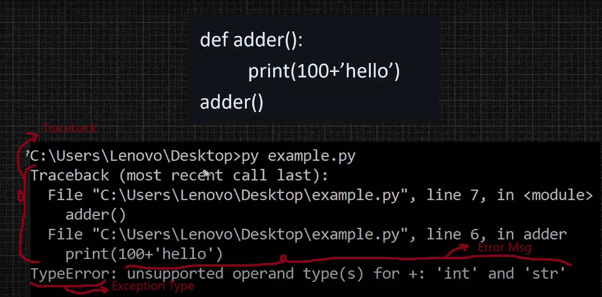
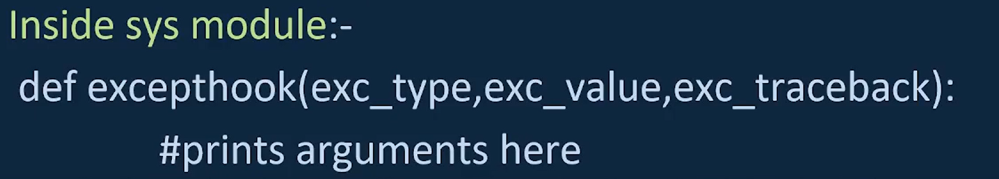
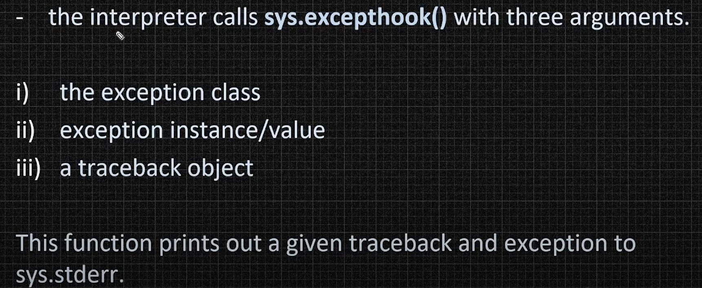
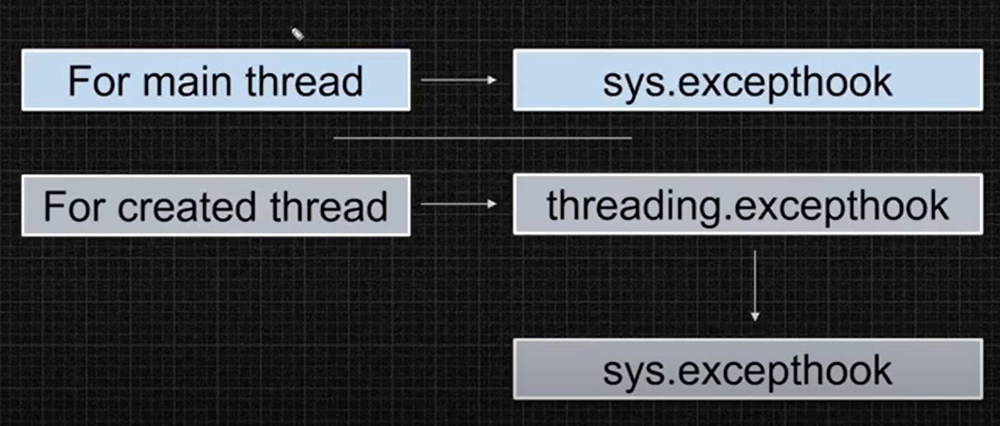
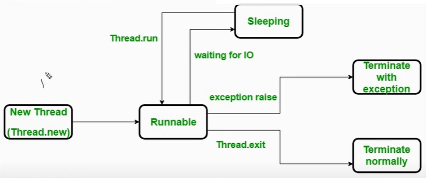

# CheatSheet for various python modules & important concepts

## Table of Contents
> 1. [Requests Module](#1-requests-module)
>> a. [Get Request](#1-get-request)<br>
>> b. [Post Request](#2-post-request)<br>
>> c. [Send JSON data](#3-sending-json-data-in-post-request)<br>
>> d. [PUT Request](#4-put-request)<br>
>> e. [Delete Request](#5-delete-request)<br>
>> f. [HEAD Request](#6-head-request)<br>
>> g. [Send parameters in GET](#7-sending-parameters-in-get-request)<br>
>> h. [Send headers](#8-sending-headers-with-request)<br>
>> i. [Cookies](#9-working-with-cookies)<br>
>> j. [Upload files](#10-uploading-files)<br>
>> k. [Authentication](#11-authentication)<br>
>> l. [Download](#12-downloading-content)<br>
>> m. [Proxies](#13-proxies)<br>
>> n. [SSL Verification](#14-disable-ssl-verification)<br>
>> o. [Custome timeout](#15-custom-timeout-for-requests)<br>
>> p. [Status Code](#16-common-status-codes)<br>
> 2. [Lambda/Anonymous Function](#2-lambdaanonymous-function)
>> a. [Basic Syntax](#basic-syntax)<br>
>> b. [lambdas with default arguments](#lambdas-with-default-arguments)<br>
>> c. [condition in lambda](#conditional-ternary-in-lambda)
> 3. [Map function](#3-map-function)<br>
>> a. [Map with Lambda](#map-with-lambda-function)<br>
>> b. [Map without Lambda](#map-without-lambda-function)<br>
>> c. [Map with multiple iterables](#map-with-multiple-iterables)
> 4. [Filter function](#4-filter-function)
>> a. [Filter without lambda](#filter-without-lambda)<br>
>> b. [Filter with lambda](#filter-with-lambda)
> 5. [Reduce function](#5-reduce-function)
>> a. [Reduce without lambda](#reduce-without-lambda)<br>
>> b. [Reduce with lambda](#reduce-without-lambda)
> 6. [Multi-threading](#6-multithreading-threading-module)<br>
>> [a. Key Concepts](#key-concepts)<br>
>> [b. Thread Methods](#main-thread-functions)<br>
>> [c. Creating Thread](#creating-threads)<br>
>>> [i. Use thread class directly](#use-thread-class-directly)<br>
>>> [ii. Extending thread class](#creating-threads-by-extending-the-thread-class)

>> [d. Thread naming and identification](#thread-naming-and-identification)<br>
>> [e. Some important builin functions](#some-important-builin-functions)<br>
>>[f. Join method](#join-method)<br>
>>[g. Synchronization in threads](#synchronization-in-threads)<br>
>>>[i. Lock](#lock---synchronization-tool)<br>
>>>[ii. R-Lock](#rlock-reentrant-lock)<br>
>>>[iii. Semaphore](#semaphore)<br>
>>>[iv. Bounded Semaphore](#bounded-semaphore)<br>
>>>[v. Exception in Python](#exception-in-python)<br>
>>>>[i. Normal Exception Handling](#normal-exception-handling)<br>
>>>>[ii. Handling Exception in threads](#handling-exceptions-in-threads)<br>

>> [h. Life Cycle Of Thread](#life-cycle-of-thread)<br>
>> [i. Thread Communication](#thread-communication)<br>
>>> [i. Using Event Object](#using-an-event-object)<br>

## 1. Requests module

### 1. Get request
- Used to retrive from server

```Python
response = requests.get('https://example.com')
print(response.status_code)  # HTTP Status Code (e.g., 200)
print(response.text)         # Response content (HTML, JSON, etc.)
print(response.json())       # Parse response as JSON (if applicable)
```

### 2. POST Request
- Used to send data to the server (typically for creating or updating).
- Content-Type: `application/x-www-form-urlencoded` (default for data)
```Python
data = {'key1': 'value1', 'key2': 'value2'}
response = requests.post('https://example.com/post', data=data)
print(response.text)  # Response content
```

### 3. Sending JSON Data in POST Request
 - Send JSON in the body of a POST request.
 - Content-Type: `application/json`
```Python
json_data = {'name': 'John', 'age': 30}
response = requests.post('https://example.com/post', json=json_data)
print(response.text)
```

### 4. PUT Request
- Used to update data on the server.
```Python
data = {'key': 'updated_value'}
response = requests.put('https://example.com/put', data=data)
print(response.text)
```

### 5. DELETE Request
- Used to delete data on the server.
```Python
response = requests.delete('https://example.com/delete')
print(response.text)
```
### 6. HEAD Request
- Similar to GET, but retrieves only headers (no body).
```Python
response = requests.head('https://example.com')
print(response.headers)
```

### 7. Sending Parameters in GET Request
- Send query parameters in a URL.
```Python
params = {'key1': 'value1', 'key2': 'value2'}
response = requests.get('https://example.com', params=params)
print(response.url)  # Full URL with parameters
```

### 8. Sending Headers with Request
- Customize headers in your requests.
```Python
headers = {'Authorization': 'Bearer your-token'}
response = requests.get('https://example.com', headers=headers)
print(response.text)
```

### 9. Working with Cookies
- Access and send cookies with requests.
```Python
# Get cookies from a response
response = requests.get('https://example.com')
print(response.cookies)

# Send cookies in a request
cookies = {'session_id': '12345'}
response = requests.get('https://example.com', cookies=cookies)
```

### 10. Uploading Files
- Send files in a POST request.

```Python
files = {'file': open('report.txt', 'rb')}
response = requests.post('https://example.com/upload', files=files)
```

### 11. Authentication
- Send requests with authentication (e.g., basic authentication)

```Python
from requests.auth import HTTPBasicAuth

response = requests.get('https://example.com', auth=HTTPBasicAuth('user', 'pass'))
```

### 12. Downloading Content
- Downloading large files in chunks.

```Python
response = requests.get('https://example.com/file.zip', stream=True)
with open('file.zip', 'wb') as f:
    for chunk in response.iter_content(chunk_size=128):
        f.write(chunk)
```

### 13. Proxies
- Send requests through a proxy.
```Python
proxies = {
    'http': 'http://10.10.1.10:3128',
    'https': 'https://10.10.1.11:1080',
}
response = requests.get('https://example.com', proxies=proxies)
```

### 14. Disable SSL Verification
- Ignore SSL certificate verification.
```Python
response = requests.get('https://example.com', verify=False)
```

### 15. Custom Timeout for Requests
 - Set both connection and read timeout values.
```Python
response = requests.get('https://example.com', timeout=(3.05, 27))
```

- `First value (3.05):` The time to wait for a connection to establish (write timeout).
- `Second value (27):` The time to wait for a response (read timeout).

### 16. Common Status Codes:
- 200: OK
- 201: Created
- 204: No Content
- 400: Bad Request
- 401: Unauthorized
- 403: Forbidden
- 404: Not Found
- 500: Internal Server Error

## 2. Lambda/Anonymous Function 

Lambda functions are small anonymous functions defined with the `lambda` keyword.

### Basic Syntax
```Python
lambda arguments: expression
```
- `arguments:` Input parameters (like in a normal function).
- `expression:` A single expression that is evaluated and returned

Example:
```Python
add = lambda x, y: x + y
print(add(2, 3))  # Output: 5
```

### Lambdas with Default Arguments
```Python
add = lambda x, y=10: x + y
print(add(5))  # Output: 15
print(add(5, 3))  # Output: 8
```

### Conditional (Ternary) in Lambda
```Python
max_value = lambda x, y: x if x > y else y
print(max_value(5, 10))  # Output: 10
```

## 3. Map function
The `map()` function executes the given function to every item of an iterable, such as a `list` or `tuple`, and returns a map object (which is an iterator).

Syntax
```Python
map(function, iterables)
```
- `function:`	The function to execute for each item
- `iterable:` A sequence, collection or an iterator object.
- Returns an iterable object

### Map without lambda function
```Python
a = [1, 2, 3, 4]

def double(val):
  return val*2

res = list(map(double, a))
print(res) # Output: [1, 4, 9, 16]
```
### Map with lambda function
```Python
a = [1, 2, 3, 4]

res = list(map(lambda n:n*n, a))
print(res) # Output: [1, 4, 9, 16]
```

### map() with multiple iterables
```Python
a = [1, 2, 3]
b = [8, 9, 10]

res = list(map(lambda x,y:x+y, a, b))
print(res) #Output: [9, 11, 13]
```
## 4. Filter Function

The `filter()` function returns an iterator where the items are filtered through a function to test if the item is accepted in result or not.

Syntax is same as `map()`

### Filter without lambda
```Python
def isEven(x):
    if x%2 == 0: return True
    return False

a = [1,2,3,4,5,6]
res = list(filter(isEven, a))
print(res) # Output: [2, 4, 6]
```

### Filter with lambda
```Python
a = [1,2,3,4,5,6]
res = list(filter(lambda x:x%2==0, a))
print(res) # Output: [2, 4, 6]
```

## 5. Reduce function
The reduce() function accepts a function and a sequence and returns a single value calculated as follows:

- Initially, the function is called with the first two items from the sequence and the result is returned.
- The function is then called again with the result obtained in step 1 and the next value in the sequence. This process keeps repeating until there are items in the sequence.

This function is defined in `functools` module.

- Syntax: `reduce(function, sequence[, initial]) -> value`

### reduce without lambda
```Python
from functools import reduce

def sum(a, b):
    return a+b
    
arr = [3, 4, 5]
val = reduce(sum, arr)
print(val) # Output: 12
```

### reduce with lambda
```Python
from functools import reduce
    
arr = [3, 4, 5]
val = reduce(lambda x,y:x+y, arr)
print(val) # Output: 12
```

## 6. Multithreading (threading module)

### Key Concepts:

- A thread is an operating system object that executes a set of instructions. By default, each Python program runs on a single thread known as the main thread, created by the Python interpreter (PVM).

- Multithreading allows multiple threads to run concurrently, though Python threads run in the same memory space, the memmory requirement increases when number of thread increases.

### Main Thread Functions:

- `threading.current_thread():` Returns the current thread object.
- `threading.current_thread().name:` Returns the name of the current thread.
- `threading.current_thread().ident:` Returns the thread ID (TID).
- `threading.current_thread().is_alive():` Returns True if the thread is active.

### Creating Threads: 

There are two primary ways to create a thread in Python:

1. Using the `Thread` class directly.
2. Extending the `Thread` class.

### Use `Thread` class directly

#### Creating Threads Using Thread Class

You can create and start threads using the `Thread` class from the `threading` module.

Refer to the example - [thread1.py](Snippets/thread1.py)

- Explanation:
    - Calling the `Thread` constructor signals the operating system to create a new thread and allocate memory for it. However, the thread's execution does not begin immediately. The new thread is only initialized, not running. The actual execution of the thread starts only when the `start()` method is called, which triggers the operating system to schedule the thread for execution.

    - We pass arguments using both `args` (tuple) and `kwargs` (dictionary) for different ways to input parameters.

#### Using the Thread Class in an Object-Oriented Way

Refer to the example - [thread2.py](Snippets/thread2.py)

- Explanation:
    - We use both instance methods and class/static methods as thread targets.

### Creating Threads by Extending the `Thread` Class
When we call `start()` on a thread object, the interpreter internally calls the `run()` method. This run() method is part of the `Thread` class, which belongs to the `threading` module. The main job of the `run()` method is to execute the target function in a separate thread (in a different memory space). This is the default behavior when we create and start a thread.

However, we can customize this behavior by overriding the `run()` method. To do this, we extend the `Thread` class in our own class and redefine the `run()` method. This allows us to define the specific actions our thread should perform.

Key Benefits of Overriding run():
1. **Custom Logic:** We can define what the thread will execute by customizing the run() method.
1. **Access to Thread Data:** Instead of returning values from a thread (which is not directly possible), we can store the results in instance variables. After the thread has finished executing, these instance variables can be accessed to retrieve the result.

    ```Python
    from threading import Thread, current_thread
    import time

    class MyClass(Thread):
        def run(self):
            a = 10
            b = 20
            time.sleep(0.1) # Simulate some working
            self.res = a+b
            
    t1 = MyClass()
    t1.start()
    time.sleep(2) # let the child thread finish
    print(f"Res={t1.res}") #Output: Res=30
    ```

Refer to the example - [thread3.py](Snippets/thread3.py)

Explanation:
1. Passing Arguments to a Thread:

    The `run()` method in Python's `Thread` class does not accept arguments directly. To pass arguments to a thread, you can either:

    - Use the `__init__` method of your child class to pass arguments when creating the thread instance.

    - Alternatively, use a lambda function or a wrapper function to handle the arguments before starting the thread.

2. Calling the Superclass Constructor:

    In the constructor (`__init__`) of your child class, it's essential to call the constructor of the parent class (`Thread`). This is done using `super().__init__()`. The `Thread` class constructor performs crucial setup steps that are necessary before the thread can be started and executed properly. Skipping this could lead to incorrect or incomplete thread initialization.

### Thread Naming and Identification
1. Unique Thread Name Assignment:

    - Each thread is assigned a unique name when created. This name follows the naming convention `Thread-[%d]`, where `%d` represents an incrementing integer.

    Example:
    - First thread: `Thread-1`
    - Second thread: `Thread-2`
2. Main Thread Name:

    - The main thread (created by Python when the program starts) is named `MainThread`.

3. Thread Object and Name Attribute:

    - Every thread in Python is an object of the `Thread` class. The name of a thread is stored in the `name` attribute of the thread object.

4. Changing Thread Names:

    - You can change the name of a thread by directly assigning a string to the `name` attribute of the thread object.
    - This applies to both the main thread and any created threads.
    - Alternatively, you can use the `setName()` and `getName()` methods to set or retrieve the thread’s name, but note that these methods are deprecated and may be removed in future Python versions.

5. Thread Identifiers:

    - Thread Identifier:

        - Each thread is assigned a unique, positive integer (within the Python process) called the thread identifier, which is stored in the `ident` attribute. This value is read-only and assigned by the Python interpreter.

    - Native Identifier:

        - The native identifier is assigned by the operating system and stored in the `native_id` attribute. It becomes available only after the thread is started. In many cases, the thread identifier (`ident`) and the native identifier (`native_id`) are the same.

    ```Python
    from threading import Thread, current_thread
    import time

    def display():
        time.sleep(0.1)

    def show():
        time.sleep(0.1)

    t1 = Thread(target=display)
    t2 = Thread(target=show)
    print(t1.name) #Outut: Thread-1 (display)
    print(t2.name) #Outut: Thread-2 (show)

    # change name of the t1 thread
    t1.name = "sudipta"
    print(t1.name) #Outut: sudipta

    # change name of the main thread
    current_thread().name = "newmain"
    print(current_thread().name) #Outut: newmain

    # Get indentifiers, initially this will print null as thread is not yet started
    print(t1.ident)
    print(t1.native_id)
    t1.start()
    print(t1.ident)
    print(t1.native_id)
    ```

### Some important builin functions

| Method            | Description                              |
|-------------------|------------------------------------------|
| `is_alive()`      | Check if a thread is running or not      |
| `main_thread()`   | Returns the details of the main thread   |
| `active_count()`  | Number of currently running threads      |
| `enumerate()`     | List of all running threads              |
| `get_native_id()` | Get the native ID of the thread          |

Refer to the example - [thread4.py](Snippets/thread4.py)

### Join Method

The  the `join()` method is used to ensure that a thread has completed its execution before the main program (or other threads) continues running. It "joins" the thread back to the main thread and waits for it to finish.

#### Example without join
```Python
import threading, time

def task():
    print("Thread starting...")
    time.sleep(2)
    print("Thread finished!")


t = threading.Thread(target=task)
t.start()

# This line will be printed immediately after starting the thread
print("Main program finished!")
```

Output
```mathematica
Thread starting...
Main program finished!
Thread finished!
```

### Example with join
```Python
import threading, time

def task():
    print("Thread starting...")
    time.sleep(2)
    print("Thread finished!")

t = threading.Thread(target=task)
t.start()

# Wait for the thread to finish before continuing
t.join()

print("Main program finished!")
```

Output:
```mathematica
Thread starting...
Thread finished!
Main program finished!
```
`join()` ensures that a thread finishes before proceeding to the next part of the program.

### Synchronization in threads
To avoid race condition and establish a synchronization between threads, we have three ways - 
1. Locks
2. R-Lock
3. Semaphore

### Lock - Synchronization Tool

A Lock is used to ensure that only one thread can access a shared resource at a time. When one thread holds the lock, other threads attempting to acquire it will fail to acquire the lock.

#### Key Methods:

1) `acquire(blocking=True, timeout=-1)`
    - When `blocking=True` (default), the method call will block the thread until the lock is acquired.
    - When `blocking=False`, the thread will not block. Instead, it will try to acquire the lock and return immediately with a True or False indicating whether the lock was acquired successfully.

        ```Python
        if lock.acquire(blocking=False):
            try:
                # Perform operations that require the lock
            finally:
                lock.release()
        else:
            print("Couldn't acquire lock, doing something else")
        ```
    - If provided, `timeout` specifies the **maximum time** (in seconds) that the thread will block while trying to acquire the lock.
    - If the lock is not acquired within the timeout period, the method returns `False`. If the lock is acquired before the timeout, it returns `True`.

        ```Python
        if lock.acquire(timeout=5):
            try:
                # Perform operations that require the lock
            finally:
                lock.release()
        else:
            print("Couldn't acquire lock within 5 seconds")
        ```
    Refer to the example - [thread6.py](Snippets/thread6.py)
2. `release():` Unlocks the resource, allowing other threads to acquire it.

#### Example and Explanation:
Refer to the example - [thread5.py](Snippets/thread5.py)

The value of the `shared_resource` should be 200 but without a lock, the final value may vary due to race conditions.

### RLock (Reentrant Lock)

- **Reentrant Lock (RLock)** allows a thread to acquire the same lock multiple times. It ensures that if a thread already holds the lock, it can continue to acquire it again without causing a deadlock, unlike a standard `Lock`.

- **Use Case:** When a thread needs to enter a locked section of code recursively or repeatedly in the same thread.

- Key Points:

    - A regular `Lock` blocks the thread if it tries to acquire the lock again, causing a deadlock.
    - An `RLock` allows the thread to enter the locked section multiple times without blocking itself.
    - `RLock` holds the information about the thread which currently hold the lock and how many times it acquires the lock.
    - `RLock` contains the same input arguments as `Lock`


    ```Python
    import threading

    lock = threading.RLock()

    def recursive_function(n):
        lock.acquire()
        print(f"Acquired lock, n={n}")
        print(lock)
        if n > 0:
            recursive_function(n - 1)
        lock.release()
        print(f"Released lock, n={n}")

    # Start the function
    thread = threading.Thread(target=recursive_function, args=(3,))
    thread.start()
    thread.join()
    ```

    Output:
    ```mathematica
    Acquired lock, n=2
    <locked _thread.RLock object owner=140067167979200 count=1 at 0x7f63edd4bd40>
    Acquired lock, n=1
    <locked _thread.RLock object owner=140067167979200 count=2 at 0x7f63edd4bd40>
    Acquired lock, n=0
    <locked _thread.RLock object owner=140067167979200 count=3 at 0x7f63edd4bd40>
    Released lock, n=0
    Released lock, n=1
    Released lock, n=2
    ```

#### Difference Between Lock and RLock:

- Lock:
    - Non-reentrant: Once acquired, the same thread cannot acquire it again until it releases it.
    - Deadlocks if the same thread tries to re-acquire the lock.

- RLock:
    - Reentrant: The same thread can acquire it multiple times without blocking.
    - The thread must release the lock the same number of times it acquires it.

### Semaphore
Semaphore maintains an internal counter, which decreases each time a thread acquires the semaphore and increases when a thread releases it. Semaphores are useful when limiting the number of threads that can access a resource simultaneously.

```python
import threading, time

# Semaphore with max 3 concurrent threads
sem = threading.Semaphore(3)

def worker(name):
    sem.acquire()
    print(f"{name} acquired the semaphore")
    time.sleep(2) 
    print(f"{name} released the semaphore")
    sem.release()

threads = []
for i in range(5):
    thread = threading.Thread(target=worker, args=(f"Thread-{i}",))
    threads.append(thread)
    thread.start()

# Wait for all threads to complete
for thread in threads:
    thread.join()

```

#### Key Points:
- `Semaphore(value=1)`: 
    - Initializes the semaphore with a counter (default is 1).
    - In the example above, only 3 threads can access the resource at a time.

- `acquire(blocking=True, timeout=None)`: 
    - Decreases the semaphore counter
    - if counter is 0, the calling thread is blocked until another thread releases the semaphore.

- `release(n=1)`: 
    - Release a semaphore, incrementing the internal counter by n.
    - **It is possible to increase the counter value beyond its initial capacity.**
    - When it was zero and other threads are waiting for it to become larger than zero again, it sends signal to wake up n of those threads.

#### Practical Scenario for release(n):

Imagine a producer-consumer problem where a producer produces multiple items at once and the semaphore tracks how many resources are available. If the producer produces several items at once, it can call `release(n)` to signal the availability of those items to multiple consumers at the same time.

### Bounded Semaphore

A **Bounded Semaphore** is a subclass of the regular `Semaphore` in Python, but with an additional check that prevents the semaphore count from exceeding its initial value. 

#### Key Features:
- Ensures the semaphore count does not exceed the initial capacity.
- If the `release()` method is called too many times, it raises a `ValueError` to signal improper usage.

```Python
import threading

bounded_sem = threading.BoundedSemaphore(2)  # Max capacity is 2

bounded_sem.release()  # Raises ValueError as exceeds initial capacity
```
#### **Use Case:**
- **Semaphore:** Allows flexibility, where releasing more than acquired is acceptable.

- **Bounded Semaphore:** Enforces strict resource limits, preventing misuse by ensuring we can't release more resources than initially acquired.

### Exception in Python

### Normal Exception Handling

#### Uncaught Exception Example:
- The code block provided throws an exception because it attempts to append an integer to a string. Since no try-except block is used, this results in a TypeError.

    ```Python
    def adder():
        print(100+"hello")
    adder()
    ```
- Output Details:
    - **Traceback:** Provides the sequence of function calls leading to the error.
    - **Exception Type:** Indicates the type of exception encountered (e.g., TypeError).
    - **Error Message:** Describes the specific error, starting with the exception type
    
    

#### About sys.excepthook():

- When exceptions are not handled using a `try-except` block, Python internally calls the `sys.excepthook()` function to handle uncaught exceptions. It is called with three arguments:
    
    1. **Exception Class:** The class of the raised exception (e.g., `TypeError`).
    
    2. **Exception Instance/Value:** The specific instance or value of the exception.
    
    3. **Traceback Object:** Contains details of the stack frames at the point where the exception occurred.

        
        

- **In an interactive session**, `sys.excepthook()` is triggered right before the control is returned to the prompt. 

#### Customizing Exception Handling:
- We can **override** the default behavior of `sys.excepthook()` by defining your custom exception handling function.

- This function can modify how uncaught exceptions are displayed or logged, but it **does not prevent the code flow from stopping**. It only modifies how the exception details are output.

```Python
import sys, traceback

def customeExceptionHandeling(exec_type, exce_msg, exec_traceback):
    print("Customised exception function called")
    print(f"\nException Type: {exec_type}")
    print(f"Error Msg: {exce_msg}")
    print(f"Traceback: \n{''.join(traceback.format_tb(exec_traceback))}")

def adder():
    print(100+'hello')

if __name__ == "__main__":
    sys.excepthook = customeExceptionHandeling
    adder()
```

```mathematica
sudipta@WSL:Snippets (main)$ python3 thread8.py 
Customised exception function called

Exception Type: <class 'TypeError'>
Error Msg: unsupported operand type(s) for +: 'int' and 'str'
Traceback: 
  File "/mnt/c/Users/Sudipta/Documents/Study/Coding/CheatSheets/Snippets/thread8.py", line 14, in <module>
    adder()
  File "/mnt/c/Users/Sudipta/Documents/Study/Coding/CheatSheets/Snippets/thread8.py", line 10, in adder
    print(100+'hello')
          ~~~^~~~~~~~

sudipta@WSL:Snippets (main)$ 
```

### Handling Exceptions in Threads
- Impact of Exceptions in One Thread:

    - If an exception occurs in one thread, it **does not affect other threads**. All other threads continue functioning as usual, independently of the thread where the exception occurred.

- Exception Handling in Threads:
    - When an exception happens in a thread, the Python interpreter automatically calls `threading.excepthook()`. This function handles uncaught exceptions in threads and is part of the `threading` module.

    - **Key Difference:** In the main thread, exceptions are handled by ``sys.excepthook()``. However, for user-created threads, `threading.excepthook()` is invoked.

    - If there is an exception inside the `threading.excepthook()` itself, the fallback is to call `sys.excepthook()`.

        

#### Parameters of threading.excepthook():
`threading.excepthook()` is called with a named tuple containing four arguments:

1. **Exception Class** – The class of the exception that was raised.
2. **Exception Instance/Value** – The specific instance of the exception.
3. **Traceback Object** – A traceback object that provides details about where the exception occurred.
4. **Thread Name** – The name of the thread where the exception happened.

#### Default Exception Handling in Threads:
- When a method is defined as the target of a thread, Python internally calls the `run()` method, which then executes the `target` method.

- Normally, we do not define a custom `try-except` block in target method. This is because `run()` has a default `try-except` block that handles uncaught exceptions.

#### Customizing Thread Exception Handling:
- You can change how exceptions are handled in threads by assigning a custom exception handler function to the `threading.excepthook` variable.

- This allows us to define specific behavior when an exception occurs in a thread, such as logging or taking corrective action.

```Python
import traceback, threading

def customeExceptionHandeling(args):
    print(f"Customised exception function called - {args.thread.name}")
    print(f"\nException Class: {args[0]}")
    print(f"\nException Msg: {args[1]}")
    print(f"\nThread Info: {args[3]}")
    print(f"Traceback: {''.join(traceback.format_tb(args[2]))}")
    print(f"Whole exception tupple: {args}")

def adder():
    print(100+'hello')

if __name__ == "__main__":
    t1 = threading.Thread(target=adder)
    threading.excepthook = customeExceptionHandeling
    t1.start()
    t1.join()
```
Output:
```mathematica
sudipta@WSL:Snippets (main)$ python3 thread8.py 
Customised exception function called - Thread-1 (adder)

Exception Class: <class 'TypeError'>

Exception Msg: unsupported operand type(s) for +: 'int' and 'str'

Thread Info: <Thread(Thread-1 (adder), started 139781288167104)>
Traceback:   File "/usr/lib/python3.12/threading.py", line 1073, in _bootstrap_inner
    self.run()
  File "/usr/lib/python3.12/threading.py", line 1010, in run
    self._target(*self._args, **self._kwargs)
  File "/mnt/c/Users/Sudipta/Documents/Study/Coding/CheatSheets/Snippets/thread8.py", line 12, in adder
    print(100+'hello')
          ~~~^~~~~~~~
Whole exception tupple: _thread._ExceptHookArgs(exc_type=<class 'TypeError'>, exc_value=TypeError("unsupported operand type(s) for +: 'int' and 'str'"), exc_traceback=<traceback object at 0x7f215e0a8c40>, thread=<Thread(Thread-1 (adder), started 139781288167104)>)
sudipta@WSL:Snippets (main)$ 
```

### Life Cycle Of Thread

Threads in Python go through various stages in their life cycle. The three main stages are:

1. New Thread:

    - When a thread is created, it does not start running immediately.

    - The thread is in the New state between creation and the invocation of the start() method.

    - Example:

        ```Python
        t = threading.Thread(target=my_function)  # Thread is created but not yet started
        ```

2. Runnable Thread:

    - After the `start()` method is called, the thread moves to the Runnable state.
    
    - In this state, the thread may be actively running or waiting for resources (like I/O or dependent threads).
    
    - This stage is divided into two types:
        
        - **Active State:** The thread is running and performing its task.
        
        - **Blocked State:** The thread is waiting for some event, like an I/O operation to complete or another thread's lock to be released.

    - A thread may switch between the active and blocked states during its lifecycle. For example, if it waits for input, it becomes blocked, and once the input is received, it becomes active again.

    - Example
    
        ```Python
        t.start()  # Thread enters Runnable state
        ```

3. Terminated Thread:

- A thread enters the **Terminated** state when it has finished executing or encounters an unhandled exception.

- This can happen naturally when the thread completes its task or if the thread is forcibly stopped due to an error or exception.

- After termination, the thread cannot be restarted.

    

### Thread Communication 
Thread communication is essential for synchronizing the execution of multiple threads. There are three common ways to achieve communication between threads:

1. Using an event object
2. Using condition object
3. Using the Queue Module

### Using an Event Object

The `threading` module provides a class called `Event`, which is used for signaling between two threads. Event objects are particularly useful when one thread needs to wait for a signal from another thread before continuing its execution. This communication mechanism revolves around a boolean flag (`True` or `False`).

- How it works:

    Initially, the flag is set to `False`. One thread will wait for a signal (flag to become `True`) from the other thread. When a specific condition is met in the first thread, it will signal the second thread to resume by setting the flag to `True`. The second thread, which is waiting on this signal, will then start its task. If the flag is `False`, the second thread will pause until it gets the signal.

- Methods in the Event class:

1. set():
    - Sets the internal flag to `True`.
    - Any thread waiting on this flag (using the `wait()` method) will be awakened and continue its work.

2. reset():
    - Resets the internal flag to `False`.
    - The thread that was signaled will pause and wait again for the flag to become `True`.

3. is_set():
    - Returns True iff the internal flag is True.

4. wait(timeout=-1):
    - Blocks the calling thread until the internal flag is set to True.
    - Optionally, a timeout can be provided to avoid indefinite waiting.

    ```Python
    import threading, time

    e = threading.Event()

    def func1():
        print("Thread1 waiting for a event to be set")
        e.wait()
        print("Thread1 receive signal")

    def func2():
        print("Thread2 started working")
        time.sleep(5)
        print("Thread2 will now set the event")
        e.set()


    if __name__=="__main__":
        t1 = threading.Thread(target=func1)
        t2 = threading.Thread(target=func2)

        t1.start()
        t2.start()

        t1.join()
        t2.join()
    ```
    Output:
    ```matmatica
    sudipta@WSL:Snippets (main)$ python3 thread8.py
    Thread1 waiting for a event to be set
    Thread2 started working
    Thread2 will now set the event
    Thread1 receive signal
    ```